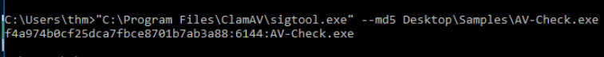
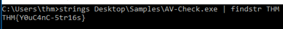

> # Introduction to Antivirus

# Summary
* [Summary](#summary)
   * [Task 1 - Introduction](#task-1---introduction)
   * [Task 2 - Antivirus Software](#task-2---antivirus-software)
   * [Task 3 - Antivirus Features](#task-3---antivirus-features)
   * [Task 4 - Deploy the VM](#task-4---deploy-the-vm)
   * [Task 5 - AV Static Detection](#task-5---av-static-detection)
   * [Task 6 - Other Detection Techniques](#task-6---other-detection-techniques)

## Task 1 - Introduction
1. Let's get started! 
    No answer needed.

## Task 2 - Antivirus Software
1. What was the virus name that infected John McAfee's PC? 
    > and its main goal at that time was to remove a virus named "Brain" that infected John McAfee's computer

    **Answer:** Brain

1. Which PC Antivirus vendor implemented the first AV software on the market? 
    > McAfee Associates, Inc. started the first AV software implementation in 1987.

    **Answer:** McAfee

1. Antivirus software is a _____-based security solution. 
    > It is a host-based application that runs in real-time (in the background) to monitor and check the current and newly downloaded files.

    **Answer:** Host

## Task 3 - Antivirus Features
1. Which AV feature analyzes malware in a safe and isolated environment? 
    > An emulator is an Antivirus feature that does further analysis on suspicious files. Once an emulator receives a request, the emulator runs the suspect (exe, DLL, PDF, etc.) files in a virtualized and controlled environment.

    **Answer:** Emulator

1. An _______ feature is a process of restoring or decrypting the compressed executable files to the original.  
    >  AV software must have an unpacker feature to unpack protected or compressed executable files into the original code.

    **Answer:** unpacker

## Task 4 - Deploy the VM
No answer needed.

## Task 5 - AV Static Detection
1. What is the `sigtool` tool output to generate an MD5 of the `AV-Check.exe` binary? 
     
    **Answer:** f4a974b0cf25dca7fbce8701b7ab3a88:6144:AV-Check.exe

1. Use the strings tool to list all human-readable strings of the AV-Check binary. What is the flag? 
     
    **Answer:** THM{Y0uC4nC-5tr16s}

## Task 6 - Other Detection Techniques
1. Which detection method is used to analyze malicious software inside virtual environments? 
    > Another method for dynamic detection is Sandboxing. A sandbox is a virtualized environment used to run malicious files separated from the host computer. 

    **Answer:** Dynamic Detection
