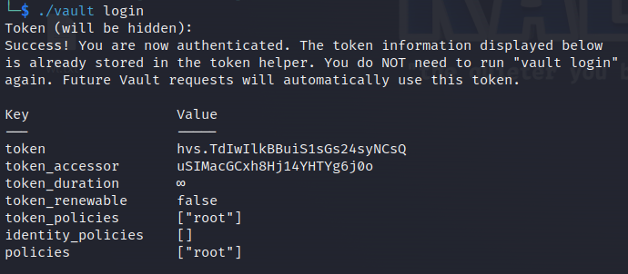
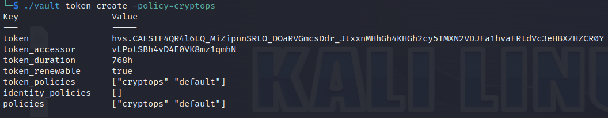

> # Introduction to CryptOps

# Summary
- [Summary](#summary)
  - [Task 2 - Key Management in DevSecOps](#task-2---key-management-in-devsecops)
  - [Task 3 - Best Practices in Key Generation](#task-3---best-practices-in-key-generation)
  - [Task 4 - Key Distribution](#task-4---key-distribution)
  - [Task 5 - Secure Storage and Usage](#task-5---secure-storage-and-usage)
  - [Task 6 - Key Rotation and Revocation Strategies](#task-6---key-rotation-and-revocation-strategies)
  - [Task 7 - Vault Config](#task-7---vault-config)

##  Task 2 - Key Management in DevSecOps
1. Which key process might involve using HSMs? 
    > Key Storage: After keys are generated and before they are distributed, they must be securely stored. Secure key storage is critical to prevent unauthorised access and use. It employs encrypted databases or specialised hardware security modules (HSMs)

    **Answer:** Key Storage

1. What can you set so that a key is recoverable after x days? 
    > Sometimes, "purge periods" are set so that when you delete a key, you can still retrieve it after x amount of days before full deletion.

    **Asnwer:** purge periods

1. What process invalidates a key before its expiry date?K 
    > Key revocation is the process of invalidating a key before its scheduled expiration.

    **Answer:** Key revocation

##  Task 3 - Best Practices in Key Generation 
1. What does RNGs stand for? 
    > Use strong Random Number Generators (RNGs): The strength of cryptographic keys lies in their randomness.

    **Answer:** Random Number Generators

1. In the context of key generation, what do you call securely configured cloud hosts or jump servers? 
    > Bastion hosts, also known as jump servers, are securely configured cloud instances that serve as an isolated access point between the external and internal network resources.

    **Answer:** Bastion hosts

##  Task 4 - Key Distribution
1. What does PKI stand for? 
    > Employ Public Key Infrastructure (PKI):  PKI involves using a pair of keys (public and private keys) where the public key can be openly distributed, and the private key remains securely with the owner.

    **Answer:** Public Key Infrastructure

1. What's an example protocol for KDC? 
    > Key Distribution Centers (KDC): A Key Distribution Center is a secure and centralised system that distributes encryption keys to communicating parties. It acts as a trusted intermediary and generates session keys for symmetric encryption. The Kerberos protocol is a well-known example of a Key Distribution Center system, which can also be used for key exchange.

    **Answer:** Kerberos

1. What types of keys are used in VPNs? (Use the acronym) 
    > Pre-Shared Key (PSK): Pre-shared keys are symmetric keys shared beforehand by communicating parties. They are frequently used in scenarios where a restricted number of parties require secure communication, such as in Virtual Private Networks (VPNs) or wireless networks. 

    **Answer:** PSK

##  Task 5 - Secure Storage and Usage
1. What access control strategy relies on user attributes, resources, and the current environment?  
    > ABAC provides a more granular level of access control, where a logical grouping of permission is based on user attributes, the resource, and the current environment.

    **Answer:** ABAC

1. What storage solution offers tamper-resistant hardware?  
    > HSM offer tamper-resistant hardware that securely handles key generation, encryption, decryption, and signing operations, ensuring that cryptographic keys do not leave the device in plaintext form.

    **Answer:** HSM

##  Task 6 - Key Rotation and Revocation Strategies
1. What are CRLs? 
    **Answer:** Certificate Revocation Lists

1. What term refers to a key's lifespan before rotation? 
    **Answer:** cryptoperiod

##  Task 7 - Vault Config
1. What command checks the overall vault information? 
    **Answer:** vault status

1. What is the token_accessor value after logging in with the root token? 
    Login with root after unseal. 
     
    **Answer:** uSIMacGCxh8Hj14YHTYg6j0o

1. What's the default Time To Live (TTL) for a token in Vault? (in hours) 
    After create token, you will see `time_duration` field's value. 
     
    **Answer:** 768

