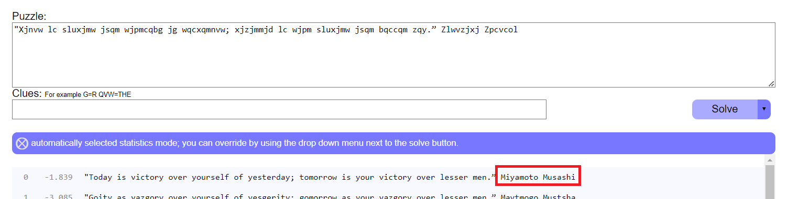
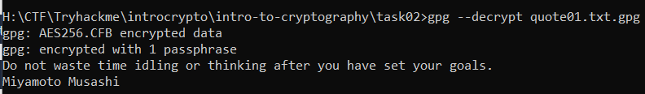
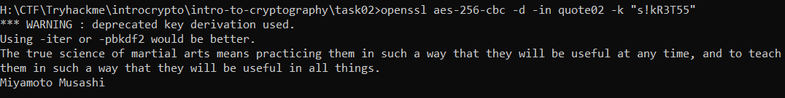
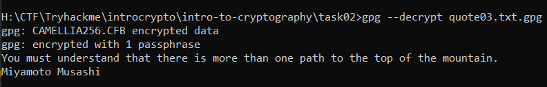
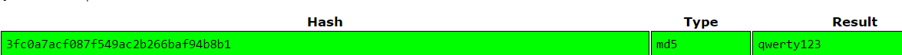

> # Introduction to Cryptography

# Summary
<!-- TOC -->

- [Summary](#summary)
    - [Task 1 - Introduction](#task-1---introduction)
    - [Task 2 - Symmetric Encryption](#task-2---symmetric-encryption)
    - [Task 3 - Asymmetric Encryption](#task-3---asymmetric-encryption)
    - [Task 4 - Diffie-Hellman Key Exchange](#task-4---diffie-hellman-key-exchange)
    - [Task 5 - Hashing](#task-5---hashing)
    - [Task 6 - PKI and SSL/TLS](#task-6---pki-and-ssltls)
    - [Task 7 - Authenticating with Passwords](#task-7---authenticating-with-passwords)

<!-- /TOC -->

## Task 1 - Introduction
1. You have received the following encrypted message:<br>
"Xjnvw lc sluxjmw jsqm wjpmcqbg jg wqcxqmnvw; xjzjmmjd lc wjpm sluxjmw jsqm bqccqm zqy." Zlwvzjxj Zpcvcol<br>
You can guess that it is a quote. Who said it?

    Use [quipquip](https://www.quipqiup.com/) to decrypt the given message.<br>
    <br>
    **Answer:** Miyamoto Musashi

## Task 2 - Symmetric Encryption
1. Decrypt the file quote01 encrypted (using AES256) with the key s!kR3T55 using gpg. What is the third word in the file?<br>
    Use `gpg --decrypt <filename>`.<br>
    <br>
    **Answer:** waste

1. Decrypt the file quote02 encrypted (using AES256-CBC) with the key s!kR3T55 using openssl. What is the third word in the file?<br>
    Use `openssl` to decrypt.<br>
    <br>
    **Answer:** science

1. Decrypt the file quote03 encrypted (using CAMELLIA256) with the key s!kR3T55 using gpg. What is the third word in the file?<br>
    `gpg --decrypt quote03.txt.gpg`<br>
    <br>
    **Answer:** understand

## Task 3 - Asymmetric Encryption
1. Bob has received the file ciphertext_message sent to him from Alice. You can find the key you need in the same folder. What is the first word of the original plaintext?<br>
    ```
    openssl pkeyutl -decrypt -in ciphertext_message -inkey private-key-bob.pem
    "Perception is strong and sight weak. In strategy it is important to see distant things as if they were close and to take a distanced view of close things."
    Miyamoto Musashi
    ```
    **Answer:** Perception

1. Take a look at Bob’s private RSA key. What is the last byte of p?<br>
    ```
    openssl rsa -in private-key-bob.pem -text -noout
    RSA Private-Key: (2048 bit, 2 primes)
    modulus:
        00:e8:5e:73:7d:54:55:0a:cc:56:64:87:b3:4b:8e:
        24:df:96:b8:b9:5f:19:d4:71:a5:b9:5a:a8:d9:ab:
        b4:7b:7f:59:08:c5:9c:47:0d:73:92:97:b8:ef:67:
        b7:a6:5a:59:2c:e3:4c:ca:7f:53:1c:9e:34:32:0e:
        c6:7c:60:b2:d6:1f:30:b2:ed:da:14:e9:15:78:80:
        71:92:3c:26:32:a9:2b:3a:15:4e:48:2d:93:04:a5:
        21:c7:da:15:6c:dd:bc:89:0e:cc:54:be:84:d6:40:
        b8:47:59:d1:b2:27:c9:0d:43:55:de:33:dd:01:8f:
        bf:6c:3e:79:31:dd:e4:90:8d:c3:35:72:31:85:15:
        ae:ac:5a:96:c8:34:90:0e:32:4e:86:45:55:78:fb:
        13:ed:a4:fb:f0:64:b4:61:04:f6:7c:e3:56:aa:03:
        a3:43:1e:40:0b:98:1f:73:66:4a:5c:3a:25:69:2c:
        d9:92:f8:69:c1:5b:61:b7:f2:3a:68:28:e9:2b:75:
        08:9c:a4:63:9e:71:2b:63:aa:99:75:cf:78:00:23:
        fc:5a:df:2d:95:14:2f:e6:10:5d:a0:ff:4d:07:c8:
        d3:bb:2d:8f:0d:8a:fc:ab:43:5d:35:53:dc:72:a2:
        74:5b:c0:88:0d:ee:c3:1f:7b:1c:74:1a:5e:e1:c1:
        88:31
    publicExponent: 65537 (0x10001)
    privateExponent:
        02:3b:3b:4b:58:ce:a2:eb:e8:bd:ce:65:1f:b4:9d:
        bb:5d:41:d3:85:e0:ee:f3:fd:c3:69:e6:1f:db:a6:
        40:09:59:06:dc:89:98:fa:68:17:0a:f3:46:59:43:
        4a:35:a9:3a:e5:1e:8c:fd:ec:03:ba:56:85:f9:de:
        58:be:14:f9:8e:bd:c8:fa:15:13:5e:54:4b:c9:45:
        4d:ec:db:46:61:44:28:ff:f6:0b:26:0f:8e:06:87:
        ec:83:60:f1:4a:af:cf:76:74:ea:86:14:80:7a:33:
        f5:7b:71:fd:63:f9:bf:9c:30:96:e6:fd:ed:a5:e9:
        10:ab:b3:93:91:ad:ea:e0:17:99:e8:7b:3d:64:58:
        b1:74:3e:0e:81:5b:6d:fa:41:7a:23:26:4f:f1:24:
        a8:73:f3:36:24:a2:65:17:7d:5b:52:8e:1f:fc:b7:
        e6:53:bc:89:b0:e5:18:65:71:29:34:cb:f7:65:51:
        39:0c:62:33:24:b8:60:bf:89:8b:c8:f5:0d:7d:e5:
        85:cf:57:cf:c3:d8:44:10:8f:54:6c:04:99:8d:d7:
        fd:e2:74:18:7b:5c:6c:3c:e1:30:0a:8b:8b:55:70:
        88:8a:67:64:63:5c:65:8f:fa:92:cf:94:04:b9:8d:
        53:28:bb:31:d8:31:3c:4c:06:cd:b6:17:e9:51:d8:
        81
    prime1:
        00:ff:ea:65:3e:e5:96:96:0b:66:55:f1:f9:d0:37:
        66:e9:35:a5:c3:43:ca:66:75:40:49:46:8d:85:a7:
        ff:f4:73:97:69:11:a1:1e:37:f9:e3:38:cb:c0:5e:
        56:e9:1a:0d:f2:9f:80:56:87:2a:99:bb:88:8e:93:
        35:5a:9a:c6:f7:99:44:90:88:09:33:a6:0d:ea:b4:
        56:98:66:20:9c:34:e7:b9:33:64:4f:08:01:08:62:
        44:68:8f:df:79:0d:84:2b:77:e7:03:8b:3c:7a:e3:
        e0:e0:ee:23:64:22:51:ed:dd:b8:1c:b3:75:c4:3f:
        4a:cf:fc:7c:57:0b:95:75:e7
    prime2:
        00:e8:72:11:5c:b5:5c:14:19:85:ce:e7:d2:e9:54:
        7b:58:ae:32:e9:e6:39:a7:65:b4:90:2f:53:b5:9d:
        22:62:84:fe:52:86:f5:01:a2:9c:b0:4f:80:ee:d4:
        07:27:3b:69:02:70:33:da:7d:97:56:b9:3e:f3:a1:
        84:9e:73:6a:47:e5:99:8c:44:86:75:c1:bf:71:89:
        06:b0:ee:dd:16:45:e7:05:fa:02:bd:e6:3e:b7:f2:
        fe:e7:22:0b:ed:ca:23:a0:68:0b:fe:fb:c3:57:19:
        21:58:6e:73:1d:9d:3c:2a:8a:c1:7e:ea:73:67:5a:
        cb:3d:a8:9b:be:50:08:9e:27
    exponent1:
        1e:20:56:c8:df:b8:29:73:b0:19:60:01:fb:8b:fa:
        16:6c:15:56:76:4d:86:60:39:30:27:19:13:e9:e2:
        0c:c1:ea:ca:18:a4:31:ed:7f:02:4b:b6:58:b0:02:
        65:30:87:01:cf:db:08:d4:a2:a4:34:5a:70:06:4e:
        5a:9b:2b:df:0b:f0:f1:5e:c2:4e:8d:36:c8:31:70:
        9c:42:31:86:92:07:d1:5a:86:6d:73:50:c3:ce:e5:
        a4:b5:83:26:39:fc:1c:2d:e2:49:1d:84:02:27:7f:
        5a:9b:4e:19:44:9d:06:76:7a:6d:0e:87:47:91:f7:
        d9:a2:2c:75:06:cd:12:73
    exponent2:
        28:a9:f3:e1:9d:14:9b:ab:8f:5e:0f:ee:34:c5:83:
        c2:92:ce:f3:5e:44:4d:c5:9c:1d:f1:39:9a:b6:ff:
        91:ee:a4:33:39:ca:d8:db:62:bf:f1:58:a3:ef:51:
        c5:0a:3e:a7:9f:8b:62:b8:bf:e5:fb:08:49:44:c3:
        57:98:e7:49:e6:9f:c3:0b:25:de:a9:e3:5c:f0:54:
        cc:55:2d:36:3d:4a:5a:20:4f:a4:7b:08:13:d4:1d:
        c5:bf:8e:08:ae:69:27:21:ac:9f:91:d9:ad:7e:06:
        f8:5a:72:27:07:1f:c4:6d:7b:c6:41:2b:a9:34:18:
        04:14:60:12:9e:1b:b3:d7
    coefficient:
        6e:69:83:47:fb:63:da:cc:a5:bb:98:e6:ff:a5:18:
        06:d2:7d:17:19:26:d7:bc:7a:72:13:5a:e3:7e:bc:
        e4:6b:ba:5c:ad:fd:b5:df:73:a0:2f:53:c4:70:f0:
        21:5b:86:13:46:96:ab:2e:4c:e1:c9:63:d0:13:73:
        9f:90:d8:20:59:3a:23:86:cf:1a:03:3b:4a:21:da:
        e8:77:28:3e:41:70:df:07:6e:7f:c0:25:6d:84:26:
        18:18:bc:78:07:2c:05:1f:b6:b8:73:38:c6:2b:ce:
        56:e7:e2:ff:12:bd:06:c4:0a:a6:f4:36:d1:cf:93:
        a6:d5:75:d3:22:b7:3b:3a
    ```
    `p` is `prime1`
    **Answer:** e7

1. Take a look at Bob’s private RSA key. What is the last byte of q?<br>
    `q` is `prime2`
    **Answer:** 27

## Task 4 - Diffie-Hellman Key Exchange
1. A set of Diffie-Hellman parameters can be found in the file dhparam.pem. What is the size of the prime number in bits?<br>
    ```
    openssl dhparam -in dhparams.pem -text -noout
    DH Parameters: (4096 bit)
        prime:
            00:c0:10:65:c6:ad:ed:88:04:88:1e:e7:50:1b:30:
            0f:05:2c:2d:d4:ea:60:44:9e:2a:f7:90:02:89:a4:
            7e:05:99:32:38:dc:75:50:0a:c7:f6:6b:f7:b4:9a:
            df:ef:ca:e0:ce:55:5d:31:48:3e:9c:35:5a:ad:03:
            9c:87:d7:1c:48:e4:2e:29:dc:a3:90:81:23:7f:fa:
            30:5c:fb:d8:62:7b:96:35:ef:9a:0f:84:49:c4:48:
            97:b5:63:38:91:01:49:f1:42:15:fd:da:84:a6:90:
            4d:2d:05:10:41:cf:06:53:52:80:eb:1b:11:ad:5d:
            63:ed:fe:b1:f7:a7:60:1c:79:b8:88:54:a3:e4:64:
            4d:d3:04:a7:d5:76:17:00:d4:44:19:d6:12:a9:1f:
            aa:2b:ac:73:d6:52:50:92:17:a9:cd:f6:b0:ee:55:
            57:a4:db:82:6e:4f:00:20:6f:6f:f5:b1:72:97:b0:
            c5:3a:88:47:86:c6:e5:dd:fc:91:2f:82:08:05:0c:
            5c:c2:f8:62:92:67:9e:f1:53:24:c0:76:f1:3d:0c:
            50:31:5b:56:26:0a:3b:05:a3:b7:be:f9:ee:a4:82:
            f8:9d:46:ab:a9:dd:b9:04:25:61:58:aa:2a:bb:7c:
            2c:c8:e1:ef:ac:f9:50:e3:64:2e:30:9c:fd:48:26:
            25:7e:75:c0:56:58:10:8d:d7:61:b4:df:f7:ce:bd:
            9c:ef:6f:8b:47:8c:0e:cf:29:ab:eb:33:56:17:99:
            19:ee:30:5f:d9:9d:80:6e:3c:91:05:e6:cd:55:ca:
            25:f2:e3:d9:c8:68:74:1d:9e:4a:e7:53:25:1f:17:
            27:3f:4e:29:c2:19:83:da:4d:8f:b5:6b:5c:de:67:
            4f:01:10:48:84:99:32:c0:e5:e0:8b:9f:eb:4e:18:
            f7:ff:c6:47:b1:47:b8:b2:7f:3c:9c:bd:93:c2:71:
            b3:b4:37:fc:ad:2e:d9:af:2d:2c:f9:de:7f:42:8b:
            39:21:d7:47:8f:18:c4:de:ad:70:0b:11:79:c4:df:
            ef:0f:3a:9a:af:85:4e:95:05:ca:35:9e:6d:93:9b:
            e4:66:23:78:2b:d9:f4:47:e4:fe:29:1e:aa:cb:95:
            66:a2:f2:2a:c3:5a:fa:c0:a0:7d:53:bd:74:37:1d:
            b1:c7:66:67:b7:7b:5f:32:bc:2f:fa:82:0a:12:15:
            2f:41:10:cd:12:70:cc:ee:29:e7:1c:b7:07:d4:28:
            1f:73:3c:15:c0:a2:1d:2b:db:07:57:f7:10:28:c7:
            ed:e4:3a:69:c4:d9:4f:0f:c2:b4:4a:97:2a:2c:b3:
            75:77:5e:1a:21:94:8c:85:fb:0d:5e:95:0f:c8:72:
            59:6c:4f
        generator: 2 (0x2)
    ```
    **Answer:** 4096

1. What is the prime number’s last byte (least significant byte)?<br>
    **Answer:** 4f

## Task 5 - Hashing
1. What is the SHA256 checksum of the file order.json?<br>
    ```
    $ sha256sum order.json
    2c34b68669427d15f76a1c06ab941e3e6038dacdfb9209455c87519a3ef2c660 *order.json
    ```
    **Answer:** 2c34b68669427d15f76a1c06ab941e3e6038dacdfb9209455c87519a3ef2c660

1. Open the file order.json and change the amount from 1000 to 9000. What is the new SHA256 checksum?<br>
    ```
    sha256sum order.json
    11faeec5edc2a2bad82ab116bbe4df0f4bc6edd96adac7150bb4e6364a238466 *order.json
    ```
    **Answer:** 11faeec5edc2a2bad82ab116bbe4df0f4bc6edd96adac7150bb4e6364a238466

1. Using SHA256 and the key 3RfDFz82, what is the HMAC of order.txt?<br>
    ```
    hmac256 3RfDFz82 order.txt
    c7e4de386a09ef970300243a70a444ee2a4ca62413aeaeb7097d43d2c5fac89f  order.txt
    ```
    **Answer:** c7e4de386a09ef970300243a70a444ee2a4ca62413aeaeb7097d43d2c5fac89f

## Task 6 - PKI and SSL/TLS
1. What is the size of the public key in bits?<br>
    ```
    openssl x509 -in cert.pem -text
    Certificate:
        Data:
            Version: 3 (0x2)
            Serial Number:
                2b:29:0c:2f:b0:52:3a:79:89:1f:82:11:07:bd:9d:84:2a:23:d5:1c
            Signature Algorithm: sha256WithRSAEncryption
            Issuer: C = UK, ST = London, L = London, O = Default Company Ltd
            Validity
                Not Before: Aug 11 11:34:19 2022 GMT
                Not After : Feb 25 11:34:19 2039 GMT
            Subject: C = UK, ST = London, L = London, O = Default Company Ltd
            Subject Public Key Info:
                Public Key Algorithm: rsaEncryption
                    RSA Public-Key: (4096 bit)
                    Modulus:
                        00:b2:92:13:57:5a:6f:34:e2:e1:f2:08:55:ae:a9:
                        cd:da:c8:e9:6b:bf:fd:5c:36:6d:d3:de:81:53:60:
                        e9:8a:ec:f6:84:1a:73:31:1a:73:cf:47:62:4a:61:
                        4e:9b:63:0d:ce:7c:74:3b:9e:d1:dc:ef:90:1e:de:
                        1b:fb:89:5c:03:f2:57:58:4a:d6:d1:d0:a5:eb:4d:
                        1f:c8:d7:c7:11:e0:38:c3:c3:20:5c:ef:23:09:71:
                        f7:54:68:78:d7:35:80:07:18:83:4a:ce:c6:82:5d:
                        1c:96:f6:ab:11:67:86:5e:8c:1f:dc:5e:68:65:24:
                        42:6a:51:21:69:87:b2:63:d8:dc:5d:c5:df:bf:cf:
                        b3:59:7b:88:c5:4e:b2:a5:2c:8d:f6:a7:45:3f:b4:
                        d2:5f:b7:15:72:e0:d1:c1:b4:4f:68:23:08:48:a5:
                        13:e9:d5:7f:21:59:c3:50:a9:09:ea:44:c2:a3:91:
                        3f:78:89:05:b0:35:5b:ee:d0:42:6e:a3:43:d9:39:
                        72:0f:a8:de:e4:83:31:73:37:d7:17:af:0c:ca:49:
                        cc:3f:2d:66:28:66:22:4a:b1:e3:20:b4:fc:67:d9:
                        b1:bb:d2:f5:66:cb:d2:55:df:4e:4b:63:ed:6b:9c:
                        db:ac:82:18:d7:76:f0:8f:20:05:79:2e:01:4c:01:
                        c0:23:54:af:e3:ee:31:ef:d1:a3:fc:69:a2:f2:5c:
                        3d:d9:58:3e:e2:27:93:34:68:04:8b:07:3c:9a:bb:
                        16:3c:26:ff:8a:61:1c:7b:b6:1e:e6:43:f7:3b:bd:
                        f5:e0:ce:c1:32:8d:f5:08:58:37:57:10:b4:d4:01:
                        ed:f7:c4:ef:f1:08:6d:d7:f3:9a:62:37:6a:e8:24:
                        60:e3:20:37:34:4c:04:24:d3:46:a2:2b:10:ea:8b:
                        9f:be:8f:e5:34:b7:ec:36:68:64:ca:92:f3:c5:15:
                        2a:f0:72:fa:23:85:65:7c:61:95:89:f0:07:a2:09:
                        4b:a9:a6:b6:04:bb:f9:1e:79:b2:ef:8c:65:47:cc:
                        bf:09:86:5a:64:64:f9:33:86:24:a3:da:39:7a:b6:
                        db:e6:13:ae:c3:c2:04:d9:02:ea:56:0b:52:02:3f:
                        25:f0:7f:d2:0b:31:1e:63:e5:eb:9a:cf:ac:97:ae:
                        8e:7a:10:e5:42:c8:c1:9b:0c:6e:34:ab:54:54:b6:
                        8e:f8:03:ed:95:bf:c0:3d:c2:ce:99:4f:96:43:d6:
                        48:71:25:bd:b9:47:d1:af:5d:c9:74:f8:b6:25:16:
                        c0:dd:91:86:20:5c:75:81:7e:df:31:e9:86:2a:f1:
                        96:10:37:88:d7:12:9f:ca:a4:f1:81:af:64:9a:c2:
                        a9:9c:9f
                    Exponent: 65537 (0x10001)
            X509v3 extensions:
                X509v3 Subject Key Identifier:
                    C8:1F:D9:46:B3:B2:25:9C:BE:38:3C:B9:94:B4:31:86:AE:40:2A:35
                X509v3 Authority Key Identifier:
                    keyid:C8:1F:D9:46:B3:B2:25:9C:BE:38:3C:B9:94:B4:31:86:AE:40:2A:35

                X509v3 Basic Constraints: critical
                    CA:TRUE
        Signature Algorithm: sha256WithRSAEncryption
            04:ec:02:e4:c7:d2:31:49:5b:9c:c7:38:e2:2a:e7:d4:29:95:
            b9:73:55:ae:f4:f0:cd:91:a4:5c:6d:51:e7:8c:b0:7d:5f:d0:
            f3:11:aa:17:b7:7d:dc:13:ca:a7:50:c6:a9:29:e9:40:df:f5:
            65:c0:da:cb:9a:1e:88:43:61:ba:0a:ca:38:cb:70:e8:5a:b1:
            c5:2e:f6:96:e6:28:51:bd:21:17:8f:a7:ef:fb:76:9c:50:b7:
            3c:6b:01:71:ee:59:2c:54:af:bc:31:05:81:6a:21:de:33:67:
            49:36:f2:00:11:7f:64:0a:7f:b2:4c:b9:de:2a:f2:31:af:a0:
            64:d2:47:29:1d:39:5c:d9:e1:4f:bb:df:c1:6e:f9:27:10:cb:
            8c:0f:1d:df:4f:78:59:29:1a:86:ad:f1:8d:4e:a3:12:cb:23:
            0c:19:14:ef:32:63:e7:bd:2f:62:50:51:57:9c:9e:29:be:92:
            5a:c2:26:c6:ea:09:67:09:8b:f7:3a:5c:97:5c:27:9c:5d:e8:
            8c:cf:9b:69:68:7c:69:0b:03:72:86:70:9c:21:88:f0:1d:00:
            0a:53:da:ac:71:bc:ee:0d:49:7f:c4:a0:a6:1a:da:2c:f9:d4:
            73:c7:5b:ca:89:b1:09:1f:f5:78:6a:08:a7:4e:52:b9:2e:62:
            06:f1:1b:9f:61:03:b1:dc:f2:4d:5f:f5:9f:34:4e:6a:d0:9a:
            12:85:2e:d3:c3:b7:60:0e:f9:58:6e:5b:92:41:25:4e:fa:60:
            61:ad:84:37:b5:9d:9a:97:bc:9b:2d:c0:2f:ad:53:9d:bc:bd:
            5e:fb:00:b6:bd:e3:d8:a8:e1:6f:6e:ce:c4:a1:35:67:37:96:
            9f:07:e6:3a:7d:65:1c:a2:36:d1:93:4c:4b:d4:f5:53:ae:03:
            87:91:d7:14:e1:33:0b:ca:5a:5c:4b:01:c2:3c:ec:79:d4:43:
            ee:a0:54:dd:9c:28:aa:88:7e:f5:bc:76:b2:eb:73:8f:a5:ea:
            12:00:a6:64:96:b2:37:35:48:a0:ba:25:91:29:f8:4d:f0:3a:
            78:68:ac:19:88:f5:34:d3:08:f5:83:30:98:1b:8d:4a:ef:81:
            38:15:b9:a8:a1:b5:95:cf:fc:2b:70:70:fc:fa:69:f6:e0:d9:
            a3:4c:0a:d0:12:49:04:fa:5b:be:b7:e3:a2:77:a5:de:18:85:
            26:30:99:82:0d:81:2f:3f:53:9e:88:f5:1d:cb:30:14:f3:42:
            86:7b:21:49:cc:0a:2d:a9:9d:bd:6e:fb:d8:36:df:92:7e:27:
            16:72:5f:a1:03:33:a9:11:cd:ee:98:44:e0:fb:b1:ee:1b:80:
            d3:fd:93:b7:23:08:be:07
    -----BEGIN CERTIFICATE-----
    MIIFezCCA2OgAwIBAgIUKykML7BSOnmJH4IRB72dhCoj1RwwDQYJKoZIhvcNAQEL
    BQAwTTELMAkGA1UEBhMCVUsxDzANBgNVBAgMBkxvbmRvbjEPMA0GA1UEBwwGTG9u
    ZG9uMRwwGgYDVQQKDBNEZWZhdWx0IENvbXBhbnkgTHRkMB4XDTIyMDgxMTExMzQx
    OVoXDTM5MDIyNTExMzQxOVowTTELMAkGA1UEBhMCVUsxDzANBgNVBAgMBkxvbmRv
    bjEPMA0GA1UEBwwGTG9uZG9uMRwwGgYDVQQKDBNEZWZhdWx0IENvbXBhbnkgTHRk
    MIICIjANBgkqhkiG9w0BAQEFAAOCAg8AMIICCgKCAgEAspITV1pvNOLh8ghVrqnN
    2sjpa7/9XDZt096BU2Dpiuz2hBpzMRpzz0diSmFOm2MNznx0O57R3O+QHt4b+4lc
    A/JXWErW0dCl600fyNfHEeA4w8MgXO8jCXH3VGh41zWABxiDSs7Ggl0clvarEWeG
    Xowf3F5oZSRCalEhaYeyY9jcXcXfv8+zWXuIxU6ypSyN9qdFP7TSX7cVcuDRwbRP
    aCMISKUT6dV/IVnDUKkJ6kTCo5E/eIkFsDVb7tBCbqND2TlyD6je5IMxczfXF68M
    yknMPy1mKGYiSrHjILT8Z9mxu9L1ZsvSVd9OS2Pta5zbrIIY13bwjyAFeS4BTAHA
    I1Sv4+4x79Gj/Gmi8lw92Vg+4ieTNGgEiwc8mrsWPCb/imEce7Ye5kP3O7314M7B
    Mo31CFg3VxC01AHt98Tv8Qht1/OaYjdq6CRg4yA3NEwEJNNGoisQ6oufvo/lNLfs
    NmhkypLzxRUq8HL6I4VlfGGVifAHoglLqaa2BLv5Hnmy74xlR8y/CYZaZGT5M4Yk
    o9o5erbb5hOuw8IE2QLqVgtSAj8l8H/SCzEeY+Xrms+sl66OehDlQsjBmwxuNKtU
    VLaO+APtlb/APcLOmU+WQ9ZIcSW9uUfRr13JdPi2JRbA3ZGGIFx1gX7fMemGKvGW
    EDeI1xKfyqTxga9kmsKpnJ8CAwEAAaNTMFEwHQYDVR0OBBYEFMgf2UazsiWcvjg8
    uZS0MYauQCo1MB8GA1UdIwQYMBaAFMgf2UazsiWcvjg8uZS0MYauQCo1MA8GA1Ud
    EwEB/wQFMAMBAf8wDQYJKoZIhvcNAQELBQADggIBAATsAuTH0jFJW5zHOOIq59Qp
    lblzVa708M2RpFxtUeeMsH1f0PMRqhe3fdwTyqdQxqkp6UDf9WXA2suaHohDYboK
    yjjLcOhascUu9pbmKFG9IRePp+/7dpxQtzxrAXHuWSxUr7wxBYFqId4zZ0k28gAR
    f2QKf7JMud4q8jGvoGTSRykdOVzZ4U+738Fu+ScQy4wPHd9PeFkpGoat8Y1OoxLL
    IwwZFO8yY+e9L2JQUVecnim+klrCJsbqCWcJi/c6XJdcJ5xd6IzPm2lofGkLA3KG
    cJwhiPAdAApT2qxxvO4NSX/EoKYa2iz51HPHW8qJsQkf9XhqCKdOUrkuYgbxG59h
    A7Hc8k1f9Z80TmrQmhKFLtPDt2AO+VhuW5JBJU76YGGthDe1nZqXvJstwC+tU528
    vV77ALa949io4W9uzsShNWc3lp8H5jp9ZRyiNtGTTEvU9VOuA4eR1xThMwvKWlxL
    AcI87HnUQ+6gVN2cKKqIfvW8drLrc4+l6hIApmSWsjc1SKC6JZEp+E3wOnhorBmI
    9TTTCPWDMJgbjUrvgTgVuaihtZXP/CtwcPz6afbg2aNMCtASSQT6W76346J3pd4Y
    hSYwmYINgS8/U56I9R3LMBTzQoZ7IUnMCi2pnb1u+9g235J+JxZyX6EDM6kRze6Y
    ROD7se4bgNP9k7cjCL4H
    -----END CERTIFICATE-----
    ```
    **Answer:** 4096

1. Till which year is this certificate valid?<br>
    **Answer:** 2039

## Task 7 - Authenticating with Passwords
1. You were auditing a system when you discovered that the MD5 hash of the admin password is 3fc0a7acf087f549ac2b266baf94b8b1. What is the original password?<br>
    Use [crackstation.net](https://crackstation.net/)<br>
    <br>    
    **Answer:** qwerty123

