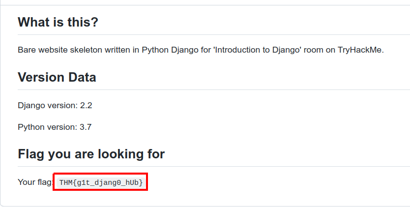
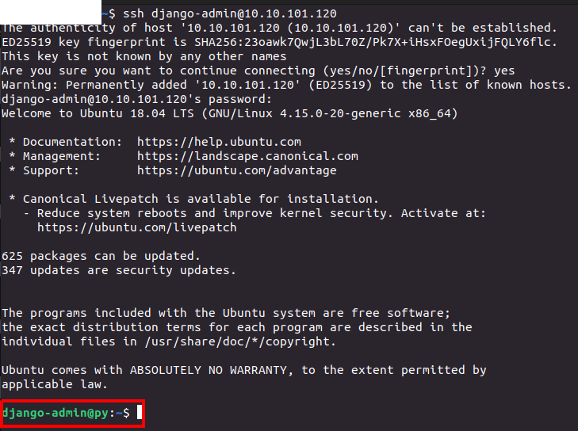
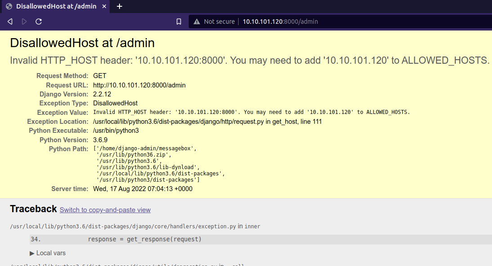
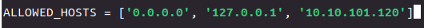
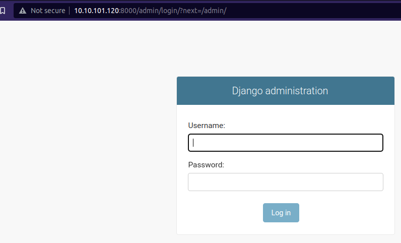
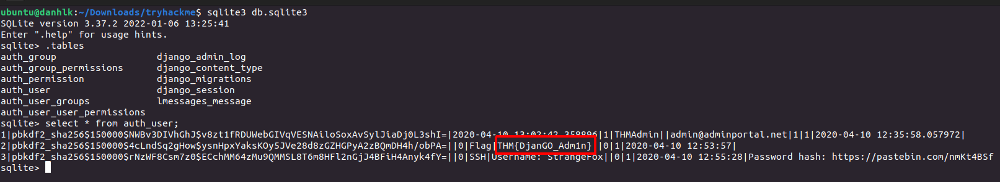
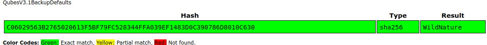
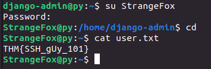
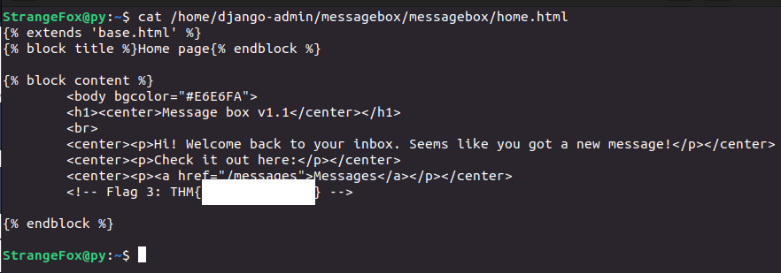

> # Introduction to Django - Tryhackme

# Summary
* [Task 2 - Unit 2 - Getting started](#task-2---unit-2---getting-started)
* [Task 3 - Unit 3 - Creating a website](#task-3---unit-3---creating-a-website)
* [Task 4 - Unit 4 - Concluding](#task-4---unit-4---concluding)
* [Task 5 - Unit 5 - CTF](#task-5---unit-5---ctf)

## Task 2 - Unit 2 - Getting started
1. How would we create an app called Forms?  
    > \> startapp 
    Startapp allows you to initialize an app for your project. Django projects can have infinite number of apps. Basic syntax: 
    python3 manage.py startapp {app_name}
    
    **Answer:** python3 manage.py startapp Forms

1. How would we run our project to a local network? 
    > Note: If you are willing to run the server to your local network, just add 0.0.0.0:8000 after runserver command. (In case if you get an error afterward, just go to settings.py located your websites folder and add this address to ALLOWED_HOSTS)
    
    **Answer:** python3 manage.py runserver 0.0.0.0:8000

## Task 3 - Unit 3 - Creating a website
No answer needed. 

## Task 4 - Unit 4 - Concluding
1. Flag from GitHub page 
    Follow atached link. 
     
    **Answer:** THM{g1t_djang0_hUb}

## Task 5 - Unit 5 - CTF
Login to the system with SSH;s credential. 
 

1. Admin panel flag? 
    When we try to navigate http://{IP}:8000/admin, it cause an error that this IP is not in ALLOWED_HOSTS. Therefor, we need to add IP's system to allowed_hosts. 
     
    Full path to settings.py is `/home/django-admin/messagebox/messagebox/settings.py`
     
    Reload http://{IP}:8000/admin. 
    Successfully load admin page.
     
    But we don't have admin's credential, when list file on messagebox application, you will see a file named `db.sqlite3`, I downloaded this file to my local machine to extract infomation. I found the admin flag. 
     
    **Answer:** THM{DjanGO_Adm1n}

1. User flag? 
    From image above, I found StrangeFox's SSH credential. But its password is hash with SHA256, use [https://crackstation.net/](https://crackstation.net/) to crack this hash then use it to login and cat the flag. 
     
     
    **Answer:** THM{SSH_gUy_101}

1. Hidden flag? 
    I discover this flag on file `home.html` in messagebox application. 
     
    **Answer:** <redacted>

