> # Investigating Windows

## Summary

### Whats the version and year of the windows machine?
Use `winver` command. 
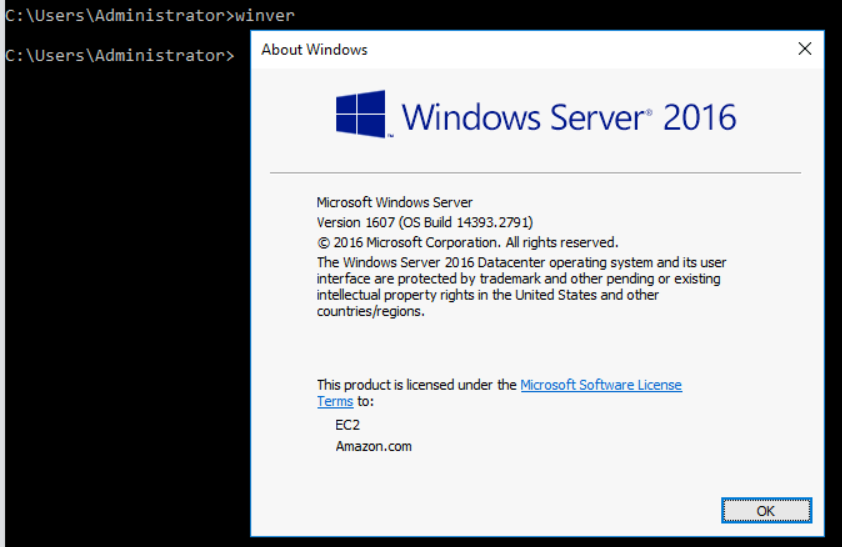 
**Answer:** WindowsServer 2016

### Which user logged in last?
Open `Event Viewer`, filter event ID 4624 and you will see the event of Administrator user. 
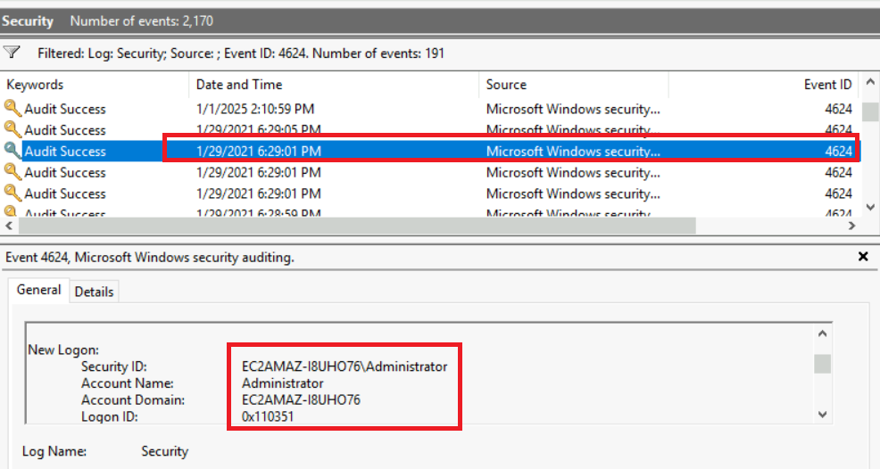 
**Answer:** Administrator

### When did John log onto the system last?
Use `net user john` and check `Last logon` information. 
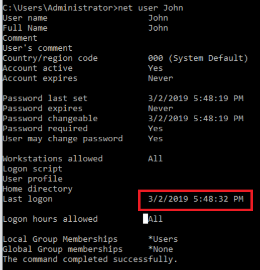 
**Answer:** 03/02/2019 5:48:32 PM

### What IP does the system connect to when it first starts?
Check the registry key `HKEY_LOCAL_MACHINE\SOFTWARE\Microsoft\Windows\CurrentVersion\Run`, you will see a key start a PE file. 
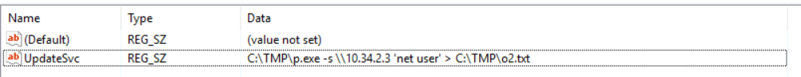 
**Answer:** 10.34.2.3

### What two accounts had administrative privileges (other than the Administrator user)?
Use `net localgroup administrators` to display all user in privilege localgroup. 
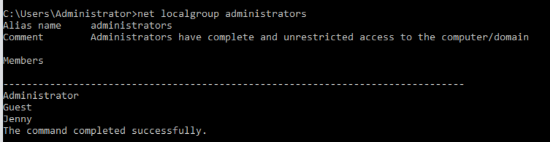 
**Answer:** Jenny, Guest

### Whats the name of the scheduled task that is malicous.
Open `Task Scheduler`, you will see the schtask that look likes malicious because it call to a netcat written by powershell. 
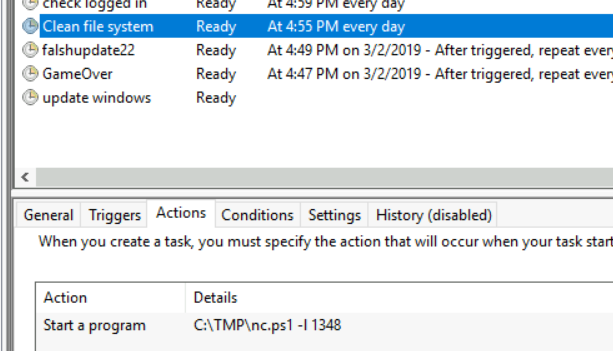 
**Answer:** check file system

### What file was the task trying to run daily?
**Answer:** nc.ps1

### What port did this file listen locally for?
**Answer:** 1348

### When did Jenny last logon?
Jenny never logins to this machine. 
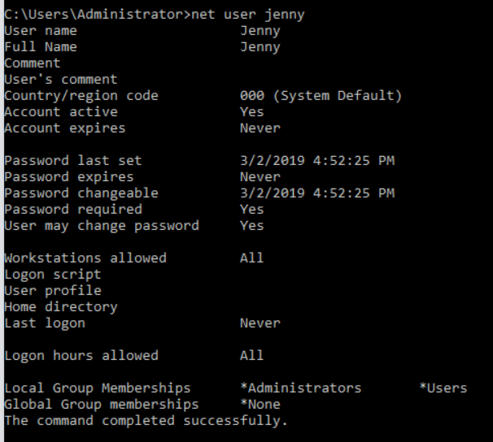 
**Answer:** never

### At what date did the compromise take place?
The path `C:\TMP` has last modified on 03/02/2019. 
**Answer:** 03/02/2019

### During the compromise, at what time did Windows first assign special privileges to a new logon?
Filter event ID 4672. 
**Answer:** 03/02/2019 4:04:49 PM

### What tool was used to get Windows passwords?
The task `GameOver` hash action look likes as mimikatz tool with argument `sekurlsa::logonpasswords`. 
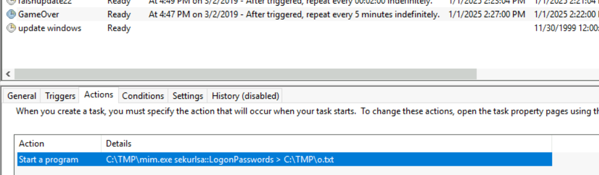 
**Answer:** mimikatz

### What was the attackers external control and command servers IP?
Check the `hosts` file, you will see the IP of `google.com` will be resolve as `76.32.97.132`. 
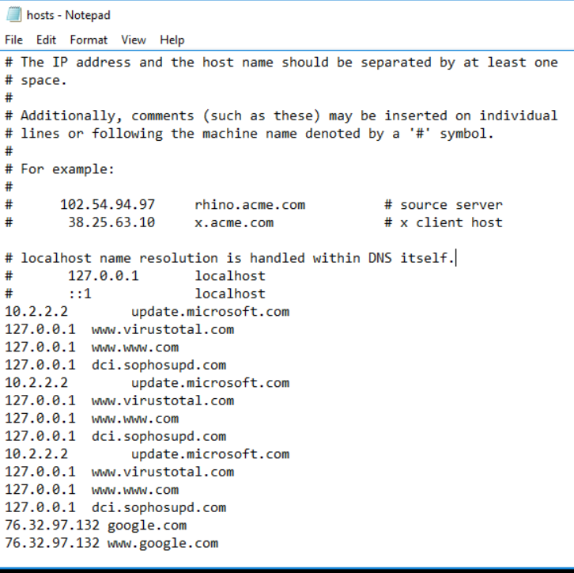 
**Answer:** 76.32.97.132

### What was the extension name of the shell uploaded via the servers website?
Navigate to `C:\inetpub\wwwroot`, there is a file named `tests.jsp` take the parameter `cmd`. 
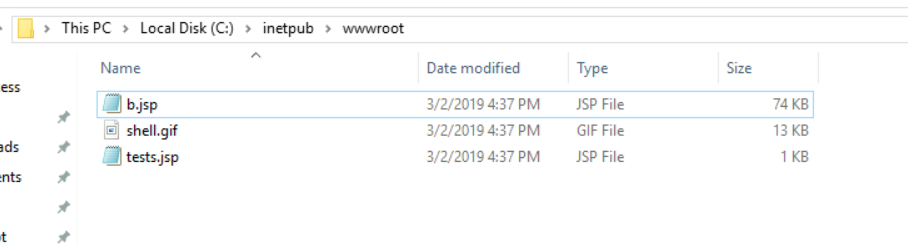 
**Answer:** .jsp

### What was the last port the attacker opened?
In Inbound rule firewall, there is a rule open a port that is not usually use in Windows. 
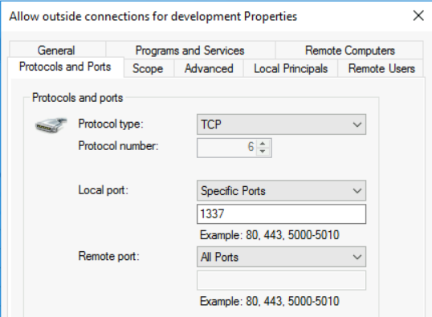 
**Answer:** 1337

### Check for DNS poisoning, what site was targeted?
From the `hosts` file, the site `google.com` was resolve with the C2 server. 
**Answer:** google.com
