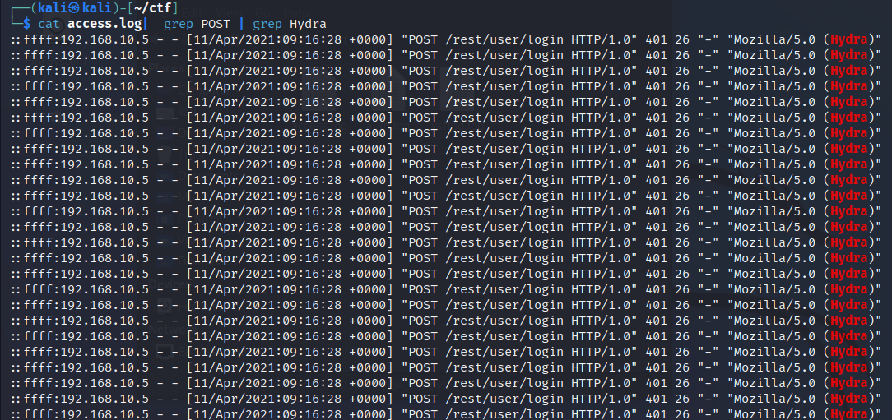
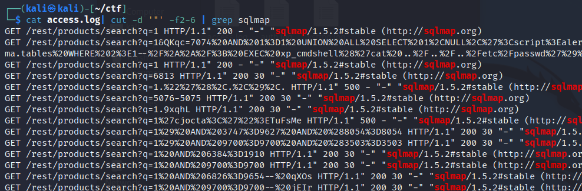
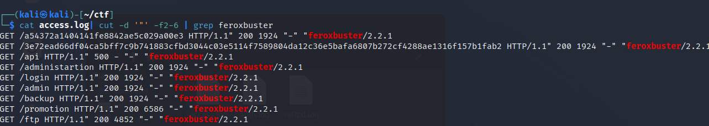
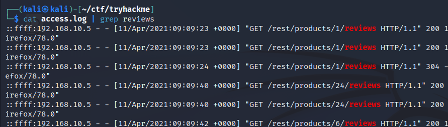
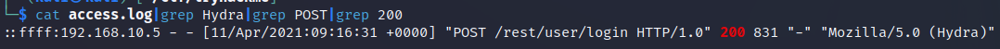
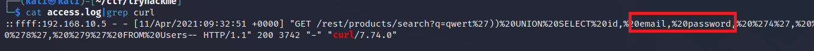
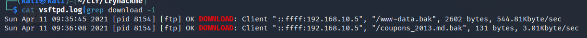
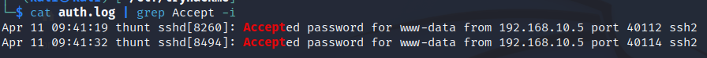

> # Juicy Details

# Summary

## Task 1 - Introduction
1. Are you ready?<br>
    **Answer:** I am ready!

## Task 2  Reconnaissance
1. What tools did the attacker use? (Order by the occurrence in the log)<br>
    Use `cut` and `uniq` command.<br>
    ```
    $ cat access.log| cut -d '"' -f6 | uniq   
    -
    Mozilla/5.0 (compatible; Nmap Scripting Engine; https://nmap.org/book/nse.html)
    Mozilla/5.0 (X11; Linux x86_64; rv:78.0) Gecko/20100101 Firefox/78.0
    Mozilla/5.0 (Hydra)
    Mozilla/5.0 (X11; Linux x86_64; rv:78.0) Gecko/20100101 Firefox/78.0
    sqlmap/1.5.2#stable (http://sqlmap.org)
    Mozilla/5.0 (X11; Linux x86_64; rv:78.0) Gecko/20100101 Firefox/78.0
    curl/7.74.0
    feroxbuster/2.2.1
    Mozilla/5.0 (X11; Linux x86_64; rv:78.0) Gecko/20100101 Firefox/78.0

    Mozilla/5.0 (X11; Linux x86_64; rv:78.0) Gecko/20100101 Firefox/78.0
    ```
    **Answer:** nmap, hydra, sqlmap, curl, feroxbuster

1. What endpoint was vulnerable to a brute-force attack?<br>
    `Hydra` is a tool often use for bruteforce attack and POST is the method use for this attack. Filter in `access.log` with `grep` command.<br>
    <br>
    **Answer:** /rest/user/login

1. What endpoint was vulnerable to SQL injection?<br>
    `sqlmap` is a tool use for finding SQLi vulnerable in web application.
    <br>
    **Answer:** /rest/products/search

1. What parameter was used for the SQL injection?<br>
    **Answer:** q

1. What endpoint did the attacker try to use to retrieve files? (Include the /)<br>
    Filter `feroxbuster`.<br>
    <br>
    **Answer:** /ftp

## Task 3 - Stolen data
1. What section of the website did the attacker use to scrape user email addresses?<br>
    Attacker scrape user emails in products reviews.<br>
    <br>
    **Answer:** products reviews

1. Was their brute-force attack successful? If so, what is the timestamp of the successful login? (Yay/Nay, 11/Apr/2021:09:xx:xx +0000)<br>
    Read in access.log, filter `Hydra`, POST method and status 200.<br>
    <br>
    **Answer:** yay, 11/Apr/2021:09:16:31 +0000

1. What user information was the attacker able to retrieve from the endpoint vulnerable to SQL injection?<br>
    After identify SQLi with sqlmap, attacker use `curl` to retrive information from the endpoint.<br>
    <br>
    **Answer:** email, password

1. What files did they try to download from the vulnerable endpoint? (endpoint from the previous task, question #5)<br>
    Check in ftp log, filter `download` keyword.<br>
    <br>
    **Answer:** coupons_2013.md.bak, www-data.bak

1. What service and account name were used to retrieve files from the previous question? (service, username)<br>
    Add option `-B` to grep command, anon is the alias of `Anonymous` user and the service is `ftp`.<br>
    <br>
    **Answer:** ftp, Anonymous

1. What service and username were used to gain shell access to the server? (service, username)<br>
    Check in `auth.log`, filter `Accept` string.<br>
    <br>
    **Answer:** ssh, www-data