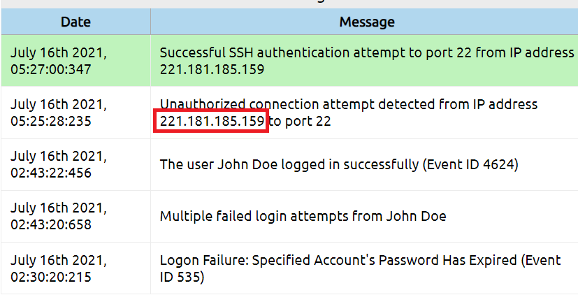
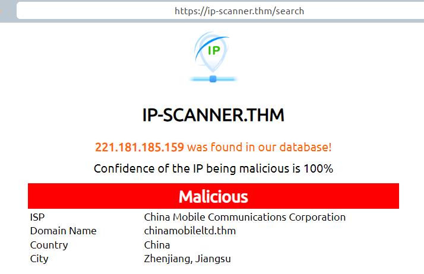
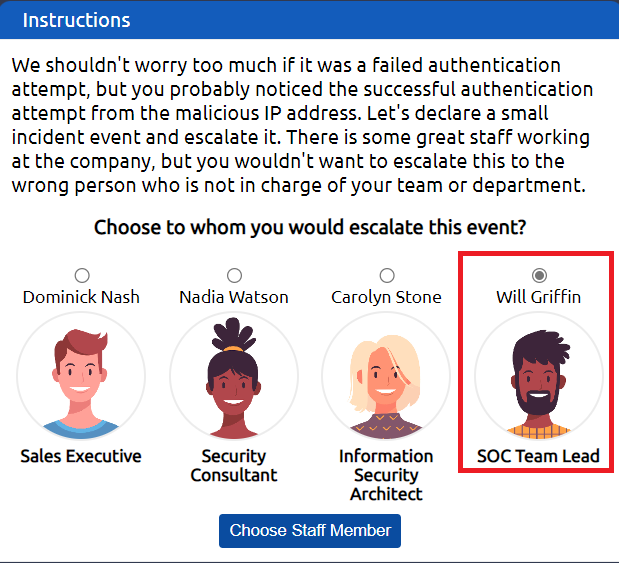
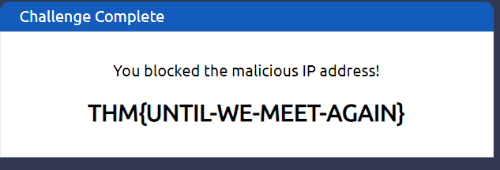

> # Junior Security Analyst Intro

## Task 1 - A career as a Junior (Associate) Security Analyst
1. What will be your role as a Junior Security Analyst? 
    > In the Junior Security Analyst role, you will be a Triage Specialist.

    **Answer:** Triage Specialist

## Task 3 - A day In the life of a Junior (Associate) Security Analyst
1. What was the malicious IP address in the alerts? 
     
    **Answer:** 221.181.185.159

1. To whom did you escalate the event associated with the malicious IP address? 
    > There are many open-source databases out there like AbuseIPDB, Cisco Talos Intelligence
    Select the red alert, paste the IP from previous question to scan. 
     
    SOC Ream Lead who we escalte the event associated with the malicious IP address. 
     
    **Answer:** Will Griffin

1. After blocking the malicious IP address on the firewall, what message did the malicious actor leave for you? 
    Paste the above IP to block it. 
     
    **Answer:** THM{UNTIL-WE-MEET-AGAIN}
