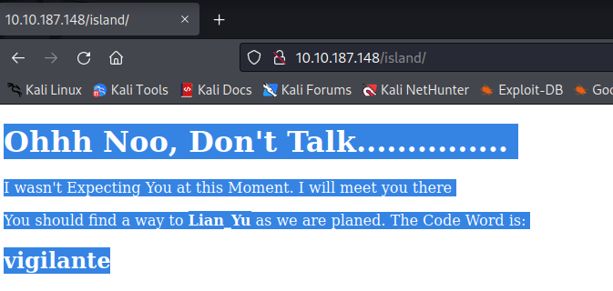
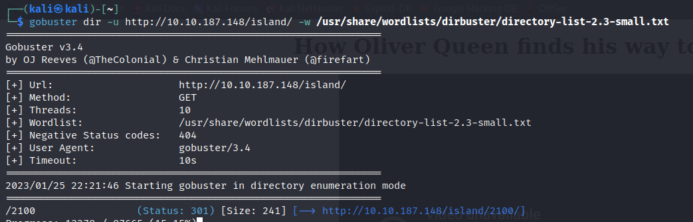
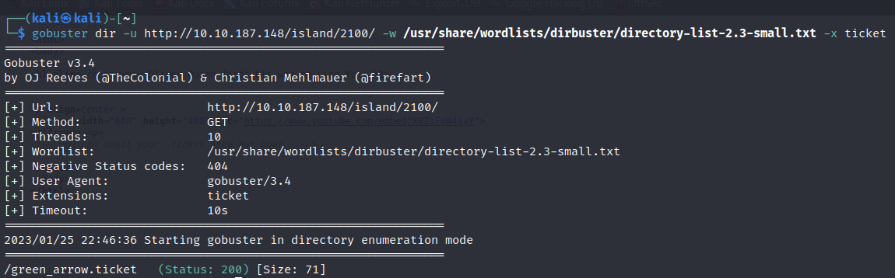
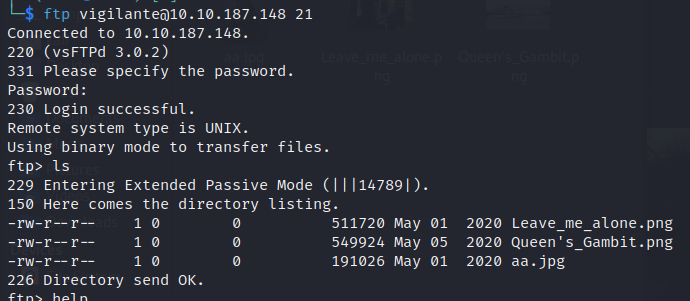
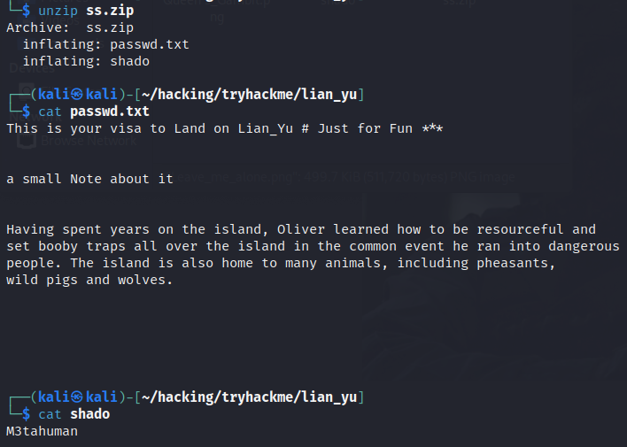
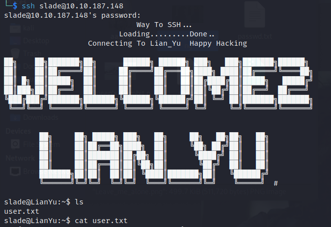
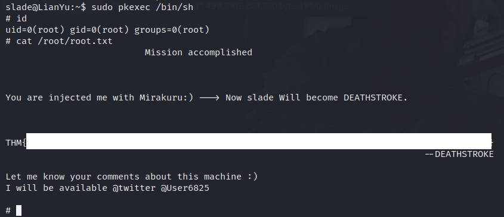

> # Lian_Yu

# Summary
<!-- TOC -->

- [Summary](#summary)
    - [What is the Web Directory you found?](#what-is-the-web-directory-you-found)
    - [what is the file name you found?](#what-is-the-file-name-you-found)
    - [what is the FTP Password?](#what-is-the-ftp-password)
    - [what is the file name with SSH password?](#what-is-the-file-name-with-ssh-password)
    - [user.txt](#usertxt)
    - [root.txt](#roottxt)

<!-- /TOC -->

## What is the Web Directory you found?
I scan the target's Web directory and found a folder call `island` but this is not the answer and in this page I found a string `vigilante` may be a username or password which is invisible.<br>
<br>
I continued scan subfolder of `island` with `gobuster` and `small_directory_list` in kali and found a directory `2100`.
<br>
**Answer:** 2100

## what is the file name you found?
In source page of http://<IP>/island/2100, there is comment with extension `.ticket` but missing filename, I use `gobuster` to search a filename with `.ticket` extension.<br>
<br>
**Answer:** green_arrow.ticket

## what is the FTP Password?
Get the content of this ticket, it shows a string look like base64 but it was wrong, I tried with base58 and successfully decoded to original string seem like a password.<br>
```
echo -n RTy8yhBQdscX | base58 -d
!#th3h00d
```
**Answer:** !#th3h00d

## what is the file name with SSH password?
Login into FTP with username:password is vigilante:!#th3h00d, list current directory you will receive 3 images but `Leave_me_alone.png` has corrupted header, follow this [link](https://en.wikipedia.org/wiki/List_of_file_signatures) to repair the file<br>
<br>
After repaired, you will receive a string `password` for something.<br>
<br>
I tried investigating the others images to find something use the above password.<br>
Use `steghide` to extract data in aa.jpg with `password`, it returns a zip file named `ss.zip`. After extracting, you receive two files `passwd.txt` and `shado`. The `shado` file contains the SSH password.<br>
<br>
**Answer:** shado

## user.txt
Login into SSH with cred slade:M3tahuman (the other use in `/home`) then read the user flag.<br>
<br>
<!-- THM{P30P7E_K33P_53CRET5__C0MPUT3R5_D0N'T} -->
**Answer:** THM{\<redacted>}

## root.txt
List command which slade could run as root without knowning the password
```
sudo -l
[sudo] password for slade: 
Matching Defaults entries for slade on LianYu:
    env_reset, mail_badpass, secure_path=/usr/local/sbin\:/usr/local/bin\:/usr/sbin\:/usr/bin\:/sbin\:/bin

User slade may run the following commands on LianYu:
    (root) PASSWD: /usr/bin/pkexec
```
From [GTFObin](https://gtfobins.github.io/gtfobins/pkexec/), we successfully become root user and read the root flag.<br>
<br>
<!-- THM{MY_W0RD_I5_MY_B0ND_IF_I_ACC3PT_YOUR_CONTRACT_THEN_IT_WILL_BE_COMPL3TED_OR_I'LL_BE_D34D} -->
**Answer:** THM{\<redacted>}
