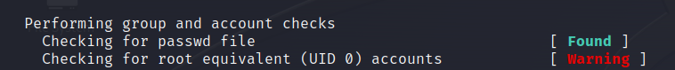

> # Linux File System Analysis

# Summary
- [Summary](#summary)
  - [Task 2 - Investigation Setup](#task-2---investigation-setup)
  - [Task 3 - Files, Permissions, and Timestamps](#task-3---files-permissions-and-timestamps)
  - [Task 4 - Users and Groups](#task-4---users-and-groups)
  - [Task 5 - User Directories and Files](#task-5---user-directories-and-files)
  - [Task 6 - Binaries and Executables](#task-6---binaries-and-executables)
  - [Task 7 - Rootkits](#task-7---rootkits)


##  Task 2 - Investigation Setup
1. After updating the PATH and LD_LIBRARY_PATH environment variables, run the command check-env. What is the flag that is returned in the output?<br>
    ```shell
    $ export PATH=/mnt/usb/bin:/mnt/usb/sbin
    $ export LD_LIBRARY_PATH=/mnt/usb/lib:/mnt/usb/lib64
    $ check-env 
    THM{5514ec4f1ce82f63867806d3cd95dbd8}
    ```
    **Answer:** THM{5514ec4f1ce82f63867806d3cd95dbd8}

##  Task 3 - Files, Permissions, and Timestamps
1. To practice your skills with the find command, locate all the files that the user bob created in the past 1 minute. Once found, review its contents. What is the flag you receive?<br>
    Use command `find / -type f -user bob -mmin 1` to solve this task. You see a file in `/var/tmp/`.<br>
    **Answer:** THM{0b1313afd2136ca0faafb2daa2b430f3}

1. Extract the metadata from the reverse.elf file. What is the file's MIME type?<br>
    Use `exiftool` to extract MIME type of `/var/www/html/assets/reverse.elf`.<br>
    **Answer:** application/octet-stream

1. Run the stat command against the /etc/hosts file on the compromised web server. What is the full Modify Timestamp (mtime) value?<br>
    **Answer:** 2020-10-26 21:10:44.000000000 +0000

##  Task 4 - Users and Groups
1. Investigate the user accounts on the system. What is the name of the backdoor account that the attacker created?<br>
    Get all user with UID = 0 in `/etc/passww`,
    ```shell
    $ cut -d: -f1,3 /etc/passwd | grep ":0"
    root:0
    b4ckd00r3d:
    ```
    **Answer:** b4ckd00r3d

1. What is the name of the group with the group ID of 46?<br>
    Find in `/etc/group`.<br>
    ```shell
    $ cut -d: -f1,3 /etc/group | grep ":46"
    plugdev:46
    ```
    **Answer:** plugdev

1. View the /etc/sudoers file on the compromised system. What is the full path of the binary that Jane can run as sudo?<br>
    **Answer:** /usr/bin/pstree

##  Task 5 - User Directories and Files
1. View Jane's .bash_history file. What flag do you see in the output?<br>
    Just read this file with `sudo`.<br>
    **Answer:** THM{f38279ab9c6af1215815e5f7bbad891b}

1. What is the hidden flag in Bob's home directory?<br>
    Use `grep` to find string `THM{` in bob's home directory.<br>
    ```shell
    $ grep -rl "THM{" /home/bob/
    /home/bob/.hidden34
    grep: /home/bob/.cache: Permission denied
    grep: /home/bob/.local/share: Permission denied
    ```
    **Answer:** THM{6ed90e00e4fb7945bead8cd59e9fcd7f}

1. Run the stat command on Jane's authorized_keys file. What is the full timestamp of the most recent modification?<br>
    **Answer:** 2024-02-13 00:34:16.005897449 +0000

##  Task 6 - Binaries and Executables
1. Run the debsums utility on the compromised host to check only configuration files. Which file came back as altered?<br>
    Run `debsums` command.<br>
    ```
    $ sudo debsums -s -e
    debsums: changed file /etc/sudoers (from sudo package)
    ```
    **Answer:** /etc/sudoers

1. What is the md5sum of the binary that the attacker created to escalate privileges to root?<br>
    In jane's history command, the attacker copy the original bash to `/var/tmp/bash` and setup to run with root user.<br>
    **Answer:** 7063c3930affe123baecd3b340f1ad2c

##  Task 7 - Rootkits
1. Run chkrootkit on the affected system. What is the full path of the .sh file that was detected?<br>
    Run chkrootkit, this tool will display full path of rootkit.<br>
    ```
    Searching for Mumblehard Linux ...                          * * * * * /var/tmp/findme.sh
    ```
    **Answer:** /var/tmp/findme.sh

1. Run rkhunter on the affected system. What is the result of the (UID 0) accounts check?<br>
    Run `rkhunter` and observe the result.<br>
    <br>
    **Answer:** Warning
