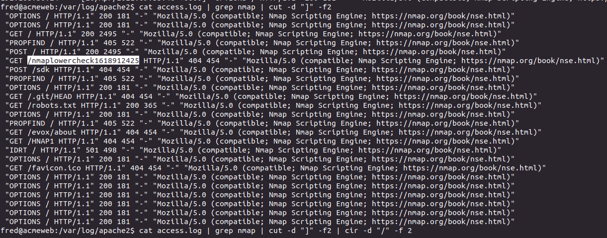
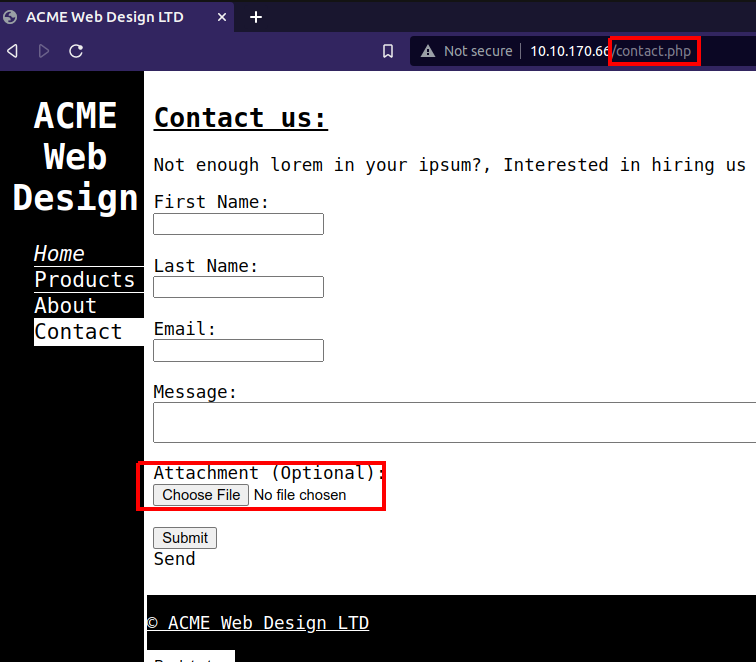
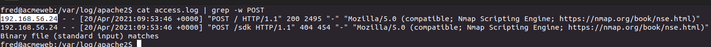
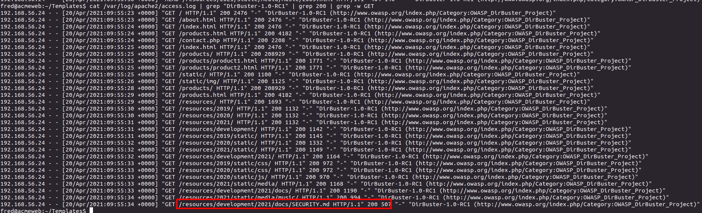
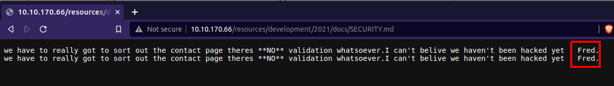
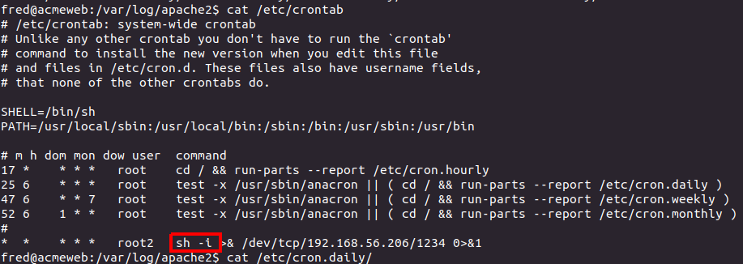
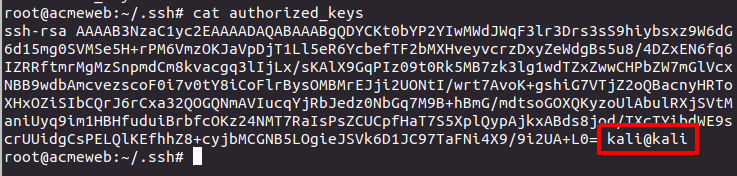
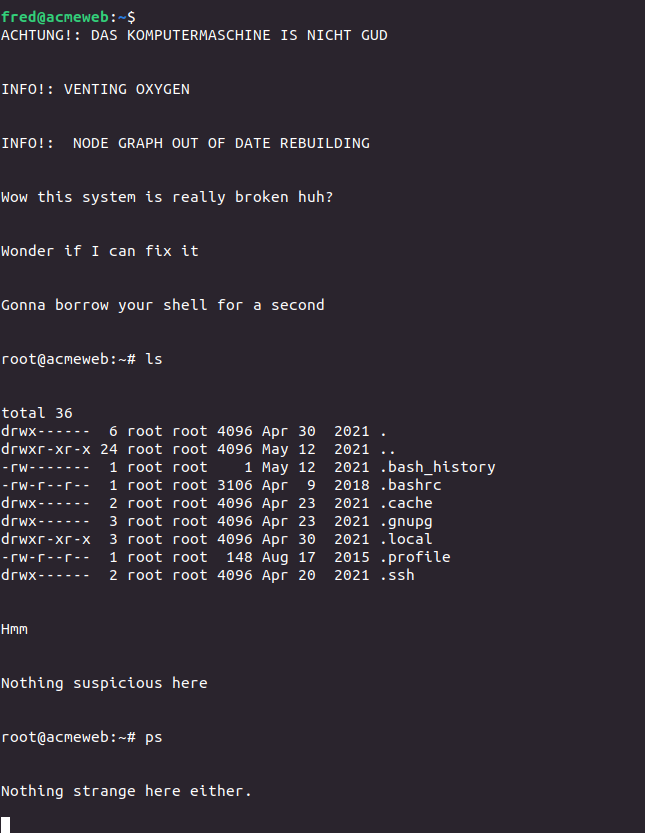
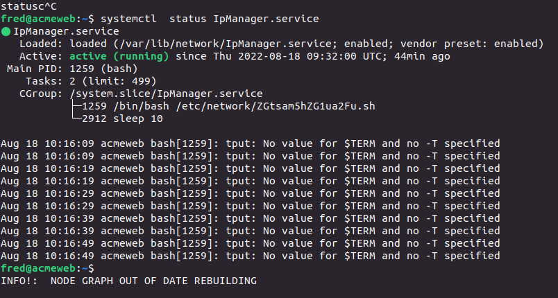
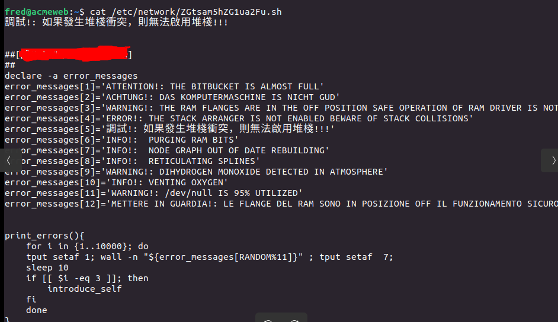

> # Linux Server Forensics - Tryhackme

# Summary
* [Task 2 - Apache Log Analysis I](#task-2---apache-log-analysis-i)
* [Task 3 - Web Server Analysis](#task-3---web-server-analysis)
* [Task 4 - Persistence Mechanisms I](#task-4---persistence-mechanisms-i)
* [Task 5 - User Accounts](#task-5---user-accounts)
* [Task 7 - Apache Log Analysis II](#task-7---apache-log-analysis-ii)
* [Task 8 - Persistence Mechanisms II](#task-8---persistence-mechanisms-ii)
* [Task 9 - Program Execution History](#task-9---program-execution-history)
* [Task 11 - Persistence Mechanisms III](#task-11---persistence-mechanisms-iii)

## Task 2 - Apache Log Analysis I
1. How many different tools made requests to the server?<br>
    To find different tools made request to the server, we will find them on User-Agent field in `access.log`<br
    Use `cut, sort and uniq` to filter User-Agent field.<br>
    ```
    $ cat access.log | cut -d " " -f 12 | sort | uniq

    "-"
    "Apache/2.4.29
    "DirBuster-1.0-RC1
    "Mozilla/5.0
    "curl/7.74.0"
    ```
    In the above result, we found two tools are `curl` and `dirbuster`.<br>
    **Answer:** 4

1. Name a path requested by Nmap.<br>
    Read `access.log` then grep `nmap` you will see a strange link.<br>
    <br>
    **Answer:** /nmaplowercheck1618912425

## Task 3 - Web Server Analysis
1. What page allows users to upload files?<br>
    Navigate to http://{IP}/contact.php, you will see a form allow user upload their file.<br>
    <br>
    **Answer:** contact.php

1. What IP uploaded files to the server?<br>
    When a user upload files to server, it will send a POST request to the server. Therefore, cat `access.log` then grep `POST` method.<br>
    <br>
    **Answer:** 192.168.56.24

1. Who left an exposed security notice on the server?<br>
    Still on `access.log` file grep `DirBuster-1.0-RC1` with status code 200 and `GET` method. You will see it found a link to SECURITY.md<br>
    <br>
    Navigate to this URI on browser, you will see a notice of Fred.<br>
    <br>
    **Answer:** Fred

## Task 4 - Persistence Mechanisms I
1. What command and option did the attacker use to establish a backdoor?<br>
    Based on hint of this question, I checked cronjob first with command `cat /etc/crontab` and found a command send reverse shell to 192.168.56.206<br>
    <br>
    **Answer:** sh -i

## Task 5 - User Accounts
1. What is the password of the second root account?<br>
    In /etc/shadow, I found a line `root2:WVLY0mgH0RtUI:0:0:root:/root:/bin/bash`, but in /etc/shadow I dont see root2 account. When I paste `WVLY0mgH0RtUI` on Google, I found this [link](https://materials.rangeforce.com/tutorial/2019/11/07/Linux-PrivEsc-SUID-Bit/) guide how to privilege escalation using SUID and the plain text of `WVLY0mgH0RtUI` is `mrcake`.<br>
    **Answer:** mrcake

## Task 7 - Apache Log Analysis II
1. Name one of the non-standard HTTP Requests.<br>
    Change to `/var/log/apache2/` to read `access.log` and filter method field.<br>
    ```
    $ cat access.log | cut -d " " -f6 | sort | uniq
    "GET
    "GXWR
    "OPTIONS
    "POST
    "\x16\x03"
    ```
    **Answer:** GXWR

2. At what time was the Nmap scan performed? (format: HH:MM:SS)<br>
    > Nmap will send HTTP requests with a random non-standard method when performing certain enumeration tasks.

    Filter request using GXWR method.<br>
    <br>
    **Answer:** 13:30:15

## Task 8 - Persistence Mechanisms II
1. What username and hostname combination can be found in one of the authorized_keys files? (format: username@hostname)<br>
    Read file `authorized_keys`, we will see the answer.<br>
    <br>
    **Answer:** kali@kali

## Task 9 - Program Execution History
1. What is the first command present in root's bash_history file?<br>
    Read `.bash_history`.<br>
    ```
    root@acmeweb:~# cat .bash_history | head
    nano /etc/passwd
    exit
    ```
    **Answer:** nano /etc/passwd

## Task 11 - Persistence Mechanisms III
1. Figure out what's going on and find the flag.<br>
    First, we will find suspicious service runnig on system.<br>
    When SSH to system, it display some text.<br>
    <br>
    List all running servcies on system. You will service named `IpManager.service` look like strange. See information about it, we will see it use file int `/etc/network/` folder.<br>
    <br>
    Read content of this file, you will see a comment on it.<br>
    <br>
    **Answer:** <redacted>
