> # MAL: Malware Introductory

# Summary
* [Summary](#summary)
   * [Task 2 - Understanding Malware Campaigns](#task-2---understanding-malware-campaigns)
   * [Task 3 - Identifying if a Malware Attack has Happened](#task-3---identifying-if-a-malware-attack-has-happened)
   * [Task 4 - Static Vs. Dynamic Analysis](#task-4---static-vs-dynamic-analysis)
   * [Task 5 - Discussion of Provided Tools &amp; Their Uses](#task-5---discussion-of-provided-tools--their-uses)
   * [Task 6 - Connecting to the Windows Analysis Environment (Deploy)](#task-6---connecting-to-the-windows-analysis-environment-deploy)
   * [Task 7 - Obtaining MD5 Checksums of Provided Files](#task-7---obtaining-md5-checksums-of-provided-files)
   * [Task 8 - Now lets see if the MD5 Checksums have been analysed before](#task-8---now-lets-see-if-the-md5-checksums-have-been-analysed-before)
   * [Task 9 - Identifying if the Executables are obfuscated / packed](#task-9---identifying-if-the-executables-are-obfuscated--packed)
   * [Task 10 - What is Obfuscation / Packing?](#task-10---what-is-obfuscation--packing)
   * [Task 11 - Visualising the Differences Between Packed &amp; Non-Packed Code ](#task-11---visualising-the-differences-between-packed--non-packed-code)
   * [Task 12 - Introduction to Strings](#task-12---introduction-to-strings)
   * [Task 13 - Introduction to Imports](#task-13---introduction-to-imports)
   * [Task 14 - Practical Summary](#task-14---practical-summary)
   
## Task 2 - Understanding Malware Campaigns
1. What is the famous example of a targeted attack-esque Malware that targeted Iran? 
    Paste entire the question to Google, we'll receive the result. 
    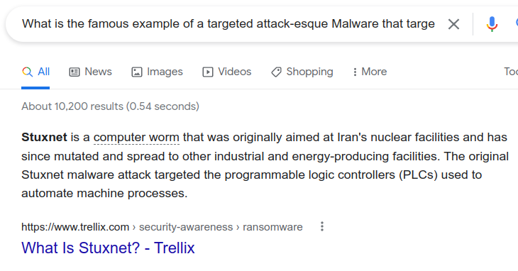 
    **Answer:** Stuxnet

1. What is the name of the Ransomware that used the Eternalblue exploit in a "Mass Campaign" attack? 
    Similar to previous question. 
    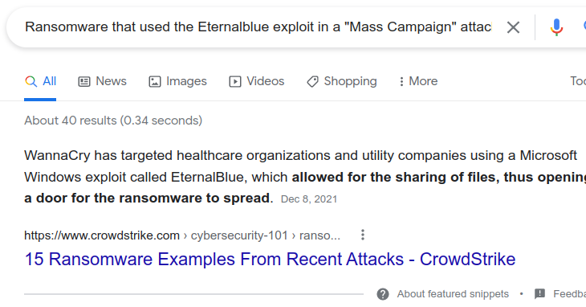 
    **Answer:** WannaCry

## Task 3 - Identifying if a Malware Attack has Happened

Steps of Malware attack: 
- Delivery
- Execution
- Maintaining Persistence
- Persistence
- Propagation

1. Name the first essential step of a Malware Attack? 
    **Answer:** Delivery

1. Now name the second essential step of a Malware Attack? 
    **Answer:** Execution

1. What type of signature is used to classify remnants of infection on a host? 
    **Answer:** Host-Based Signatures

1. What is the name of the other classification of signature used after a Malware attack? 
    **Answer:** Network-Based Signatures

## Task 4 - Static Vs. Dynamic Analysis
    No answer needed.

## Task 5 - Discussion of Provided Tools & Their Uses
    No answer needed.

## Task 6 - Connecting to the Windows Analysis Environment (Deploy)
    No answer needed.

## Task 7 - Obtaining MD5 Checksums of Provided Files
1. The MD5 Checksum of aws.exe  
    **Answer:** D2778164EF643BA8F44CC202EC7EF157

1. The MD5 Checksum of Netlogo.exe 
    **Answer:** 59CB421172A89E1E16C11A428326952C

1. The MD5 Checksum of vlc.exe 
    **Answer:** 5416BE1B8B04B1681CB39CF0E2CAAD9F

## Task 8 - Now lets see if the MD5 Checksums have been analysed before
1. Does Virustotal report this MD5 Checksum / file aws.exe as malicious? (Yay/Nay) 
    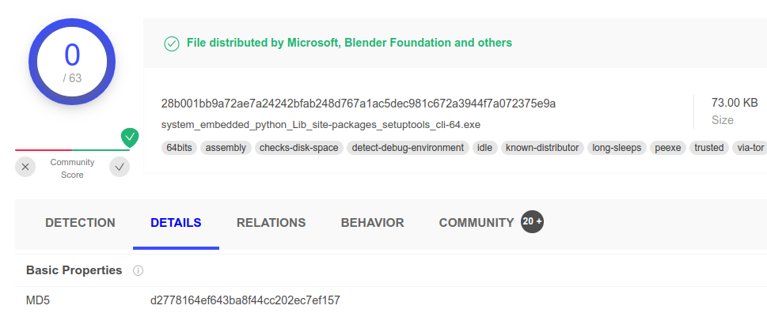 
    **Answer:** NAY

1. Does Virustotal report this MD5 Checksum / file Netlogo.exe as malicious? (Yay/Nay) 
    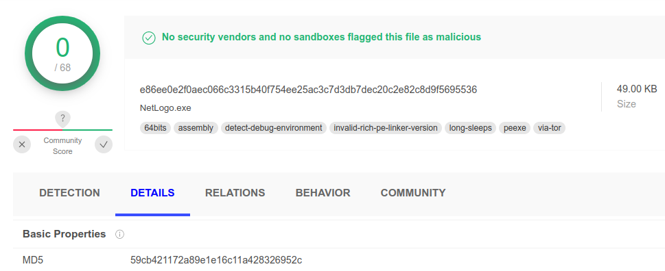 
    **Answer:** NAY

1. Does Virustotal report this MD5 Checksum / file vlc.exe as malicious? (Yay/Nay) 
    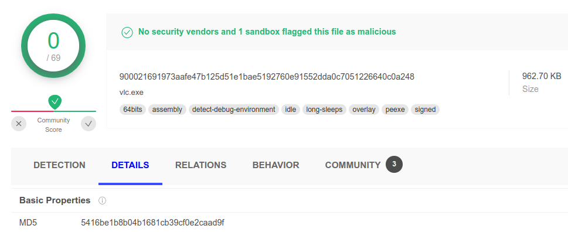 
    **Answer:** NAY

## Task 9 - Identifying if the Executables are obfuscated / packed
1. What does PeID propose 1DE9176AD682FF.dll being packed with? 
    **Answer:** Microsoft Visual C++ 6.0 DLL

1. What does PeID propose AD29AA1B.bin being packed with? 
    **Answer:** Microsoft Visual C++ 6.0

## Task 10 - What is Obfuscation / Packing?
1. What packer does PeID report file "6F431F46547DB2628" to be packed with? 
    **Answer:** FSG 1.0 -> dulek/xt

## Task 11 - Visualising the Differences Between Packed & Non-Packed Code 
    No answer needed.

## Task 12 - Introduction to Strings
1. What is the URL that is outputted after using "strings" 
    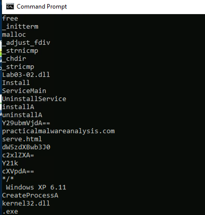 
    **Answer:** practicalmalwareanalysis.com

1. How many unique "Imports" are there? 
    **Answer:** 5

## Task 13 - Introduction to Imports
1. How many references are there to the library "msi" in the "Imports" tab of IDA Freeware for "install.exe" 
    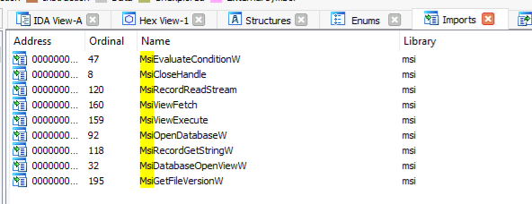 

## Task 14 - Practical Summary
1. What is the MD5 Checksum of the file? 
    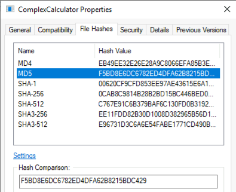 
    **Answer:** F5BD8E6DC6782ED4DFA62B8215BDC429

1. Does Virustotal report this file as malicious? (Yay/Nay) 
    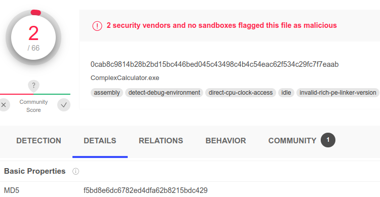 
    **Answer:** Yay

1. What is the last string outputted? 
    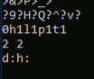 
    **Answer:** d:h:

1. What is the output of PeID when trying to detect what packer is used by the file? 
    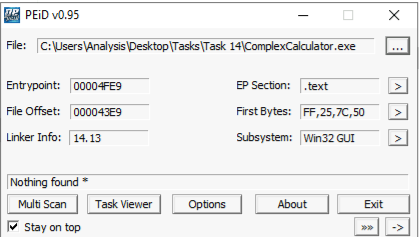 
    **Answer:** Nothing found.
