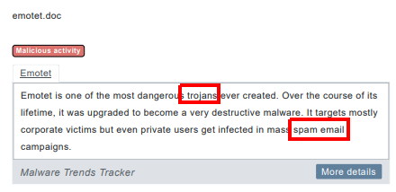
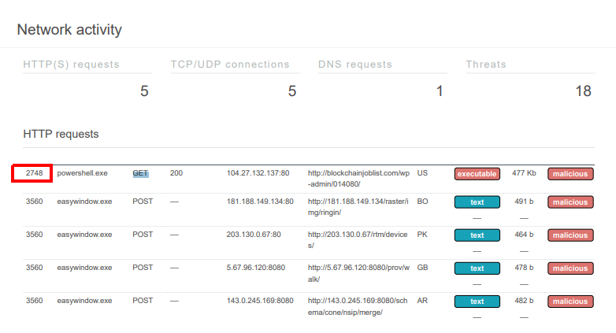
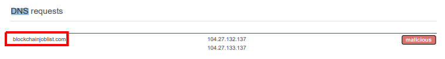
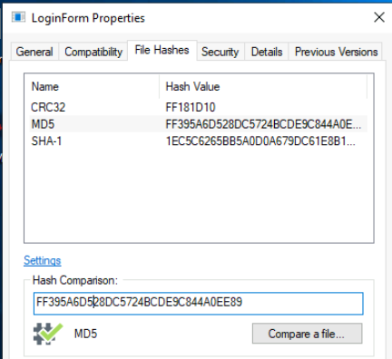
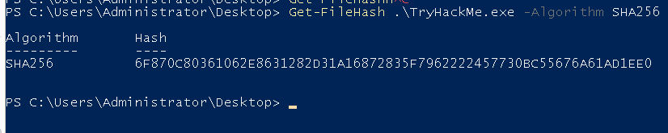
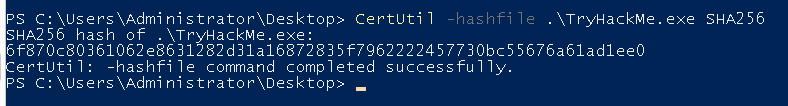
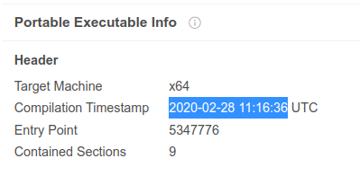
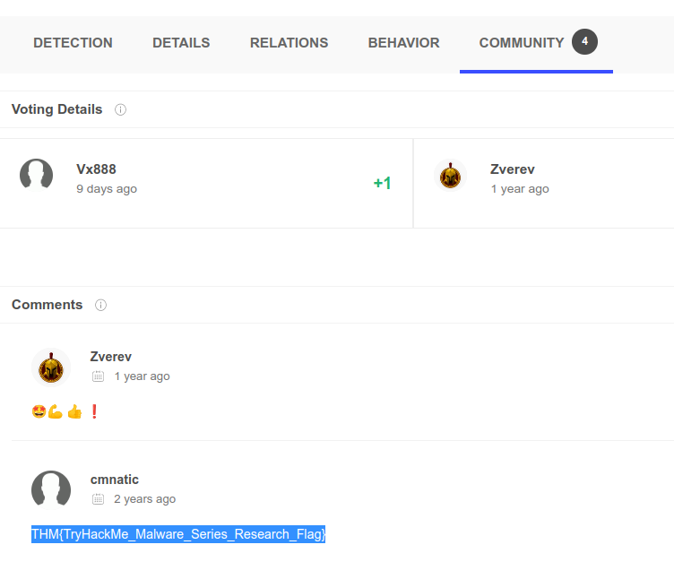

> # MAL: Researching - Tryhackme

# Summary
* [Task 3 - Checksums 101](#task-3---checksums-101)
* [Task 4 - Online Sandboxing](#task-4---online-sandboxing)
* [Task 5 - Practical: Calculating &amp; Reporting Checksums](#task-5---practical-calculating--reporting-checksums)
* [Task 6 - VirusTotal](#task-6---virustotal)
* [Task 7 - Future Reading (References)](#task-7---future-reading-references)

## Task 3 - Checksums 101
1. Name the term for an individual piece of binary 
    > Ultimately, the markup of data on a computer system is binary, merely ones and zeros where each value is a "bit".

    **Answer:** bit

1. What are checksums also known as? 
    > These checksums are also commonly referred to as "hashes".

    **Answer:** hashes

1. Name the algorithm that is next in the series after SHA-256 
    > In the real-world, some popular algorithms are SHA1, SHA-256 and in some cases, SHA-512, 

    **Answer:** SHA-512

1. According to this task, how long will you need to hash 6 million files before a MD5 hash collision occurs? 
    > the hashing algorithm MD5 which is a famous recent example will need 6 billion files to be hashed per second - for 100 years on average

    **Answer:** 100 years

1. Who developed the MD5 algorithm? 
    Search on Google. 
    **Answer:** Ronald Rivest

## Task 4 - Online Sandboxing
1. Name the key term for the type of malware that Emotet is classified as 
     
    **Answer:** trojan

1. Research time! What type of emails does Emotet use as its payload? 
    From the image above. 
    **Answer:** spam email

1. Begin analysing the report, what is the timestamp of when the analysis was made? 
    Based on analysis date field. 
    **Answer:** 9/16/2019, 13:54:48

1. Name the file that is detected as a "Network Trojan" 
    Search string `network trojan`, you will see the answer. 
    **Answer:** easywindow.exe

1. What is the PID of the first HTTP GET request? 
    In network activity. 
     
    **Answer:** 2748

1. What is the only DNS request that is made after the sample is executed? 
    In DNS requests panel. 
     
    **Answer:** blockchainjoblist.com

## Task 5 - Practical: Calculating & Reporting Checksums
1. Using the HashTab tool, what is the MD5 checksum for "LoginForm.exe"? 
     
    **Answer:** FF395A6D528DC5724BCDE9C844A0EE89
1. Using Get-FileHash in Powershell, retrieve the SHA256 of "TryHackMe.exe"
     
    **Answer:** 6F870C80361062E8631282D31A16872835F7962222457730BC55676A61AD1EE0

1. What would be the syntax to retrieve the SHA256 checksum of "TryHackMe.exe" using CertUtil in Powershell? 
     
    **Answer:** CertUtil -hashfile .\TryHackMe.exe SHA256

## Task 6 - VirusTotal
1. Navigate to the "Details" tab, what is the other filename and extension reported as present? 
    In Names panel. 
     
    **Answer:** HxD.exe

1. In the same "Details" tab, what is the reported compilation timestamp? 
    In Portable Executable Info. 
     
    **Answer:** 2020-02-28 11:16:36

1. What is the THM{} formatted flag on the report? 
    In Comminity tab, you will see a comment with the THM flag. 
     
    **Answer:** THM{TryHackMe_Malware_Series_Research_Flag}

## Task 7 - Future Reading (References)

Cryptography and Checksums: 
[A Meaningful MD5 Hash Collision Attack](https://scholarworks.sjsu.edu/cgi/viewcontent.cgi?referer=https://www.google.com/&httpsredir=1&article=1020&context=etd_projects) - (Narayana D. Kashyap., 2008) 
[Cryptography & Network Security](https://dl.acm.org/doi/book/10.5555/1209579) - (Behrouz A. Forozuan., 2007) 
[The first collision for full SHA-1](https://shattered.io/static/shattered.pdf) - (Stevens et al., 2017) / (Shattered.io) 

Blog (Selfless Promo)

[So you want to analyse malware?](https://blog.cmnatic.co.uk/posts/so-you-want-to-analyse-malware/ )

Sandboxing Engines:

[any.run](https://any.run/)

[hybrid-analysis](https://hybrid-analysis.com/)

