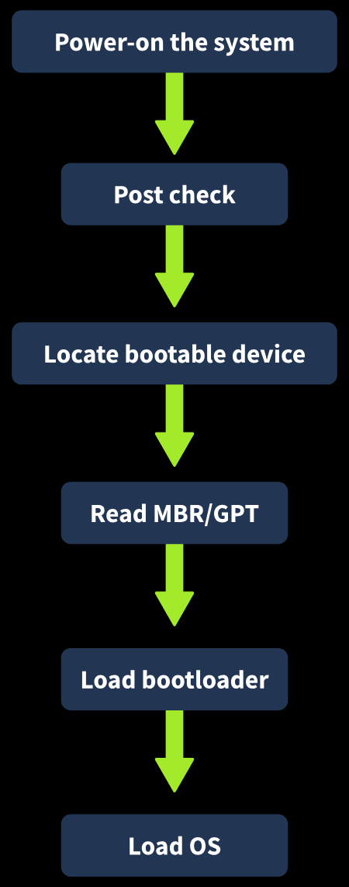
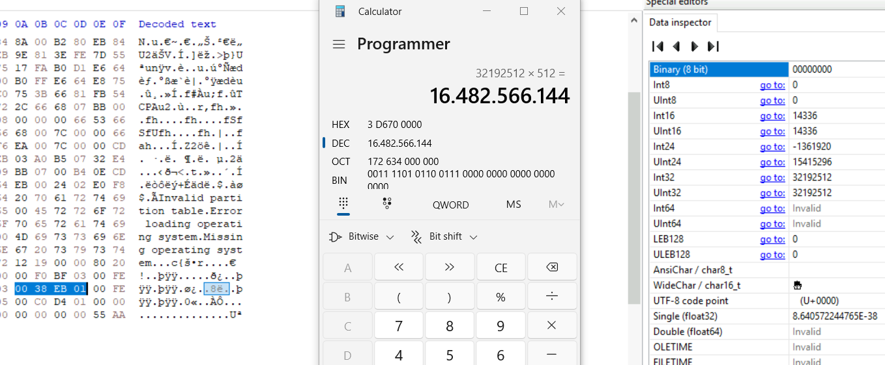
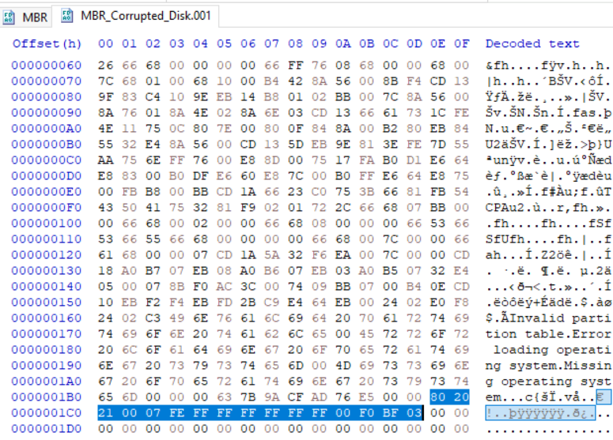
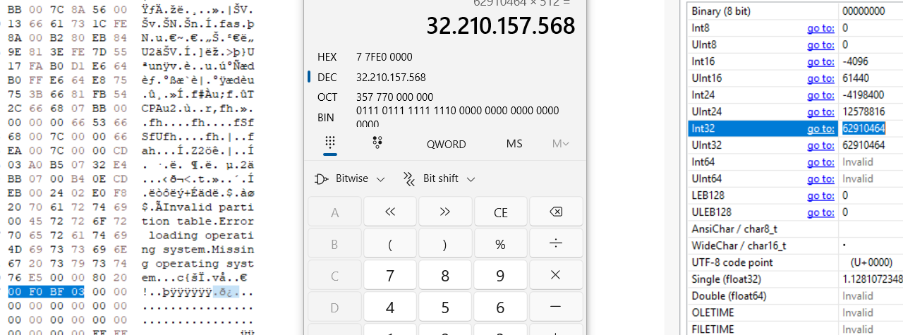
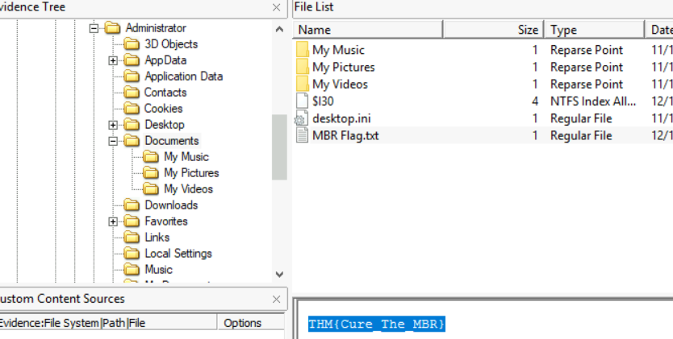
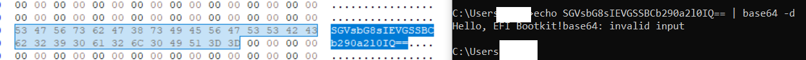

> # MBR and GPT Analysis

## Summary

### Task 1 - Introduction
1. What are the separate sections on a disk known as? 
    > In the Windows OS, these partitions are represented by drive letters such as C, D, E, etc. Other operating systems may use different ways to refer to these partitions. 

    **Answer:** partitions

1. Which type of malware infects the boot process? 
    > often known as Bootkits, or tampering with them to make the system un-bootable.

    **Answer:** Bootkit

### Task 2 - Boot Process
 
1. What is the name of the hardware diagnostic check performed during the boot process? 
    > . The BIOS/UEFI then starts a Power-On-Self-Test to ensure all the system’s hardware components are working fine. You

    **Answer:**  Power-On-Self-Test

1. Which firmware supports a GPT partitioning scheme? 
    > UEFI uses a GPT partitioning scheme

    **Answer:** UEFI

1. Which device has the operating system to boot the system? 
    **Answer:** bootable device

### Task 3 - What if MBR?
1. Which component of the MBR contains the details of all the partitions present on the disk? 
    > This table contains the details of all the partitions present on the disk. 

    **Answer:** partition table

1. What is the standard sector size of a disk in bytes? 
    > The Master Boot Record (MBR) takes up 512 bytes of space at the very first sector of the disk. 

    **Answer:** 512

1. Which component of the MBR is responsible for finding the bootable partition? 
    > This Bootloader code contains the Initial Bootloader. The initial bootloader is the first thing that executes in the MBR. This initial bootloader code has a primary purpose of finding the bootable partition

    **Answer:** Bootloader Code

1. What is the magic number inside the MBR? 
    **Answer:** 55 AA

1. What is the maximum number of partitions MBR can support? 
    > An MBR disk has a total of 4 partitions, and each partition is represented by 16 bytes in the partition table.

    **Answer:** 4

1. What is the size of the second partition in the MBR file found in C:\Analysis\MBR\? (rounded to the nearest GB) 
    Convert the 4 byte to decimal then calculate with 512 to get the size in GB. 
     
    **Answer:** 16

### Task 5 - MBR Tampering Case
You must edit signature and LAB to 55AA and 00080000 to FTK can read the file. 
1. How many partitions are on the disk? 
    There is only one partition on the disk. 
     
    **Answer:** 1

1. What is the first byte at the starting LBA of the partition? (represented by two hexadecimal digits) 
    Go to offset 1048576. 
    **Answer:** EB

1. What is the type of the partition? 
    The value of byte is `07`, so the partition's type is NTFS. 
    **Answer:** NTFS

1. What is the size of the partition? (rounded to the nearest GB) 
     
    **Answer:** 32

1. What is the flag hidden in the Administrator's Documents folder? 
     
    **Answer:** THM{Cure_The_MBR}

### Task 6 - What if GPT?
1. How many partitions are supported by the GPT? 
    > The GPT also supports up to 128 partitions

    **Answer:** 128

1. What is the partition type GUID of the 2nd partition given in the attached GPT file? 
    Follow the instruction to get the partition type GUID. 
    **Answer:** E3C9E316-0B5C-4DB8-817D-F92DF00215AE

### Task 8 - UEFI Bootkit Case
1. Which partition has the bootloader in it? 
    > In the GPT, the bootloader is comprised of multiple files with .efi extension, and they all are stored in this EFI System Partition (ESP). 

    **Answer:** EFI System Partition

1. What is the malicious string embedded in the bootloader? 
    I found a base64 string. 
     
    **Answer:** Hello, EFI Bootkit!
