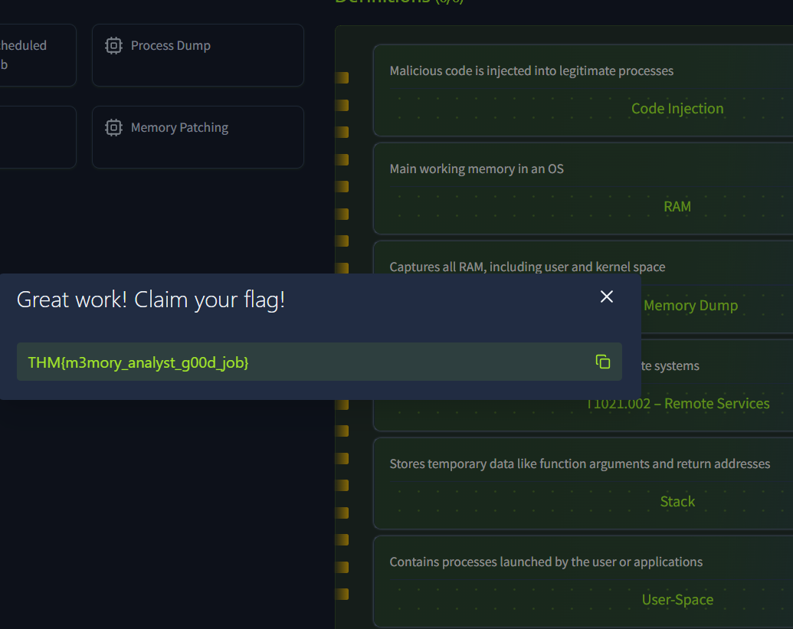

> # Memory Analysis Introduction

## Summary
- [Summary](#summary)
  - [Task 2 - Volatile Memory](#task-2---volatile-memory)
  - [Task 3 - Memory Dumps](#task-3---memory-dumps)
  - [Task 4 - Memory Analysis Attack Fingerprints](#task-4---memory-analysis-attack-fingerprints)
  - [Task 5 - Practical](#task-5---practical)

### Task 2 - Volatile Memory
1. What type of memory is prioritized because its data disappears after shutdown? 
    **Answer:** RAM

1. What is the slowest component in the memory hierarchy? 
    **Answer:** disk

1. Which memory region typically contains dynamically allocated data like encryption keys? 
    > Heap : Used for dynamic memory allocation during runtime, such as objects and buffers created by programs.

    **Answer:** heap

1. What disk-based area temporarily stores RAM data when memory is full? 
    > Swap is a reserved area on the disk that the operating system uses to store data from RAM when physical memory is full temporarily.

    **Answer:** swap

### Task 3 - Memory Dumps
1. What tool is commonly used by attackers to extract credentials from memory? 
    > Tools like Mimikatz are often used by red teamers and attackers to extract credentials directly from memory, making memory dumps an important defensive focus.

    **Answer:** mimikatz

1. What type of memory dump captures all RAM, including user and kernel space? 
    > Full Memory Dump: Captures all RAM, including user and kernel space. Useful for complete forensic investigations and malware analysis.

    **Answer:** full

1. What Linux tool can be used to extract memory for forensic purposes? 
    > On Linux and macOS, analysts can use tools like LiME (Linux Memory Extractor) or dd with access to /dev/mem or /proc/kcore, depending on kernel protections.

    **Answer:** LiME

1. Which file on Windows systems stores memory during hibernation? 
    > the system’s hibernation file (hiberfil.sys) can also be parsed to extract RAM contents saved when the machine enters hibernation mode.

    **Answer:** hiberfil.sys

1. What anti-forensics technique hides processes by altering kernel structures? 
    > DKOM (Direct Kernel Object Manipulation)	Alters kernel structures to hide processes, threads, or drivers from standard system tools.

    **Answer:** DKOM

### Task 4 - Memory Analysis Attack Fingerprints
1. What technique involves replacing a trusted process’s memory with malicious code? 
    > Process hollowing, a technique where the memory of a trusted process is replaced with malicious code.

    **Answer:** Process hollowing

1. Which Windows service provides PowerShell remoting? 
    > WinRM provides PowerShell remoting. Look for wsmprovhost.exe and memory references to remote session initialization.

    **Answer:** winrm

1. What MITRE technique ID is associated with in-memory PowerShell execution? 
    **Answer:** T1086 

1. What command-line tool enables remote execution and is linked to lateral movement (T1021.002)? 
    **Answer:** PsExec

1. Which MITRE technique involves setting tasks that persist through reboots (e.g., schtasks.exe)? 
    **Answer:** T1053.005

### Task 5 - Practical
1. What is the value of the flag? 
     
    **Answer:** THM{m3mory_analyst_g00d_job}
