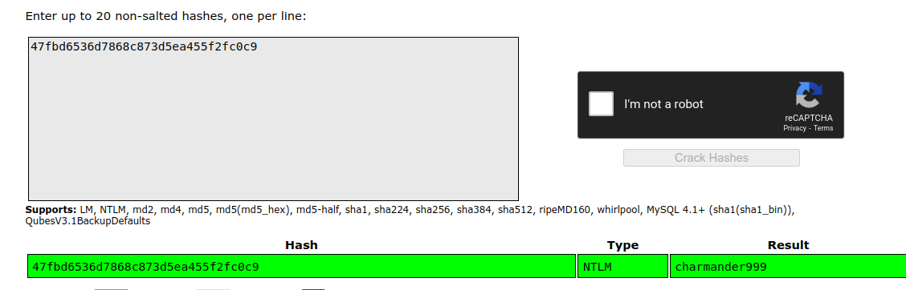

# Table of Contents
* [Table of Contents](#table-of-contents)
   * [Task 2 - Login](#task-2---login)
   * [Task 3 - Analysis](#task-3---analysis)
   * [Task 4 - TrueCrypt](#task-4---truecrypt)

## Task 2 - Login
What is John's password?
Use `volatility` with `imageinfo` plugin to indentify OS's info
```sh
$ vol.py -f Snapshot6.vmem imageinfo
Volatility Foundation Volatility Framework 2.6.1
INFO    : volatility.debug    : Determining profile based on KDBG search...
          Suggested Profile(s) : Win7SP1x64, Win7SP0x64, Win2008R2SP0x64, Win2008R2SP1x64_24000, Win2008R2SP1x64_23418, Win2008R2SP1x64, Win7SP1x64_24000, Win7SP1x64_23418
                     AS Layer1 : WindowsAMD64PagedMemory (Kernel AS)
                     AS Layer2 : FileAddressSpace (/home/ubuntu/Downloads/Snapshot6.vmem)
                      PAE type : No PAE
                           DTB : 0x187000L
                          KDBG : 0xf80002c4a0a0L
          Number of Processors : 1
     Image Type (Service Pack) : 1
                KPCR for CPU 0 : 0xfffff80002c4bd00L
             KUSER_SHARED_DATA : 0xfffff78000000000L
           Image date and time : 2020-12-27 06:20:05 UTC+0000
     Image local date and time : 2020-12-26 22:20:05 -0800
```

Use `hashdump` plguin to dump hash password
```sh
$ vol.py -f Snapshot6.vmem --profile=Win7SP1x64 hashdump
Volatility Foundation Volatility Framework 2.6.1
Administrator:500:aad3b435b51404eeaad3b435b51404ee:31d6cfe0d16ae931b73c59d7e0c089c0:::
Guest:501:aad3b435b51404eeaad3b435b51404ee:31d6cfe0d16ae931b73c59d7e0c089c0:::
John:1001:aad3b435b51404eeaad3b435b51404ee:47fbd6536d7868c873d5ea455f2fc0c9:::
HomeGroupUser$:1002:aad3b435b51404eeaad3b435b51404ee:91c34c06b7988e216c3bfeb9530cabfb:::
```

Submit `47fbd6536d7868c873d5ea455f2fc0c9` to [CrackStation](https://crackstation.net/) for retrieving the raw password.

**Answer:** charmander999

## Task 3 - Analysis
1. When was the machine last shutdown?
First, indentify OS's info.
```sh
$ vol.py -f Snapshot19.vmem imageinfo
Volatility Foundation Volatility Framework 2.6.1
INFO    : volatility.debug    : Determining profile based on KDBG search...
          Suggested Profile(s) : Win7SP1x64, Win7SP0x64, Win2008R2SP0x64, Win2008R2SP1x64_24000, Win2008R2SP1x64_23418, Win2008R2SP1x64, Win7SP1x64_24000, Win7SP1x64_23418
                     AS Layer1 : WindowsAMD64PagedMemory (Kernel AS)
                     AS Layer2 : FileAddressSpace (/home/ubuntu/Downloads/Snapshot19.vmem)
                      PAE type : No PAE
                           DTB : 0x187000L
                          KDBG : 0xf80002bfd0a0L
          Number of Processors : 1
     Image Type (Service Pack) : 1
                KPCR for CPU 0 : 0xfffff80002bfed00L
             KUSER_SHARED_DATA : 0xfffff78000000000L
           Image date and time : 2020-12-27 23:06:01 UTC+0000
     Image local date and time : 2020-12-28 00:06:01 +0100
```

Then use `shutdowntime` plugin to find the answer.<br>
```sh
$ vol.py -f Snapshot19.vmem --profile=Win7SP1x64 shutdowntime
Volatility Foundation Volatility Framework 2.6.1
Registry: SYSTEM
Key Path: ControlSet001\Control\Windows
Key Last updated: 2020-12-27 22:50:12 UTC+0000
Value Name: ShutdownTime
Value: 2020-12-27 22:50:12 UTC+0000
```
**Answer:** 2020-12-27 22:50:12

2. What did John write?
Use `consoles` plugin to find what John wrote on cmd.
```sh
$ vol.py -f Snapshot19.vmem --profile=Win7SP1x64 consoles
Volatility Foundation Volatility Framework 2.6.1
**************************************************
ConsoleProcess: conhost.exe Pid: 2488
Console: 0xffa66200 CommandHistorySize: 50
HistoryBufferCount: 1 HistoryBufferMax: 4
OriginalTitle: %SystemRoot%\System32\cmd.exe
Title: Administrator: C:\Windows\System32\cmd.exe
AttachedProcess: cmd.exe Pid: 1920 Handle: 0x60
----
CommandHistory: 0x21e9c0 Application: cmd.exe Flags: Allocated, Reset
CommandCount: 7 LastAdded: 6 LastDisplayed: 6
FirstCommand: 0 CommandCountMax: 50
ProcessHandle: 0x60
Cmd #0 at 0x1fe3a0: cd /
Cmd #1 at 0x1f78b0: echo THM{You_found_me} > test.txt
Cmd #2 at 0x21dcf0: cls
Cmd #3 at 0x1fe3c0: cd /Users
Cmd #4 at 0x1fe3e0: cd /John
Cmd #5 at 0x21db30: dir
Cmd #6 at 0x1fe400: cd John
----
Screen 0x200f70 X:80 Y:300
Dump:
                                                                                
C:\>cd /Users                                                                   
                                                                                
C:\Users>cd /John                                                               
The system cannot find the path specified.                                      
                                                                                
C:\Users>dir                                                                    
 Volume in drive C has no label.                                                
 Volume Serial Number is 1602-421F                                              
                                                                                
 Directory of C:\Users                                                          
                                                                                
12/27/2020  02:20 AM    <DIR>          .                                        
12/27/2020  02:20 AM    <DIR>          ..                                       
12/27/2020  02:21 AM    <DIR>          John                                     
04/12/2011  08:45 AM    <DIR>          Public                                   
               0 File(s)              0 bytes                                   
               4 Dir(s)  54,565,433,344 bytes free                              
                                                                                
C:\Users>cd John                                                                
                                                                                
C:\Users\John>
```
At "Cmd #1", we found the flag.<br>
**Answer:** You_found_me

## Task 4 - TrueCrypt
What is the TrueCrypt passphrase?
Identify OS's info.
```sh
$ vol.py -f Snapshot14.vmem imageinfo
Volatility Foundation Volatility Framework 2.6.1
INFO    : volatility.debug    : Determining profile based on KDBG search...
          Suggested Profile(s) : Win7SP1x64, Win7SP0x64, Win2008R2SP0x64, Win2008R2SP1x64_24000, Win2008R2SP1x64_23418, Win2008R2SP1x64, Win7SP1x64_24000, Win7SP1x64_23418
                     AS Layer1 : WindowsAMD64PagedMemory (Kernel AS)
                     AS Layer2 : FileAddressSpace (/home/ubuntu/Downloads/Snapshot14.vmem)
                      PAE type : No PAE
                           DTB : 0x187000L
                          KDBG : 0xf80002c4d0a0L
          Number of Processors : 1
     Image Type (Service Pack) : 1
                KPCR for CPU 0 : 0xfffff80002c4ed00L
             KUSER_SHARED_DATA : 0xfffff78000000000L
           Image date and time : 2020-12-27 13:41:31 UTC+0000
     Image local date and time : 2020-12-27 05:41:31 -0800
```

Then use `truecryptsummary` plugin to find the TrueCrypt's passphrase 
```sh
$ vol.py -f Snapshot14.vmem --profile=Win7SP1x64 truecryptsummary
Volatility Foundation Volatility Framework 2.6.1
Password             forgetmenot at offset 0xfffff8800512bee4
Process              TrueCrypt.exe at 0xfffffa80052c2b30 pid 1904
Kernel Module        truecrypt.sys at 0xfffff880050f0000 - 0xfffff88005131000
Symbolic Link        Volume{079ed9bf-4815-11eb-bff1-000c29582936} -> \Device\TrueCryptVolumeM mounted 2020-12-27 13:41:12 UTC+0000
Symbolic Link        M: -> \Device\TrueCryptVolumeM mounted 2020-12-27 13:41:12 UTC+0000
Symbolic Link        M: -> \Device\TrueCryptVolumeM mounted 2020-12-27 13:41:12 UTC+0000
Driver               \Driver\truecrypt at 0x3cad2e70 range 0xfffff880050f0000 - 0xfffff88005131000
Device               TrueCryptVolumeM at 0xfffffa8004b23080 type FILE_DEVICE_DISK
Container            Path: \??\C:\Users\John\Documents\test.txt
Device               TrueCrypt at 0xfffffa800771fc40 type FILE_DEVICE_UNKNOWN
```
At line 1, we found the passphrase.<br>
**Answer:** forgetmenot
