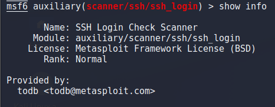

> # Metasploit: Introduction

# Summary
<!-- TOC -->

- [Summary](#summary)
    - [Task 2 - Main Components of Metasploit](#task-2---main-components-of-metasploit)
    - [Task 3 - Msfconsole](#task-3---msfconsole)
    - [Task 4 - Working with modules](#task-4---working-with-modules)

<!-- /TOC -->

## Task 2 - Main Components of Metasploit
1. What is the name of the code taking advantage of a flaw on the target system? 
    > Exploit: A piece of code that uses a vulnerability present on the target system.

    **Answer:** exploit

1. What is the name of the code that runs on the target system to achieve the attacker's goal? 
    > Payloads are codes that will run on the target system.

    **Answer:** payload

1. What are self-contained payloads called? 
    > Singles: Self-contained payloads (add user, launch notepad.exe, etc.) that do not need to download an additional component to run.

    **Answer:** singles

1. Is "windows/x64/pingback_reverse_tcp" among singles or staged payload? 
    > The former is an inline (or single) payload, as indicated by the “_” between “shell” and “reverse”

    **Answer:** single

## Task 3 - Msfconsole
1. How would you search for a module related to Apache? 
    **AnsweR:** search Apache

1. Who provided the auxiliary/scanner/ssh/ssh_login module? 
    Use this module then run `show info`, you will see all information about the selected module. 
     
    **Answer** todb

## Task 4 - Working with modules
1. How would you set the LPORT value to 6666? 
    **Answer:** set lport 6666

1. How would you set the global value for RHOSTS  to 10.10.19.23 ?  
    **Answer:** set rhosts 10.10.19.23

1. What command would you use to clear a set payload? 
    **Answer:** unset payload

1. What command do you use to proceed with the exploitation phase?  
    **Answer:** exploit

