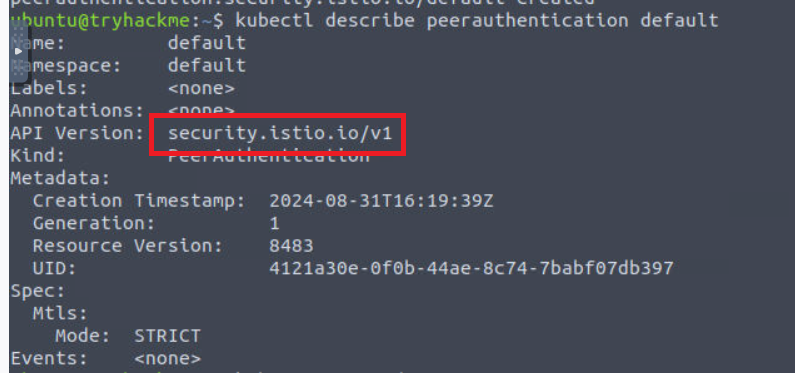

> # Microservices Architectures

## Summary
- [Summary](#summary)
  - [Task 2 - PSS and PSA](#task-2---pss-and-psa)
  - [Task 3 - A Very Microservice Problem](#task-3---a-very-microservice-problem)
  - [Task 4 - Service Meshes](#task-4---service-meshes)
  - [Task 5 - Service Mesh Architecture](#task-5---service-mesh-architecture)
  - [Task 6 - Service Mesh Implementation](#task-6---service-mesh-implementation)

### Task 2 - PSS and PSA
1. Which Pod Security Standard level would you use to ensure cluster hardening best practices are followed? 
    > Restricted: As it sounds, this policy is highly restrictive and follows current pod hardening best practices. 

    **Answer:** Restricted

1. Which Pod Security Standard level allows known privilege escalations? 
    > Privileged: As the name suggests, this is the most relaxed policy and is unrestricted, with the widest level of permission being granted. Known privilege escalations are allowed using this policy but they are intentional.

    **Answer:** Privileged

1. Which Pod Security Admission mode rejects a request upon policy violation? 
    > Enforce: If a pod creation request violates the policy, the request will be rejected.

    **Answer:** Enforce

1. What would the syntax of a label enforcing a restricted policy look like? 
    **Answer:** pod-security.kubernetes.io/enforce=restricted

### Task 3 - A Very Microservice Problem
1. A Microservice architecture is an alternative to what style of architecture? 
    >  a microservices architecture involves separating parts of an application into microservices (which run as containerised workloads) instead of having a single piece of code (known as a monolithic architecture). 

    **Answer:** monolithic

1. A problem with microservice architectures is that service-to-service communication is usually? 
    **Answer:** unencrypted 

1. The solution to the above problem would be to have both sides of a connection authenticated using? 
    > mTLS (Mutual Transport Layer Security) provides mutual authentication, ensuring that both sides of a connection are authenticated using certificates.
    **Answer:** mTLS

### Task 4 - Service Meshes
1. A Service Mesh separates which logic from the rest? 
    > Would it not then make sense to separate the business logic of the microservice from all of the other logic and configurations and have this be handled separately and repeatedly across all microservices? 

    **Answer:** business

1. The rest are separated into a separate proxy, which runs alongside the application pod, known as? 
    > A service mesh achieves this by extracting all of the non-business logic and configurations and having them run in its own proxy in parallel to the microservice, called a sidecar.

    **Answer:** sidecar

### Task 5 - Service Mesh Architecture
1. In this task, we looked at an implementation of a Service Mesh named what? 
    > We have covered what a Service Mesh is and how exactly it can help a DevSecOps engineer to secure a microservices architecture; now we will take a look at a popular implementation of Service Mesh, Istio.

    **Answer:** Istio

1. In this Service Mesh implementation, what is used to achieve the proxies? 
    **Answer:** Envoy

1. What is the name given to this area of the architecture where the proxies communicate with services (and other proxies)? 
    **Answer:** Data Plane

1. What is the name of the component that makes up the Control Plane? 
    > Istiod is the name of the component that makes up the Control Plane.

    **Answer:** Istiod

### Task 6 - Service Mesh Implementation
1. What value is contained within the API version field when you describe the authentication policy? 
     
    **Answer:** security.istio.io/v1
