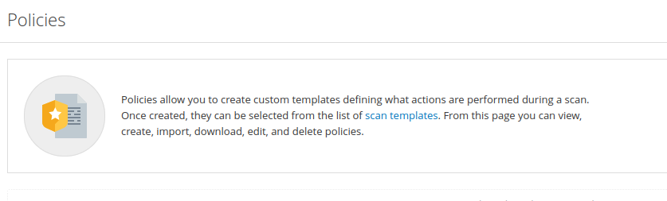
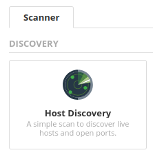
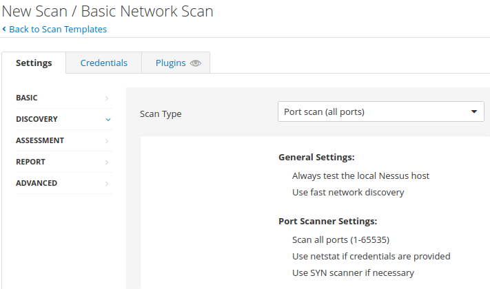
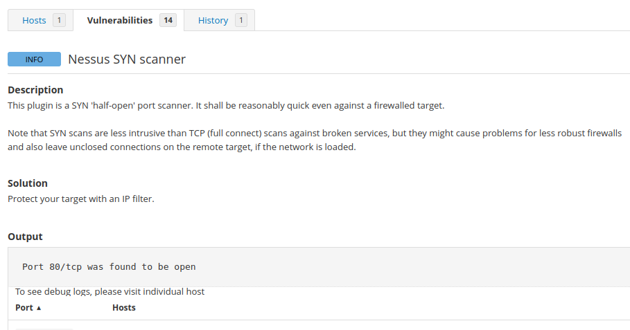
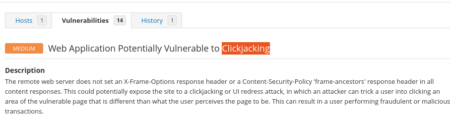

> # Nessus

## Summary
- [Summary](#summary)
  - [Task 3 - Navigation and Scans](#task-3---navigation-and-scans)
  - [Task 4 - Scanning!](#task-4---scanning)
  - [Task 5 - Scanning a Web Application!](#task-5---scanning-a-web-application)

### Task 3 - Navigation and Scans
1. What is the name of the button which is used to launch a scan? 
    **Answer:** New Scan

1. What side menu option allows us to create custom templates? 
     
    **Answer:** Policies

1. What menu allows us to change plugin properties such as hiding them or changing their severity? 
     
    **Answer:** Plugin Rules

1. In the 'Scan Templates' section after clicking on 'New Scan', what scan allows us to see simply what hosts are alive? 
     
    **Answer:** Host Discovery

1. One of the most useful scan types, which is considered to be 'suitable for any host'? 
     
    **Answer:** Basic Network Scan

1. What scan allows you to 'Authenticate to hosts and enumerate missing updates'? 
     
    **Answer:** Credentialed Patch Audit

1. What scan is specifically used for scanning Web Applications? 
     
    **Answer:** Web Application Tests

### Task 4 - Scanning!
1. Create a new 'Basic Network Scan' targeting the deployed VM. What option can we set under 'BASIC' (on the left) to set a time for this scan to run? This can be very useful when network congestion is an issue. 
     
    **Answer:** Schedule

1. Under 'DISCOVERY' (on the left) set the 'Scan Type' to cover ports 1-65535. What is this type called? 
     
    **Answer:** Port scan (all ports)

1. What 'Scan Type' can we change to under 'ADVANCED' for lower bandwidth connection? 
     
    **Answer:** Scan low bandwidth links

1. After the scan completes, which 'Vulnerability' in the 'Port scanners' family can we view the details of to see the open ports on this host? 
     
    **Answer:** Nessus SYN scanner

1. What Apache HTTP Server Version is reported by Nessus? 
     
    **Answer:** 2.4.99

### Task 5 - Scanning a Web Application!
1. What is the plugin id of the plugin that determines the HTTP server type and version? 
     
    **Answer:** 10107

1. What authentication page is discovered by the scanner that transmits credentials in cleartext? 
    **Answer:** login.php

1. What is the file extension of the config backup? 
     
    **Answer:** .bak

1. Which directory contains example documents? (This will be in a php directory) 
     
    **Answer:** external/phpids/0.6/docs/examples/

1. What vulnerability is this application susceptible to that is associated with X-Frame-Options? 
     
    **Answer:** Clickjacking
