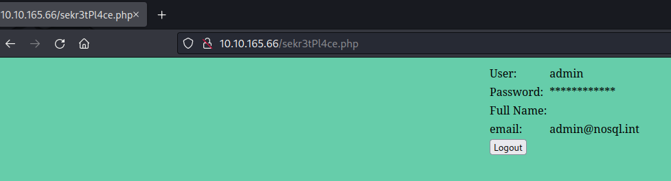
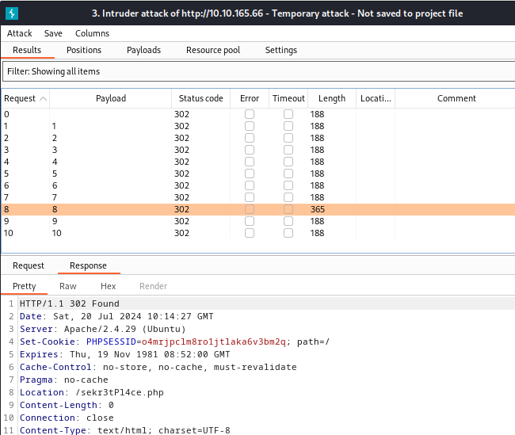
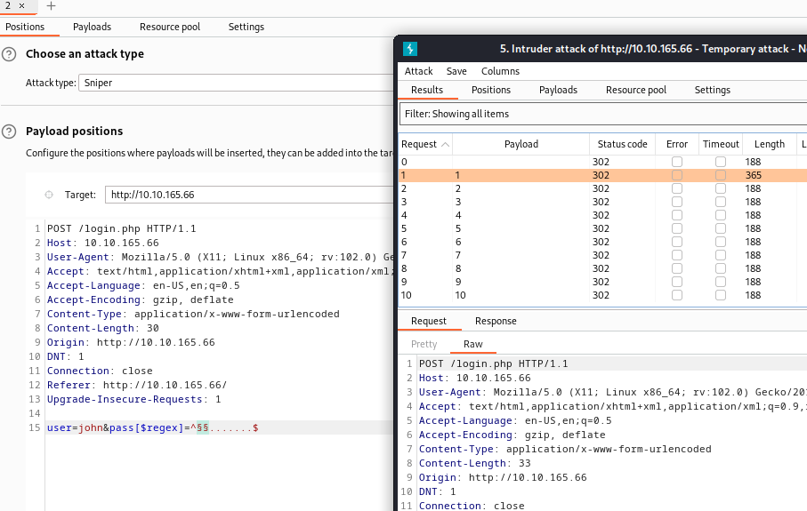

> # NoSQL Injection

# Summary
- [Summary](#summary)
  - [Task 2 - What is NoSQL](#task-2---what-is-nosql)
  - [Task 3 - NoSQL Injection](#task-3---nosql-injection)
  - [Task 4 - Operator Injection: Bypassing the Login Screen](#task-4---operator-injection-bypassing-the-login-screen)
  - [Task 5 - Operator Injection: Logging in as Other Users](#task-5---operator-injection-logging-in-as-other-users)
  - [Task 6 - Operator Injection: Extracting Users' Passwords](#task-6---operator-injection-extracting-users-passwords)
  - [Task 7 - Syntax Injection: Identification and Data Extraction](#task-7---syntax-injection-identification-and-data-extraction)


##  Task 2 - What is NoSQL
1. What is a group of documents in MongoDB is known as?<br>
    > MongoDB allows you to group multiple documents with a similar function together in higher hierarchy structures called collections for organizational purposes.

    **Answer:** collections

1. Using the MongoDB Operator Reference, what operator is used to filter data when a field isn't equal to a given value?<br>
    Follow this [link](https://www.mongodb.com/docs/manual/reference/operator/query/).<br>
    > $ne: Matches all values that are not equal to a specified value.

    **Answer:** $ne

1. Following the example of the 3 documents given before, how many documents would be returned by the following filter: ['gender' => ['$ne' => 'female'] , 'age' => ['$gt'=>'65'] ]?<br>
    No document has both male gender and age greater than 65.<br>
    **Answer:** 0

##  Task 3 - NoSQL Injection
1. What type of NoSQL Injection is similar to normal SQL Injection?<br>
    > Syntax Injection - This is similar to SQL injection, where we have the ability to break out of the query and inject our own payload. The key difference to SQL injection is the syntax used to perform the injection attack.

    **Answer:** Syntax

1. What type of NoSQL Injection allows you to modify the behaviour of the query, even if you can't escape the syntax?<br>
    > Operator Injection—Even if we can't break out of the query, we could potentially inject a NoSQL query operator that manipulates the query's behaviour, allowing us to stage attacks such as authentication bypasses.

    **Answer:**  Operator

##  Task 4 - Operator Injection: Bypassing the Login Screen
1. When bypassing the login screen using the $ne operator, what is the email of the user that you are logged in as?<br>
    Add `user[$ne]=abc&pass[$ne]=abc&remember=on` payload to parameters for getting all the documents in database.<br>
    <br>
    **Answer:** admin@nosql.int

##  Task 5 - Operator Injection: Logging in as Other Users
1. How many users are there in total?<br>
    Submit this payload `user[$nin][]=admin&pass[$ne]=abc&remember=on` first, we will get the username `pedro`. Then exclude `pedro` with `user[$nin][]=admin&user[$nin][]=pedro&pass[$ne]=abc&remember=on` and go on with other username until the response is invalid.<br>
    The total of users are four.<br>
    **Answer:** 4

1. There is a user that starts with the letter "p". What is his username?<br>
    **Answer:** pedro

##  Task 6 - Operator Injection: Extracting Users' Passwords
1. What is john's password?<br>
    Use Intruder of BurpSuite to guest the password's length.<br>
    <br>
    Base on the hint, the password is numbers only, so we guest the first character from 0 to 9 to find which number is appear first.<br>
    <br>
    The number 1 is appear first, we continue to the end of password.<br>
    **Answer:** 10584312

1. One of the users seems to be reusing his password for many services. Find which one and connect through SSH to retrieve the final flag!<br>
    The goal user is `pedro`, repeat steps above to find the password, and the password is `coolpass123`.<br>
    **Answer:** flag{N0Sql_n01iF3!}

##  Task 7 - Syntax Injection: Identification and Data Extraction    
1. What common character is used to test for injection in both SQL and NoSQL solutions?<br>
    **Answer:** '

1. What is the email value of the super secret user returned in the last entry?<br>
    Use payload `' || 1 || '` to get all email address.<br>
    ```shell
    $ ssh syntax@10.10.165.66
    syntax@10.10.165.66's password: 
    Please provide the username to receive their email:' ||1||'
    admin@nosql.int
    pcollins@nosql.int
    jsmith@nosql.int
    Syntax@Injection.FTW
    Connection to 10.10.165.66 closed.
    ```
    **Answer:** Syntax@Injection.FTW

