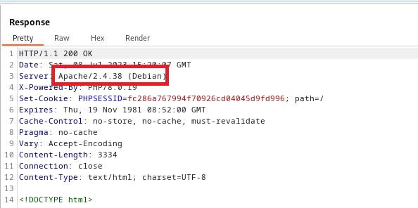
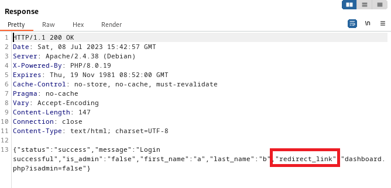
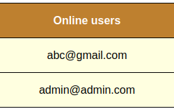
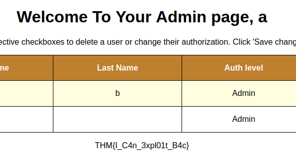

> # OWASP Broken Access Control

# Summary
<!-- TOC -->

- [Summary](#summary)
    - [Task 2 - Broken Access Control Introduction](#task-2---broken-access-control-introduction)
    - [Task 4 - Assessing the Web Application](#task-4---assessing-the-web-application)
    - [Task 5 - Exploiting the Web Application](#task-5---exploiting-the-web-application)

<!-- /TOC -->

## Task 2 - Broken Access Control Introduction
1. What is IDOR? 
    > **Insecure direct object references** occur when an attacker can access a resource or data by exploiting a weakness in the application’s access control mechanisms.

    **Answer:** Insecure direct object reference

1. What occurs when an attacker can access resources or data belonging to other users with the same level of access? 
    > **Horizontal privilege escalation** occurs when an attacker can access resources or data belonging to other users with the same level of access. For example, a user might be able to access another user’s account by changing the user ID in the URL.

    **Answer:** Horizontal privilege escalation

1. What occurs when an attacker can access resources or data from users with higher access levels? 
    > **Vertical privilege escalation** occurs when an attacker can access resources or data belonging to users with higher access levels. For example, a regular user can access administrative functions by manipulating a hidden form field or URL parameter.

    **Answer:** Vertical privilege escalation

1. What is ABAC? 
    > Attribute-Based Access Control (ABAC)

    **Answer:** Attribute-Based Access Control

1. What is RBAC? 
    > Role-Based Access Control (RBAC)

    **Answer:** Role-Based Access Control

## Task 4 - Assessing the Web Application
1. What is the type of server that is hosting the web application? This can be found in the response of the request in Burp Suite. 
    Capture response from server on BurpSuite. 
     
    **Answer:** Apache

1. What is the name of the parameter in the JSON response from the login request that contains a redirect link? 
    After create an account, login and capture the request. You will see the parameter respones from server. 
     
    **Answer:** redirect_link

1. What Burp Suite module allows us to capture requests and responses between ourselves and our target? 
    **Answer:** Proxy

1. What is the admin’s email that can be found in the online users’ table? 
    We will see the admin's email in Online User table. 
     
    **Answer:** admin@admin.com

## Task 5 - Exploiting the Web Application
1. What kind of privilege escalation happened after accessing admin.php? 
    Admin is a user with high privilege, so it is 'vertical'. 
    **Answer:** vertical

1. What parameter allows the attacker to access the admin page? 
    **Answer:** isadmin

1. What is the flag in the admin page?
    The flag is display on admin page. 
     
    **Answer:** THM{I_C4n_3xpl01t_B4c}
