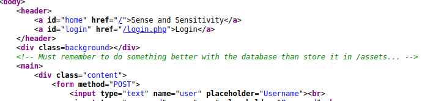
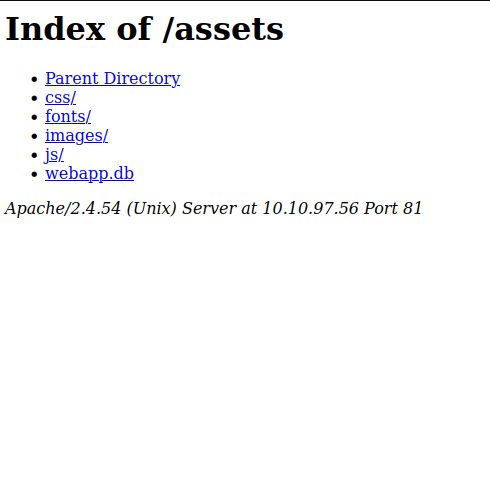
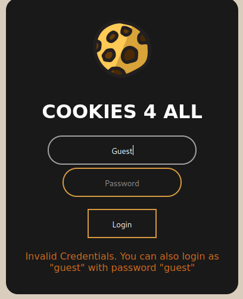
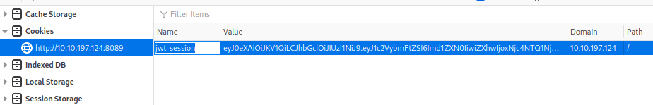
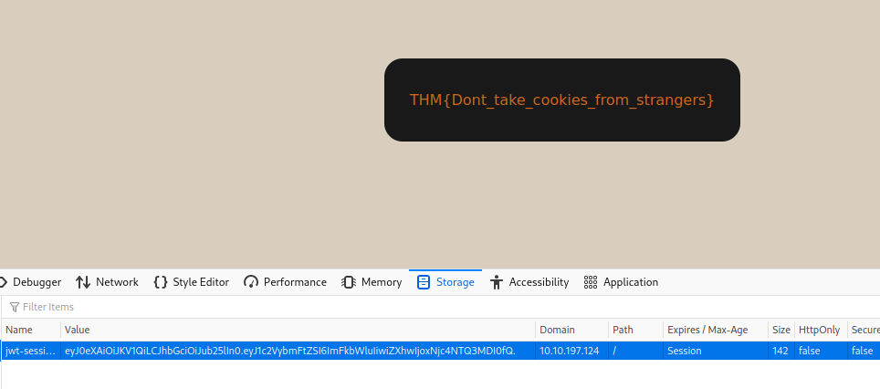
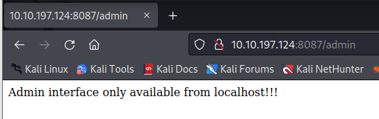
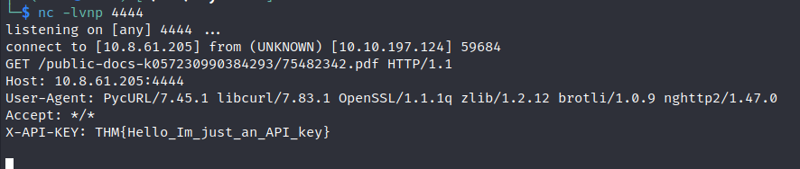

> # OWASP Top 10 - 2021

# Summary
<!-- TOC -->

- [Summary](#summary)
    - [Task 4 - Broken Access Control (IDOR Challenge)](#task-4---broken-access-control-idor-challenge)
    - [Task 8 - Cryptographic Failures (Challenge)](#task-8---cryptographic-failures-challenge)
    - [Task 10 - 3.1. Command Injection](#task-10---31-command-injection)
    - [Task 11 - 4. Insecure Design](#task-11---4-insecure-design)
    - [Task 12 - 5. Security Misconfiguration](#task-12---5-security-misconfiguration)
    - [Task 15 - Vulnerable and Outdated Components - Lab](#task-15---vulnerable-and-outdated-components---lab)
    - [Task 17 - Identification and Authentication Failures Practical](#task-17---identification-and-authentication-failures-practical)
    - [Task 19 - Software Integrity Failures](#task-19---software-integrity-failures)
    - [Task 20 - Data Integrity Failures](#task-20---data-integrity-failures)
    - [Task 21 - 9. Security Logging and Monitoring Failures](#task-21---9-security-logging-and-monitoring-failures)
    - [Task 22 - 10. Server-Side Request Forgery (SSRF)](#task-22---10-server-side-request-forgery-ssrf)

<!-- /TOC -->

## Task 4 - Broken Access Control (IDOR Challenge)
1. Look at other users' notes. What is the flag?<br>
    Change id from 1 to 0 to retrive the flag.<br>
    **Answer:** flag{fivefourthree}

## Task 8 - Cryptographic Failures (Challenge)
1. What is the name of the mentioned directory?<br>
    View source code on /login.php, you will the author refer to a directory storing the database.<br>
    <br>
    **Answer:** /assets

1. Navigate to the directory you found in question one. What file stands out as being likely to contain sensitive data?<br>
    <br>
    **Answer:** webapp.db

1. Use the supporting material to access the sensitive data. What is the password hash of the admin user?<br>
    Use `sqlite3 webapp.db` to load this file then run `select * from users;`.<br>
    ```
    sqlite> select * from users;
    4413096d9c933359b898b6202288a650|admin|6eea9b7ef19179a06954edd0f6c05ceb|1
    23023b67a32488588db1e28579ced7ec|Bob|ad0234829205b9033196ba818f7a872b|1
    4e8423b514eef575394ff78caed3254d|Alice|268b38ca7b84f44fa0a6cdc86e6301e0|0
    ```
    **Answer:** 6eea9b7ef19179a06954edd0f6c05ceb

1. What is the admin's plaintext password?<br>
    Use [CrackStation](https://crackstation.net)<br>
    **Answer:** qwertyuiop

1. Log in as the admin. What is the flag?<br>
    **Answer:** THM{Yzc2YjdkMjE5N2VjMzNhOTE3NjdiMjdl}

## Task 10 - 3.1. Command Injection
1. What strange text file is in the website's root directory?<br>
    Payload: `$(ls)
    **Answer:** drpepper.txt

1. How many non-root/non-service/non-daemon users are there?<br>
    Payload: $(cat /etc/passwd)
    There is no user have `/bin/bash` or `/bin/sh` in this file.<br>
    **Answer:** 0

1. What user is this app running as?<br>
    Payload: $(whoami)
    **Answer:** apache

1. What is the user's shell set as?<br>
    Payload: $(cat /etc/passwd)
    At the last line
    **Answer:** /sbin/nologin

1. What version of Alpine Linux is running?
    Payload: $(cat /etc/alpine-release)
    **Answer:** 3.16.0

## Task 11 - 4. Insecure Design
1. What is the value of the flag in joseph's account?<br>
    The josehp's favorite color is green.<br>    
    **Answer:** THM{Not_3ven_c4tz_c0uld_sav3_U!}

## Task 12 - 5. Security Misconfiguration
1. What is the database file name (the one with the .db extension) in the current directory?<br>
    Payload: import os; print(os.popen("ls -l").read())
    **Answer:** todo.db

1. Modify the code to read the contents of the app.py file, which contains the application's source code. What is the value of the secret_flag variable in the source code?
    Payload: import os; print(os.popen("cat app.py | grep secret_flag").read())
    **Answer:** THM{Just_a_tiny_misconfiguration}

## Task 15 - Vulnerable and Outdated Components - Lab
1. What is the content of the /opt/flag.txt file?<br>
    The target use `CSE Bookstore` webapp, the exploit for this can be found [here](https://www.exploit-db.com/exploits/47887)
    Just run the exploit with URL of target, it will spawn a shell for you.<br>
    ```
    python 47887.py http://10.10.97.56:84/
    ```
    **Answer:** THM{But_1ts_n0t_my_f4ult!}

## Task 17 - Identification and Authentication Failures Practical
1. What is the flag that you found in darren's account?
    Add a space before `darren`.<br>
    **Answer:** fe86079416a21a3c99937fea8874b667

1. What is the flag that you found in arthur's account?<br>
    **Answer:** d9ac0f7db4fda460ac3edeb75d75e16e

## Task 19 - Software Integrity Failures
1. What is the SHA-256 hash of https://code.jquery.com/jquery-1.12.4.min.js?<br>
    Paste this link to [https://www.srihash.org/](https://www.srihash.org/)<br>
    **Answer:** sha256-ZosEbRLbNQzLpnKIkEdrPv7lOy9C27hHQ+Xp8a4MxAQ=

## Task 20 - Data Integrity Failures
1. Try logging into the application as guest. What is guest's account password?<br>
    <br>
    **Answer:** guest

1. What is the name of the website's cookie containing a JWT token?<br>
    <br>
    **Answer:** jwt-session

1. What is the flag presented to the admin user?<br>
    Copy value of JWT, paste it to [https://token.dev/](https://token.dev/), change from `guest` to `admin` and `alg` to none, thep copy the new JWT token value to browser. Reload this page, you will receive the flag as admin.<br>
    <br>
    **Answer:** THM{Dont_take_cookies_from_strangers}

## Task 21 - 9. Security Logging and Monitoring Failures
1. What IP address is the attacker using?<br>
    ```
    $ cat login-logs.txt           
    200 OK           12.55.22.88 jr22          2019-03-18T09:21:17 /login
    200 OK           14.56.23.11 rand99        2019-03-18T10:19:22 /login
    200 OK           17.33.10.38 afer11        2019-03-18T11:11:44 /login
    200 OK           99.12.44.20 rad4          2019-03-18T11:55:51 /login
    200 OK           67.34.22.10 bff1          2019-03-18T13:08:59 /login
    200 OK           34.55.11.14 hax0r         2019-03-21T16:08:15 /login
    401 Unauthorised 49.99.13.16 admin         2019-03-21T21:08:15 /login
    401 Unauthorised 49.99.13.16 administrator 2019-03-21T21:08:20 /login
    401 Unauthorised 49.99.13.16 anonymous     2019-03-21T21:08:25 /login
    401 Unauthorised 49.99.13.16 root          2019-03-21T21:08:30 /login 
    ```
    **Answer:** 49.99.13.16

1. What kind of attack is being carried out?<br>
    The attacker try multiple account continously.<br>
    **Answer:** brute force

## Task 22 - 10. Server-Side Request Forgery (SSRF)
1. Explore the website. What is the only host allowed to access the admin area?<br>
    Access to `/admin`, it will display which host can access to admin area.<br>
    <br>
    **Answer:** localhost

1. Check the "Download Resume" button. Where does the server parameter point to?<br>
    Inspect this button, it will send request to `ecure-file-storage.com:8087`.<br>
    **Answer:** ecure-file-storage.com

1. Using SSRF, make the application send the request to your AttackBox instead of the secure file storage. Are there any API keys in the intercepted request?<br>
    Use `netcat` listen at port 4444, then use `BurpSuite` to modify request to your AttackBox's IP.
    <br>
    **Answer:** THM{Hello_Im_just_an_API_key}
