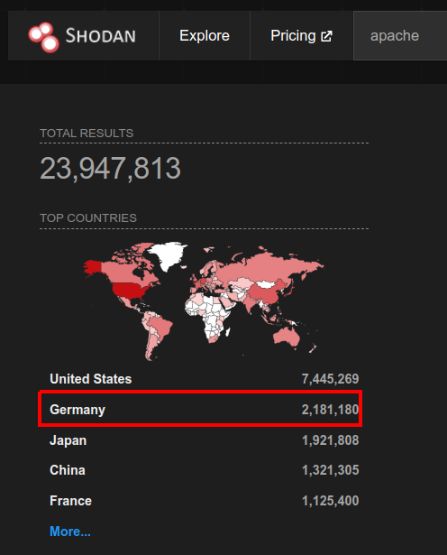
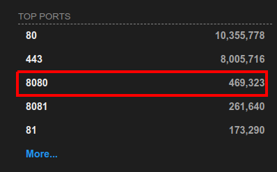
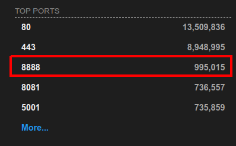

> # Passive Reconnaissance

# Summary
* [Summary](#summary)
   * [Task 3 - Whois](#task-3---whois)
   * [Task 4 - nslookup and dig](#task-4---nslookup-and-dig)
   * [Task 5 - DNSDumpster](#task-5---dnsdumpster)
   * [Task 6 - Shodan.io](#task-6---shodanio)

## Task 3 - Whois
1. When was TryHackMe.com registered?<br>
    ```sh
    $ whois tryhackme.com
    Domain Name: TRYHACKME.COM
    Registry Domain ID: 2282723194_DOMAIN_COM-VRSN
    Registrar WHOIS Server: whois.namecheap.com
    Registrar URL: http://www.namecheap.com
    Updated Date: 2021-05-01T19:43:23Z
    Creation Date: 2018-07-05T19:46:15Z
    Registry Expiry Date: 2027-07-05T19:46:15Z
    Registrar: NameCheap, Inc.
    Registrar IANA ID: 1068
    Registrar Abuse Contact Email: abuse@namecheap.com
    Registrar Abuse Contact Phone: +1.6613102107
    Domain Status: clientTransferProhibited https://icann.org/epp#clientTransferProhibited
    Name Server: KIP.NS.CLOUDFLARE.COM
    Name Server: UMA.NS.CLOUDFLARE.COM
    DNSSEC: unsigned
    URL of the ICANN Whois Inaccuracy Complaint Form: https://www.icann.org/wicf/
    >>> Last update of whois database: 2022-07-17T13:27:23Z <<<
    ```
    **Answer:** 20180705

1. What is the registrar of TryHackMe.com?<br>
    **Answer:** namecheap.com

1. Which company is TryHackMe.com using for name servers?<br>
    **Answer:** cloudflare.com

## Task 4 - nslookup and dig
1. Check the TXT records of thmlabs.com. What is the flag there?
    ```sh
    $ nslookup -type=TXT thmlabs.com
    Server:		127.0.0.53
    Address:	127.0.0.53#53

    Non-authoritative answer:
    thmlabs.com	text = "THM{a5b83929888ed36acb0272971e438d78}"

    Authoritative answers can be found from:
    ```
    ```sh
    $ dig thmlabs.com TXT

    ; <<>> DiG 9.18.1-1ubuntu1.1-Ubuntu <<>> thmlabs.com TXT
    ;; global options: +cmd
    ;; Got answer:
    ;; ->>HEADER<<- opcode: QUERY, status: NOERROR, id: 2326
    ;; flags: qr rd ra; QUERY: 1, ANSWER: 1, AUTHORITY: 0, ADDITIONAL: 1

    ;; OPT PSEUDOSECTION:
    ; EDNS: version: 0, flags:; udp: 65494
    ;; QUESTION SECTION:
    ;thmlabs.com.			IN	TXT

    ;; ANSWER SECTION:
    thmlabs.com.		286	IN	TXT	"THM{a5b83929888ed36acb0272971e438d78}"

    ;; Query time: 0 msec
    ;; SERVER: 127.0.0.53#53(127.0.0.53) (UDP)
    ;; WHEN: Sun Jul 17 20:53:52 +07 2022
    ;; MSG SIZE  rcvd: 90
    ```

## Task 5 - DNSDumpster
1. Lookup tryhackme.com on DNSDumpster. What is one interesting subdomain that you would discover in addition to www and blog?<br>
 **Answer:** remote

## Task 6 - Shodan.io
1. According to Shodan.io, what is the 2nd country in the world in terms of the number of publicly accessible Apache servers?<br>
    Search "Apache" on [Shodan.io](https://www.shodan.io/search?query=apache), return a list top countries use Apache.<br>
    <br>
    **Answer:** Germany

1. Based on Shodan.io, what is the 3rd most common port used for Apache?<br>
    Below top countries is top port use for Apache.<br>
    <br>
    **Answer:** 8080

1. Based on Shodan.io, what is the 3rd most common port used for nginx?<br>
    Change keyword from "Apache" to "Nginx", the same result returned.<br>
    <br>
    **Answer:** 8888
