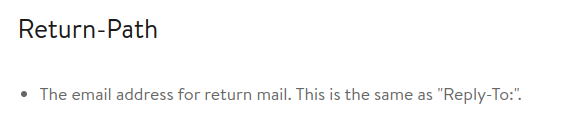
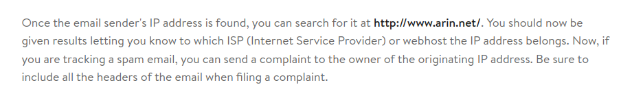
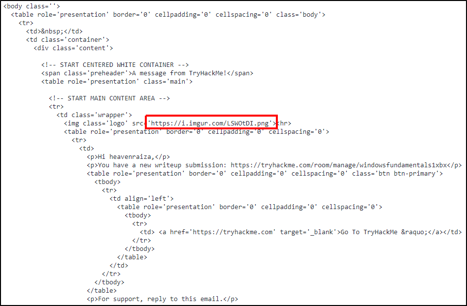
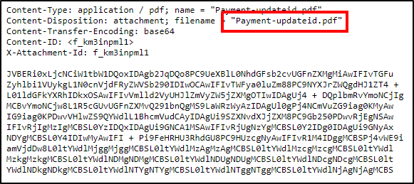

# Table of Contents
* [Task 2 - The Email Address](#task-2---the-email-address)
* [Task 3 - Email Delivery](#task-3---email-delivery)
* [Task 4 - Email Headers](#task-4---email-headers)
* [Task 5 - Email Body](#task-5---email-body)
* [Task 6 - Types of Phishing](#task-6---types-of-phishing)
* [Task 7 - Conclusion](#task-7---conclusion)

#  Task 2 - The Email Address
Email dates back to what time frame?<br>
**Answer:** 1970s

# Task 3 - Email Delivery
1. What port is classified as Secure Transport for SMTP?<br>
**Answer:** 465

2. What port is classified as Secure Transport for IMAP?<br>
**Answer:** 993

3. What port is classified as Secure Transport for POP3?<br>
**Answer:** 995

# Task 4 - Email Headers
1. What email header is the same as "Reply-to"?

**Answer:** Return-Path

2. Once you find the email sender's IP address, where can you retrieve more information about the IP?

**Answer:** http://www.arin.net

# Task 5 - Email Body
1. In the above screenshots, what is the URI of the blocked image?

**Answer:** https://i.imgur.com/LSWOtDI.png

2. In the above screenshots, what is the name of the PDF attachment?

**Answer:** Payment-updateid.pdf

3. In the attached virtual machine, view the information in email2.txt and reconstruct the PDF using the base64 data. What is the text within the PDF?<br>
Copy all base64 string then use base64 command to decode.<br>
```sh
echo -n $STRING | base64 -d > file.pdf
```
Open result file, we will see the flag.<br>
**Answer:** THM{BENIGN_PDF_ATTACHMENT}

# Task 6 - Types of Phishing
1. What trusted entity is this email masquerading as?<br>
**Answer:** Home Depot

2. What is the sender's email?<br>
**Answer:** support@teckbe.com

3. What is the subject line? <br>
Search "Subject" in email, you'll see the base64 string, decode it.<br>
**Answer:** Order Placed : Your Order ID OD2321657089291 Placed Successfully

4. What is the URL link for - CLICK HERE? (Enter the defanged URL)
Search "CLICK HERE", found the URL then use CyberChef to defanging it.<br>
**Answer:** hxxp[://]t[.]teckbe[.]com/p/?j3=EOowFcEwFHl6EOAyFcoUFV=TVEchwFHlUFOo6lVTTDcATE7oUE7AUET==

# Task 7 - Conclusion
What is BEC?<br>
**Answer:** Business Email Compromise
