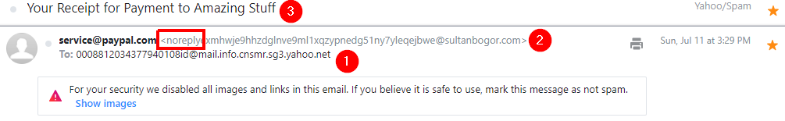
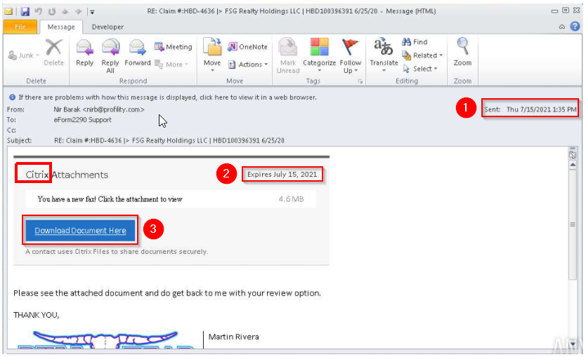
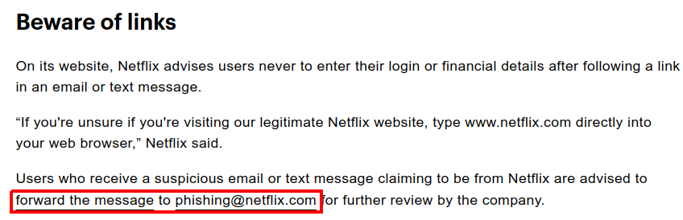

# Task 2 - Cancel your PayPal order
What phrase does the gibberish sender email start with? 

**Answer:** noreply

# Task 3 - Track your package
What is the root domain for each URL? Defang the URL. 

**Answer:** devret[.]xyz

# Task 4 - Select your email provider to view document

**Answer:** Citrix

# Task 5 - Please update your payment details
What should users do if they receive a suspicious email or text message claiming to be from Netflix? 

From hint, we see an advice 

**Answer:** forward the message to phishing@netflix.com

# Task 6 - Your recent purchase
1. What does BCC mean?
**Answer:** Blind carbon copy

2. What technique was used to persuade the victim to not ignore the email and act swiftly?
**Answer:** Urgency

# Task 7 - DHL Express Courier Shipping notice
What is the name of the executable that the Excel attachment attempts to run?
**Answer:** regasms.exe
