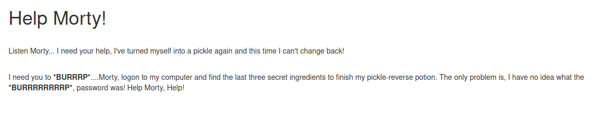
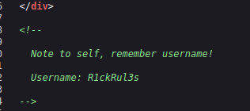
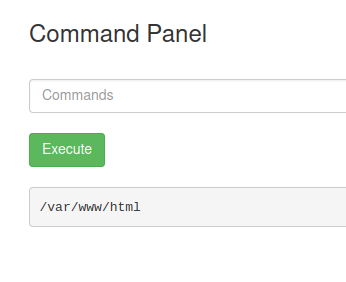
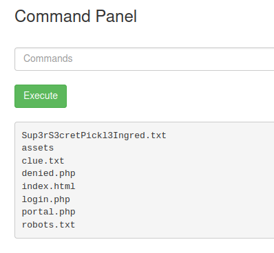
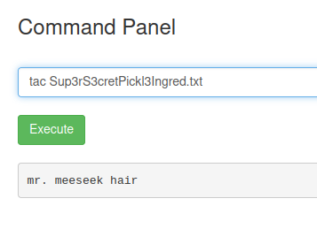
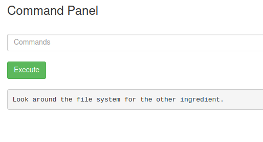
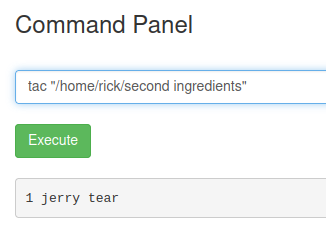
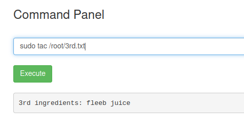

> # Pickle Rick

1. What is the first ingredient Rick needs? 
    Check the home page first, we have to find the information about credential of the target to find 3 ingredients. 
     
    When I looked at page source, I found the username is R1ckRul3s. 
     
    Almost page will have the file named `robots.txt`, I checked it and found a string may be the password. 
    With `dirsearch` tool, I also found the path to `login.php`, use R1ckRul3s:Wubbalubbadubdub to login and success. 
    It will redirect you to `portal.php` where you can run command on the target. 
     
    List files in current directory. 
     
    The 1st ingredient is in file Sup3r..., but the `cat` command is disable in the target, so I must find another tool to read it, so I use `tac` command and successfully open this file. 
     
    **Answer:** mr. meeseek hair

1. Whats the second ingredient Rick needs? 
    Another file named `clue.txt` hint that we have to look around file system to find the others. 
     
    List `/home` directoty, in the rick's home folder you will see the 2nd ingredient. 
     
    **Answer:** 1 jerry tear

1. Whats the final ingredient Rick needs? 
    The current user in this shell is www-data, but when I run `sudo -l`, this user can run all command without password. 
     
    The 3rd ingredient is in `/root` folder, read it with `sudo` before. 
     
    **Answer:** fleeb juice
