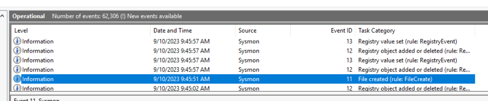
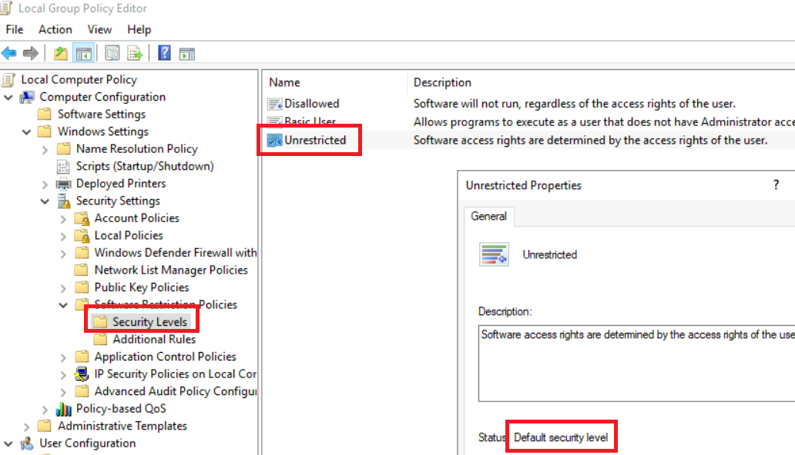
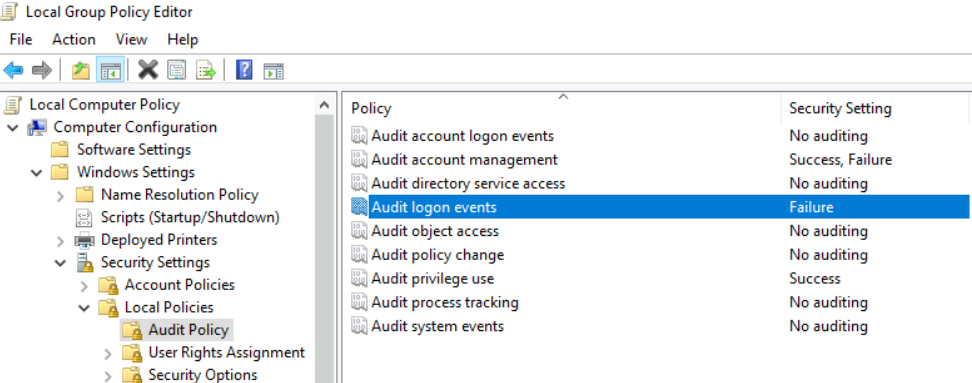

> # Preparation

# Summary
<!-- TOC -->

- [Summary](#summary)
    - [Task 2 - Incident Response Capability](#task-2---incident-response-capability)
    - [Task 3 - People and Documentation Preparation](#task-3---people-and-documentation-preparation)
    - [Task 4 - Technology Preparation](#task-4---technology-preparation)
    - [Task 5 - Visibility](#task-5---visibility)

<!-- /TOC -->

## Task 2 - Incident Response Capability
1. What is an observed occurrence within a system? 
    > Event: This is an observed occurrence within a system or network. It ranges from a user connecting to a file server, a user sending emails, or anti-malware software blocking an infection.

    **Answer:** Event

1. What is described as a violation of security policies and practices? 
    > Incident: This is a violation of security policies or practices by an adversary to negatively affect the organisation through actions such as exfiltrating data, encrypting through ransomware, or causing a denial of services.

    **Answer:** Incident

1. Under which incident response phase do organisations lay down their procedures? 
    > Preparation: Ensures that the organisation can effectively react to a breach with laid down procedures.

    **Answer:** Preparation

1. Under which phase will an organisation resume business operations fully and update its response capabilities? 
    > Recovery & Lessons Learned: Business operations are to resume fully after removing all threats and restoring systems to full function. Additionally, the organisation considers the experience, updates its response capabilities, and conducts updated training based on the incident.

    **Answer:** Recovery & Lessons Learned

## Task 3 - People and Documentation Preparation
1. A group that handles events involving cyber security breaches, comprising individuals with different skills and expertise, is known as? 
    > You must create a cyber security incident response team (CSIRT) that includes business, technical, legal counsel, and public relations experts with relevant skills and authority to act upon decisions during a cyber attack. 

    **Answer:** cyber security incident response team

1. Which documents would be used to accompany any evidence collected and keeps track of who handles the investigation procedures? 
    > Additionally, the team would keep track of the flow of information and manage evidence forms and documents, such as the chain of custody documents. 

    **Answer:** chain of custody documents

## Task 4 - Technology Preparation
1. What would a kit containing the necessary incident-handling tools be called? 
    > There should be means of collecting forensic evidence using disk and memory imaging tools, secure storage only accessible to the CSIRT, and analysis tools such as sandboxes. Accompanying these efforts should be an incident-handling **jump bag**
    **Answer:** jump bag

## Task 5 - Visibility
1. What is the Event ID for the File Created rule associated with the test? 
    Open *Event Viewer* and find `File Create` event. 
     
    **Answer:** 11

1. Under the Software Restriction Policies, what is the default security level assigned to all policies? 
    Open `Edit group policy`, full path is `Group Policy Object Policy/Computer Configuration/Windows Settings/Security Settings/Software Restriction Policies`
     
    **Answer:** Unrestricted

1. Find the Audit Policy folder under Local Policies. What setting has been assigned to the policy Audit logon events? 
     
    **Answer:** Failure

