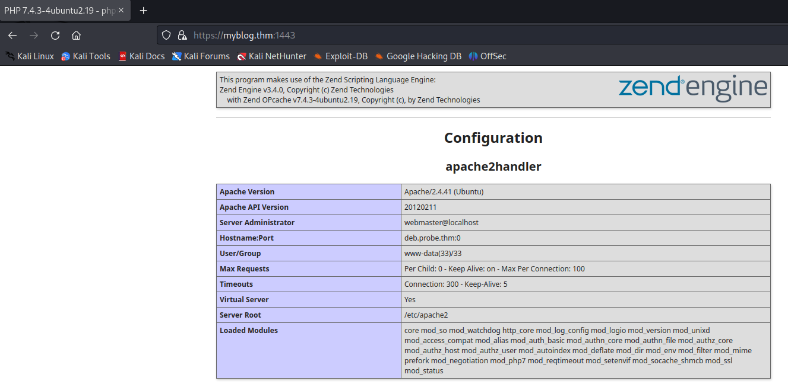
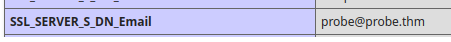
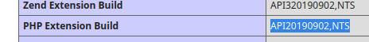
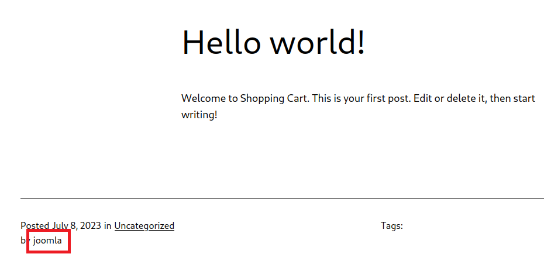

> # Probe

# Summary

## What is the version of the Apache server?
Use `nmap` to scan all ports from 1-10000 on the target machine.<br>
```
$ nmap 10.10.236.44 -Pn -p 1-10000
Starting Nmap 7.93 ( https://nmap.org ) at 2023-11-20 05:55 EST
Nmap scan report for 10.10.236.44
Host is up (0.27s latency).
Not shown: 9992 closed tcp ports (conn-refused)
PORT     STATE SERVICE
22/tcp   open  ssh
80/tcp   open  http
443/tcp  open  https
1338/tcp open  wmc-log-svc
1443/tcp open  ies-lm
1883/tcp open  mqtt
8000/tcp open  http-alt
9007/tcp open  ogs-client
```

Continues use `nmap` to find which version is running on port 80 and 443.<br>
```
$ nmap 10.10.236.44 -Pn -p 80,443 -sV
Starting Nmap 7.93 ( https://nmap.org ) at 2023-11-20 06:06 EST
Nmap scan report for 10.10.236.44
Host is up (0.28s latency).

PORT    STATE SERVICE  VERSION
80/tcp  open  http     lighttpd 1.4.55
443/tcp open  ssl/http Apache httpd 2.4.41
Service Info: Host: ip-10-10-236-44.eu-west-1.compute.internal

Service detection performed. Please report any incorrect results at https://nmap.org/submit/ .
```
**Answer:** 2.4.41

## What is the port number of the FTP service?
```
$ nmap 10.10.236.44 -Pn -p 1338,1443,1883,8000,9007 -sV
Starting Nmap 7.93 ( https://nmap.org ) at 2023-11-20 06:18 EST
Nmap scan report for 10.10.236.44
Host is up (0.27s latency).

PORT     STATE SERVICE                 VERSION
1338/tcp open  ftp                     vsftpd 2.0.8 or later
1443/tcp open  ssl/http                Apache httpd 2.4.41 ((Ubuntu))
1883/tcp open  mosquitto version 1.6.9
8000/tcp open  http                    Apache httpd 2.4.41 ((Ubuntu))
9007/tcp open  http                    Apache httpd 2.4.41
Service Info: Host: myblog.thm
```
**Answer:** 1338

## What is the FQDN for the website hosted using a self-signed certificate and contains critical server information as the homepage?
Port 1443 is the phpadmin page, it contains critical server information as the homepage `https://myblog.thm:1443/`/<br>
<br>
**Answer:** dev.probe.thm 

## What is the email address associated with the SSL certificate used to sign the website mentioned in Q3?
The answer is in `SSL_SERVER_I_DN_Email` field.<br>
<br>
**Answer:** probe@probe.thm 


## What is the value of the PHP Extension Build on the server?
Search the string `PHP Extension Build`.<br>
<br>
**Answer:** API20190902,NTS

## What is the banner for the FTP service?
Connect to port 1338 using `ftp`.<br>
```
$ ftp 10.10.236.44 1338
Connected to 10.10.236.44.
220 THM{WELCOME_101113}
```
**Answer:** THM{WELCOME_101113}

## What software is used for managing the database on the server?
**Answer:** phpMyAdmin

## What is the Content Management System (CMS) hosted on the server?
Use `whatweb` at port 9007, you will see the web server use WordPress.<br>
```shell
$ whatweb https://10.10.7.156:9007/
https://10.10.7.156:9007/ [200 OK] Apache[2.4.41], Country[RESERVED][ZZ], HTML5, HTTPServer[Ubuntu Linux][Apache/2.4.41 (Ubuntu)], IP[10.10.7.156], MetaGenerator[WordPress 6.2.2], Script, Title[Welcome to my Blog &#8211; I am going to be the best blogger], UncommonHeaders[link], WordPress[6.2.2]
```

## What is the version number of the CMS hosted on the server?
From the above, we have had the answer.<br>
**Answer:" 6.2.2

## What is the username for the admin panel of the CMS?
Follow to the blog [https://myblog.thm:9007/?p=1](https://myblog.thm:9007/?p=1).<br>
<br>

**Answer:** joomla

## During vulnerability scanning, OSVDB-3092 detects a file that may be used to identify the blogging site software. What is the name of the file?
Use `nikto` to scan the CGI dir, you will see the line contains OSVDB-3092 description.<br>
```shell
$ nikto -url https://myblog.thm:9007/license.txt -ssl -C all
[SNIP]
OSVDB-3092: /license.txt: License file found may identify site software
[SNIP]
```
**Answer:** license.txt

## What is the name of the software being used on the standard HTTP port?
Use `nmap -sC -sV` to scan port 80.<br>
```shell
$ nmap -sC -sV 10.10.7.156 -p80
Starting Nmap 7.93 ( https://nmap.org ) at 2024-06-03 12:34 EDT
Nmap scan report for myblog.thm (10.10.7.156)
Host is up (0.24s latency).

PORT   STATE SERVICE VERSION
80/tcp open  http    lighttpd 1.4.55
|_http-server-header: lighttpd/1.4.55
|_http-title: 403 Forbidden

Service detection performed. Please report any incorrect results at https://nmap.org/submit/ .
Nmap done: 1 IP address (1 host up) scanned in 13.25 seconds
```
**Answer:** lighttpd

## What is the flag value associated with the web page hosted on port 8000?
Use `gobuster` to find whether the web page has hidden file/directory.<br>
```shell
$ gobuster dir -u http://myblog.thm:8000 -w /usr/share/wordlists/dirbuster/directory-list-2.3-medium.txt 
===============================================================
Gobuster v3.6
by OJ Reeves (@TheColonial) & Christian Mehlmauer (@firefart)
===============================================================
[+] Url:                     http://myblog.thm:8000
[+] Method:                  GET
[+] Threads:                 10
[+] Wordlist:                /usr/share/wordlists/dirbuster/directory-list-2.3-medium.txt
[+] Negative Status codes:   404
[+] User Agent:              gobuster/3.6
[+] Timeout:                 10s
===============================================================
Starting gobuster in directory enumeration mode
===============================================================
/contactus            (Status: 301) [Size: 319] [--> http://myblog.thm:8000/contactus/]
```
We found `contactus`, navigate to the above link we will see the flag.<br>
```shell
$ curl http://probe.thm:8000/contactus/                                                                 
Flag: THM{CONTACT_US_1100} 
```
**Answer:** THM{CONTACT_US_1100} 
