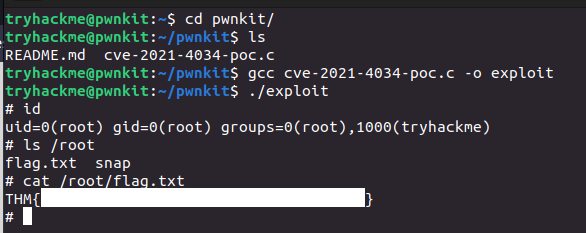

> # Pwnkit: CVE-2021-4034 - Tryhackme

# Summary
* [Task 2 - Tutorial Background](#task-2---tutorial-background)
* [Task 3 - Practical Exploitation](#task-3---practical-exploitation)
* [Task 4 - Tutorial Remediations](#task-4---tutorial-remediations)

## Task 2 - Tutorial Background
CVE-2021-4034 được phát hiện bởi nghiên cứu viên ở Qualys và được công bố trong tháng một 2022.

**Pokit là gì?**
Có ghi trong [Polkit CVE-2021-3560](/Polkit%20CVE-2021-3560/README.md)<br>

**Lỗ hổng**
Được đề cập trước đó, lỗ hổng pwnkit tồn tại trong tích hợp `pkexec`. 
Các phiên bản pkexec được phát hành trước bản vá không xử lý các đối số dòng lệnh an toàn, có thể dẫn đến lỗ hổng "out-of-bounds-write", cho phép kẻ tấn công thao tác trên môi trường mà lệnh pkexec đang chạy trong đó. 

Cụ thể hơn, pkexec cố gắng phân tích bất kỳ tham số dòng lệnh nào được đưa và nó sử dụng vòng lặp for-loop, bắt đầy ở chỉ số 1. Điều gì xảy ra khi chúng ta không cung cấp bất kỳ tham số. 

Mã giả sau giúp hiểu vấn đề:
```bash
for(n=1; n < number_of_arguments; n++){
  //Do Stuff
}
```

Nếu không có tham số thì n sẽ không bao giờ nhỏ hơn tổng số tham số. Như vậy, n sẽ luôn bằng 1 và vòng lặp bị vượt mặt hoàn toàn.

Nó trở thành vấn đề ở phía sau khi lệnh pkexec cố gắng viết một giá trị của tham số vị trí n. Vì không có bất kỳ tham số nào, nên không có tham số nào ở vị trí n - thay vào đó chương trình ghi đè thứ tiếp tiếp theo lên bộ nhớ, điều này xảy ra là giá trị đầu tiên của danh sách biến môi trường khi chương trình được gọi sử dụng một hàm trong C gọi là execve(). Mặc khác, vượt mặt pkexec với một danh sách rỗng tham số, chúng ta có thể buộc nó ghi đè một biến môi trường.

Ví dụ: một số biến môi trường bị xóa bởi hệ điều hành khi bạn cố gắng chạy một chương trình có SUID được bật; điều này ngăn kẻ tấn công có thể chiếm quyền khi nó chạy với quyền cao nhất. Sử dụng "out-of"bound-write", chúng ta có thể giới thiệu lại sự lụa chọn của mình về các biến môi trường nguy hiểm này bằng cách lừa pkexec thêm nó.


1. Is Pwnkit exploitable remotely (Aye/Nay)?<br>
    **Answer:**Nay

1. In which Polkit utility does the Pwnkit vulnerability reside?<br>
    **Answer:** pkexec

## Task 3 - Practical Exploitation
Follow these steps in tutorial.<br>
<br>
**Answer:** THM{<redacted>}

## Task 4 - Tutorial Remediations
Để ngăn ngừa việc khai thác lỗi này, thực hiện cập nhật và cài bản vá mới nhất từ nhà cung cấp `sudo apt update && sudo apt upgrade`.<br>
Nếu bản vá chưa được phát hành cho hệ thống, cần phải loại bỏ SUID cho khỏi chương trình `pkexec` bằng lệnh:
```
sudo chmod 755 `which pkexec`
```
Nhưng đây chỉ là phương pháp tạm thời, vẫn phải cập nhật bản vá từ nhà cung cấp khi nó được phát hành. 

Kiểm tra máy hiện tại đã được vá lỗi trên pwnkit hay chưa.<br>
```
$ gcc cve-2021-4034-poc.c -o exploit

$ ./exploit 
mkdir: cannot create directory ‘GCONV_PATH=.’: Invalid argument
touch: cannot touch 'GCONV_PATH=./pwnkit': No such file or directory
chmod: cannot access 'GCONV_PATH=./pwnkit': No such file or directory
GLib: Cannot convert message: Could not open converter from “UTF-8” to “PWNKIT”
pkexec --version |
       --help |
       --disable-internal-agent |
       [--user username] PROGRAM [ARGUMENTS...]

See the pkexec manual page for more details.
```
