> # Pyramid Of Pain

 

# Summary
<!-- TOC -->

- [Summary](#summary)
    - [Task 2 - Hash Values (Trivial)](#task-2---hash-values-trivial)
    - [Task 3 - IP Address (Easy)](#task-3---ip-address-easy)
    - [Task 4 - Domain Names (Simple)](#task-4---domain-names-simple)
    - [Task 5 - Host Artifacts (Annoying)](#task-5---host-artifacts-annoying)
    - [Task 6 - Network Artifacts (Annoying)](#task-6---network-artifacts-annoying)
    - [Task 7 - Tools (Challenging)](#task-7---tools-challenging)
    - [Task 8 - TTPs (Tough)](#task-8---ttps-tough)

<!-- /TOC -->
## Task 2 - Hash Values (Trivial)
VirusTotal
MetaDefender Cloud - OPSWAT
1. Provide the ransomware name for the hash '63625702e63e333f235b5025078cea1545f29b1ad42b1e46031911321779b6be' using open-source lookup tools 
    I use `MetaDefender Cloud - OPSWAT`. 
    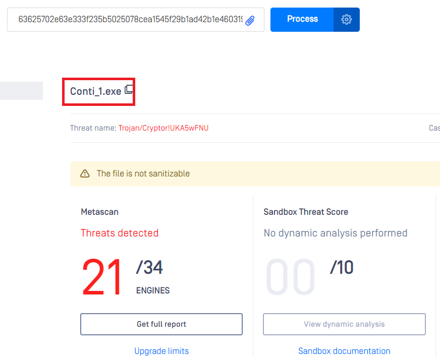 
    **Answer:** Conti

## Task 3 - IP Address (Easy)
[Tham khảo](https://unit42.paloaltonetworks.com/fast-flux-101/)
1. What is the ASN for the third IP address observed? 
    In connections tab, you will see the ASN of the third IP address. 
    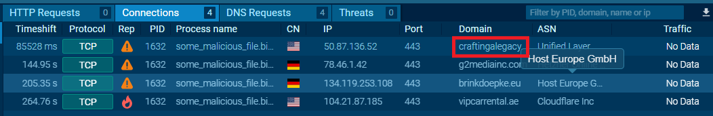 
    **Answer:** Host Europe GmbH

1. What is the domain name associated with the first IP address observed? 
    From the previous image. 
    **Answer:** craftingalegacy.com

## Task 4 - Domain Names (Simple)
URL shorteners service providers. 
- bit.ly 
- goo.gl 
- ow.ly 
- s.id 
- smarturl.it 
- tiny.pl 
- tinyurl.com 
- x.co 

1. Provide the first malicious URL request you are seeing, you will be using this report to answer the remaining questions of this task.
    The given link is the same as previous task so the first malicious URL request is also the first fomain name. 
    **Answer:** craftingalegacy.com

1. What term refers to an address used to access websites? 
    **Answer:** Domain name

1. What type of attack uses Unicode characters in the domain name to imitate the a known domain? 
    > Punycode is a way of converting words that cannot be written in ASCII, into a Unicode ASCII encoding.

    **Answer:** Punycode attack

1. Provide the redirected website for the shortened URL using a preview: https://tinyurl.com/bw7t8p4u 
    Add '+' character behind the link, you will see the preview of the actual link of it. 
    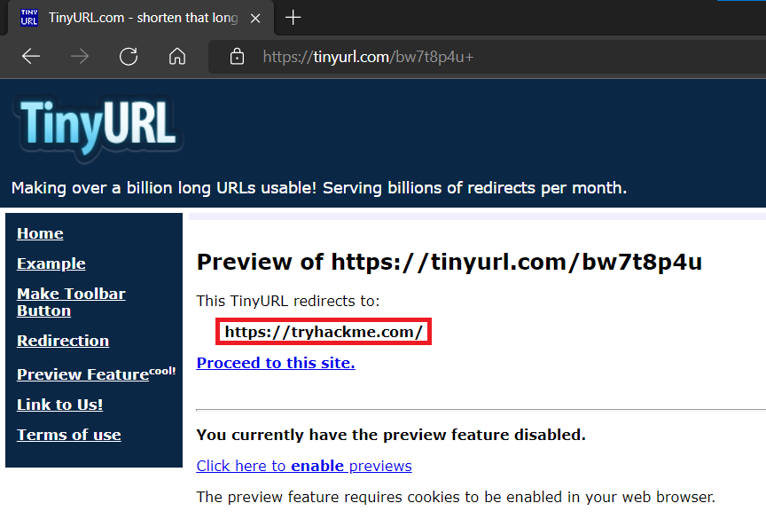 
    **Answer:** https://tryhackme.com/

## Task 5 - Host Artifacts (Annoying)
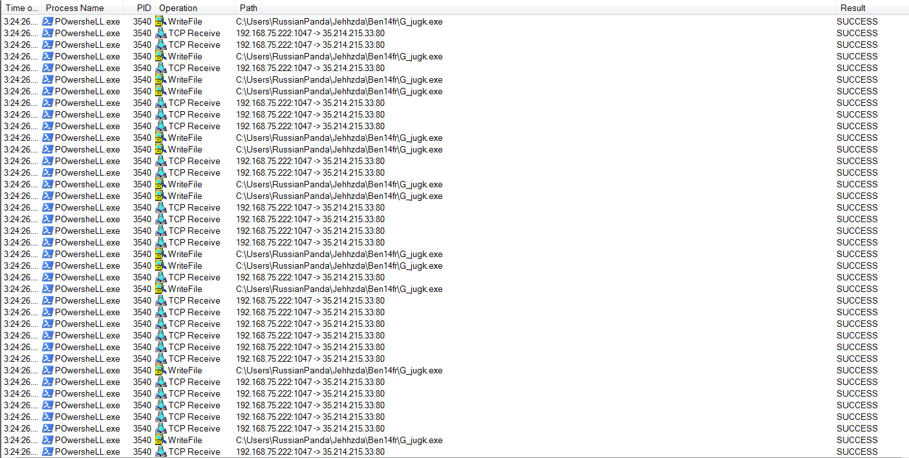 

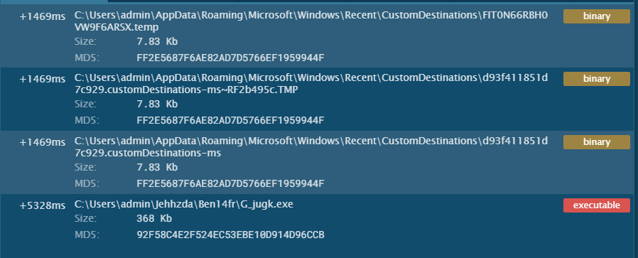 
1. What is the suspicious IP the victim machine tried to connect to in the screenshot above? 
    **Answer:** 35.214.215.33

1. Use the tools introduced in task 2 and provide the name of the malware associated with the IP address 
    Paste the IP address to VirusTotal and in Comunity tab, you will see a comment contains the name of the malware. 
    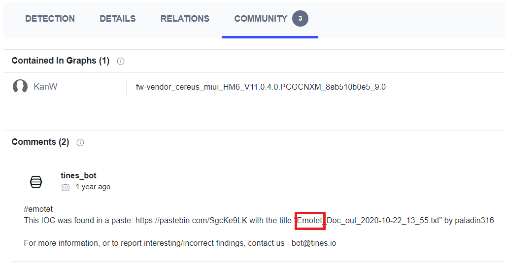 
    **Answer:** Emotet

1. Using your OSINT skills, what is the name of the malicious document associated with the dropped binary? 
    From image above, the name of the malicious asscociated with the dropped binary is G_jugk.exe
    **Answer:** G_jugk.exe

1. Use your OSINT skills and provide the name of the malicious document associated with the dropped binary  
    Search on google, you will see the link to anyrun. 
    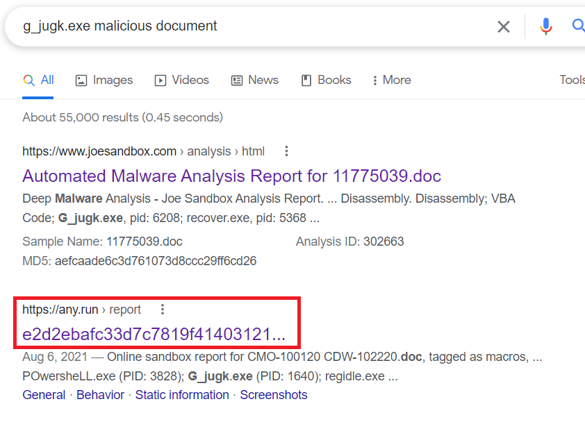 
    Follow this link, you will the name of the sample. 
    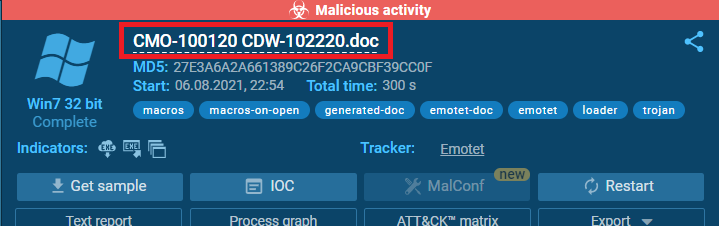 
    **Answer:** CMO-100120 CDW-102220.doc

## Task 6 - Network Artifacts (Annoying)
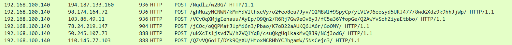 

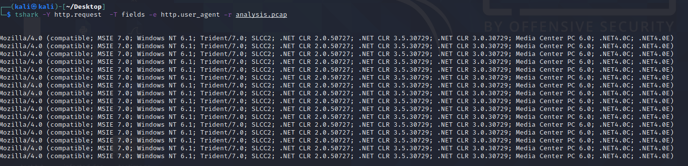 

1. What browser uses the User-Agent string shown in the screenshot above? 
    In User-Agent field, the string `MSIE` stand for `Microsoft Internet Explorer`. 
    **Answer:** Internet Explorer

1. How many POST requests are in the screenshot from the pcap file? 
    **Answer:** 6

## Task 7 - Tools (Challenging)
1. Provide the method used to determine similarity between the files  
    > Fuzzy hashing is also a strong weapon against the attacker's tools. Fuzzy hashing helps you to perform similarity analysis - match two files with minor differences based on the fuzzy hash values.

    **Answer:** Fuzzy hashing

1. Provide the alternative name for fuzzy hashes without the abbreviation 
    Research on Google. 
    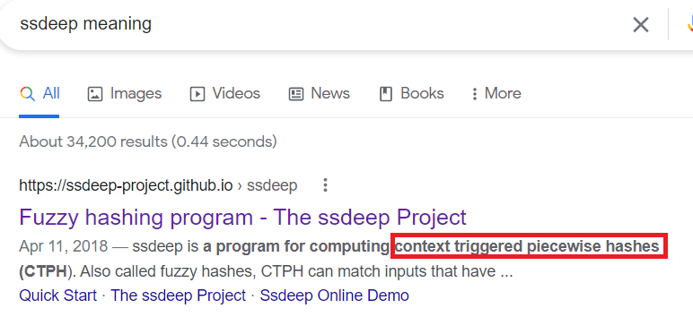 
    **Answer:** context triggered piecewise hashes

## Task 8 - TTPs (Tough)
1. Navigate to ATT&CK Matrix webpage. How many techniques fall under the Exfiltration category? 
    Follow Home -> Tactics -> Techniques -> Exfiltration, you will see the number of techniques. 
    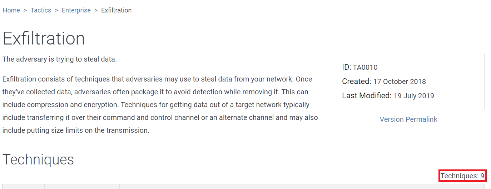 
    **Answer:** 9

1. Chimera is a China-based hacking group that has been active since 2018. What is the name of the commercial, remote access tool they use for C2 beacons and data exfiltration? 
    Research on google, you wil see a link associated with Chimera group. 
    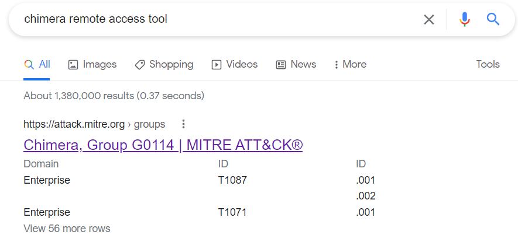 
    In the below image, ATT&CK Matrix refer a tool called `Cobalt Strike` which is very popular. 
    **Answer:** Cobalt Strike
