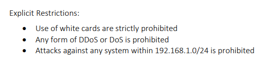
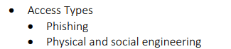

> # Red Team Engagements - Tryhackme

# Summary
* [Task 2 - Defining Scope and Objectives](#task-2---defining-scope-and-objectives)
* [Task 3 - Rules of Engagement](#task-3---rules-of-engagement)
* [Task 5 - Engagement Documentation](#task-5---engagement-documentation)
* [Task 7 - Resource Plan](#task-7---resource-plan)
* [Task 8 - Operations Plan](#task-8---operations-plan)
* [Task 9 - Mission Plan](#task-9---mission-plan)

## Task 2 - Defining Scope and Objectives
1. What CIDR range is permitted to be attacked? 
    > Attacks against systems within 10.0.4.0/22 are permitted.

    **Answer:** 10.0.4.0/22

1. Is the use of white cards permitted? (Y/N) 
    > Use of white cards is permitted depending on downtime and length.

    **Answer:** Y

1. Are you permitted to access "*.bethechange.xyz?" (Y/N) 
    > Any interaction with "*.bethechange.xyz" is prohibited.

    **Answer:** N

## Task 3 - Rules of Engagement
1. Once downloaded, read the sample document and answer the questions below. 
     
    **Answer:** 3

1. What is the first access type mentioned in the document? 
     
    **Answer:** Phishing

1. Is the red team permitted to attack 192.168.1.0/24? (Y/N) 
    > Attacks against any system within 192.168.1.0/24 is prohibited

    **Answer:** N

## Task 5 - Engagement Documentation
1. How long will the engagement last? 
    > Holo Enterprises has hired TryHackMe as an external contractor to conduct a month-long network infrastructure assessment and security posture.

    **Answer:** a month

1. How long is the red cell expected to maintain persistence? 
    > Operators are also expected to execute and maintain persistence to sustain for a period of three weeks. 

    **Answer:** 3 weeks

1. What is the primary tool used within the engagement? 
    > The red cell will accomplish objectives by employing the use of Cobalt Strike as the primary red cell tool.

    **Answer:** Cobalt Strike

## Task 7 - Resource Plan
1. When will the engagement end? (MM/DD/YYYY) 
    > Post-Exploitation and Persistence: 10/24/2021 - 11/14/2021

    **Answer:** 11/14/2021

1. What is the budget the red team has for AWS cloud cost? 
    > Red Cell is requesting a budget of $1000 for AWS cloud costs

    **Answer:** $1000

1. Are there any miscellaneous requirements for the engagement? (Y/N) 
    > No other requirements are currently projected

    **Answer:** N

## Task 8 - Operations Plan
1. What phishing method will be employed during the initial access phase? 
    > spearphishing via mshta and typosquatted domains will be employed in the initial access phase.

    **Answer:** spearphishing

1. What site will be utilized for communication between the client and red cell? 
    > Throughout the engagement the red cell will utilize vectr.io to communicate 

    **Answer:** vectr.io

1. If there is a system outage, the red cell will continue with the engagement. (T/F) 
    > In the event of a system outage all engagement operations will cease

    **Answer:** F

## Task 9 - Mission Plan
1. When will the phishing campaign end? (mm/dd/yyyy) 
    **Answer:** 10/23/2021

1. Are you permitted to attack 10.10.6.78? (Y/N) 
    Because this IP is not in External Target. 
    **Answer:** N

1. When a stopping condition is encountered, you should continue working and determine the solution yourself without a team lead. (T/F) 
    > In the event of any varying events throughout the engagement, immediately contact a team lead and disuss how to continue.

    **Answer:** F

