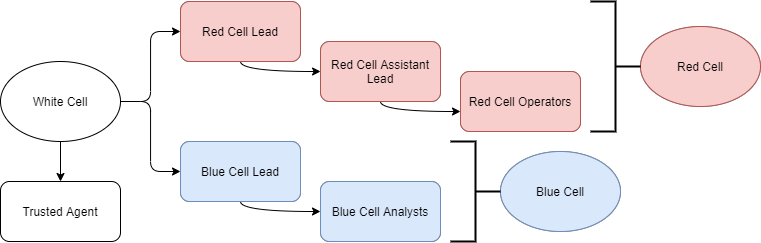

> # Red Team Fundamentals - Tryhackme

# Summary
* [Task 2 - Vulnerability Assessment and Penetration Tests Limitations](#task-2---vulnerability-assessment-and-penetration-tests-limitations)
* [Task 3 - Red Team Engagements](#task-3---red-team-engagements)
* [Task 4 - Teams and Functions of an Engagement](#task-4---teams-and-functions-of-an-engagement)
* [Task 5 - Engagement Structure](#task-5---engagement-structure)
* [Task 6 - Overview of a Red Team Engagement](#task-6---overview-of-a-red-team-engagement)

## Task 2 - Vulnerability Assessment and Penetration Tests Limitations
1. Would vulnerability assessments prepare us to detect a real attacker on our networks? (Yay/Nay) 
    It detects vulnerability on the networks. 
    **Answer:** nay

1. During a penetration test, are you concerned about being detected by the client? (Yay/Nay) 
    Because it based on the contract made before. 
    **Answer:** nay

1. Highly organised groups of skilled attackers are nowadays referred to as ... 
    > Nowadays, the most prominent threat actors are known as Advanced Persistent Threats (APT), which are highly skilled groups of attackers, usually sponsored by nations or organised criminal groups.

    **Answer:** Advanced Persistent Threats

## Task 3 - Red Team Engagements
1. The goals of a red team engagement will often be referred to as flags or... 
    > Every red team engagement will start by defining clear goals, often referenced as crown jewels or flags, ranging from compromising a given critical host to stealing some sensitive information from the target. 

    **Answer:** crown jewels

1. During a red team engagement, common methods used by attackers are emulated against the target. Such methods are usually called TTPs. What does TTP stand for? 
    **Answer:** Tactics, Techniques and Procedures

1. The main objective of a red team engagement is to detect as many vulnerabilities in as many hosts as possible (Yay/Nay) 
    It's the main objective of conventional penetration tests. 
    **Answer:** Nay

## Task 4 - Teams and Functions of an Engagement
1. What cell is responsible for the offensive operations of an engagement? 
    > A red cell is the component that makes up the offensive portion of a red team engagement that simulates a given target's strategic and tactical responses.

    **Answer:** red cell

1. What cell is the trusted agent considered part of? 
     
    Based on the image above. 
    **Answer:** white cell

## Task 5 - Engagement Structure
1. If an adversary deployed Mimikatz on a target machine, where would they be placed in the Lockheed Martin cyber kill chain? 
    From the table outlining. 
    **Answer:** Installation

1. What technique's purpose is to exploit the target's system to execute code? 
    Similar to the above question. 
    **Answer:** Exploitation

## Task 6 - Overview of a Red Team Engagement
1. Click the "View Site" button and follow the example engagement to get the flag
    **Answer:** THM{RED_TEAM_ROCKS}

