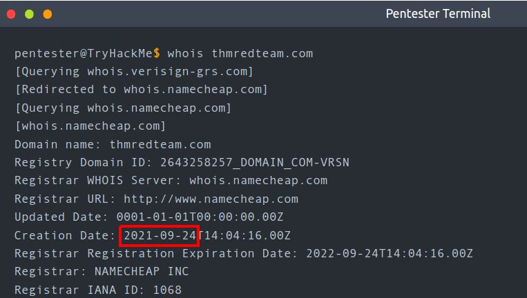
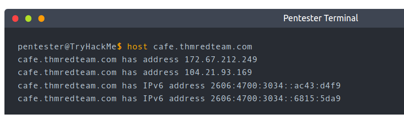
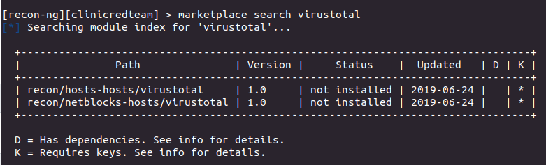
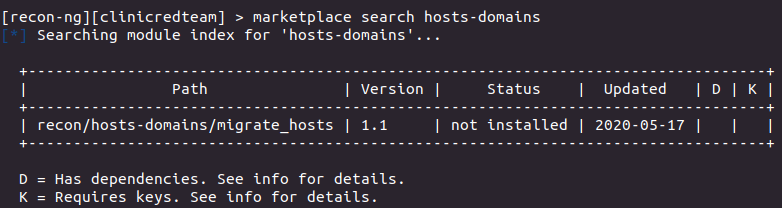
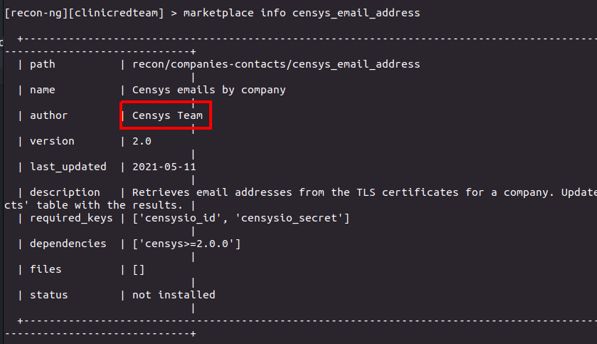
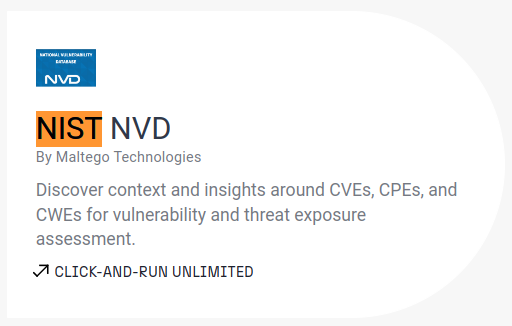
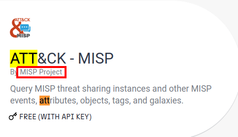

> # Red Team Recon - Tryhackme

# Summary
* [Task 3 - Built-in Tools](#task-3---built-in-tools)
* [Task 4 - Advanced Searching](#task-4---advanced-searching)
* [Task 5 - Specialized Search Engines](#task-5---specialized-search-engines)
* [Task 6 - Recon-ng](#task-6---recon-ng)
* [Task 7 - Maltego](#task-7---maltego)

## Task 3 - Built-in Tools
1. When was thmredteam.com created (registered)? (YYYY-MM-DD) 
     
    **Answer:** 2021-09-24

1. To how many IPv4 addresses does clinic.thmredteam.com resolve? 
     
    **Answer:** 2

1. To how many IPv6 addresses does clinic.thmredteam.com resolve? 
    From image above. 
    **Answer:** 2

## Task 4 - Advanced Searching
1. How would you search using Google for xls indexed for http://clinic.thmredteam.com? 
    Use `filetypr` and `site` attribute. 
    **Answer:** filetype:xls site:clinic.thmredteam.com

1. How would you search using Google for files with the word passwords for http://clinic.thmredteam.com? 
    **Answer:** passwords site:clinic.thmredteam.com

## Task 5 - Specialized Search Engines
[ViewDNS.info](ViewDNS.info) 
[https://threatintelligenceplatform.com/](https://threatintelligenceplatform.com/) 
[https://search.censys.io](https://search.censys.io/) 
[https://www.shodan.io/](https://www.shodan.io/) 

1. What is the shodan command to get your Internet-facing IP address? 
    Print `shodan -h`, you will see flag `myip` will `Print your external IP address`. 
    **Answer:** shodan myip

## Task 6 - Recon-ng
1. How do you start recon-ng with the workspace clinicredteam? 
    **Answer:** recon-ng -w clinicredteam

1. How many modules with the name virustotal exist? 
    Search on marketplace, you will see two modules with the name `virustotal`. 
     
    **Answer:** 2

1. There is a single module under hosts-domains. What is its name?<rb>
    Search for `hosts-domains`, you will only one module appear. 
     
    **Answer:** migrate_hosts

1. censys_email_address is a module that “retrieves email addresses from the TLS certificates for a company.” Who is the author? 
    Display info of this module. 
     
    **Answer:** Censys Team

## Task 7 - Maltego
1. What is the name of the transform that queries NIST’s National Vulnerability Database? 
    Search on Maltego Tranform Hub. 
     
    **Answer:** NIST NVD

1. What is the name of the project that offers a transform based on ATT&CK? 
     
    **Answer:** MISP Project

