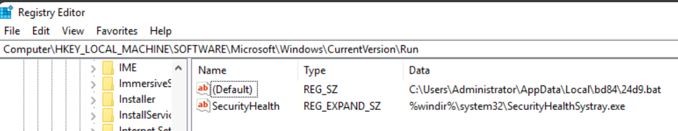
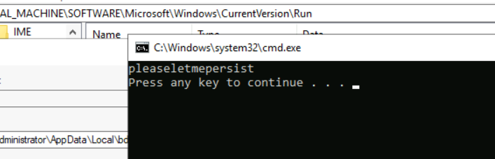
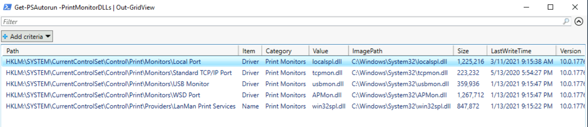
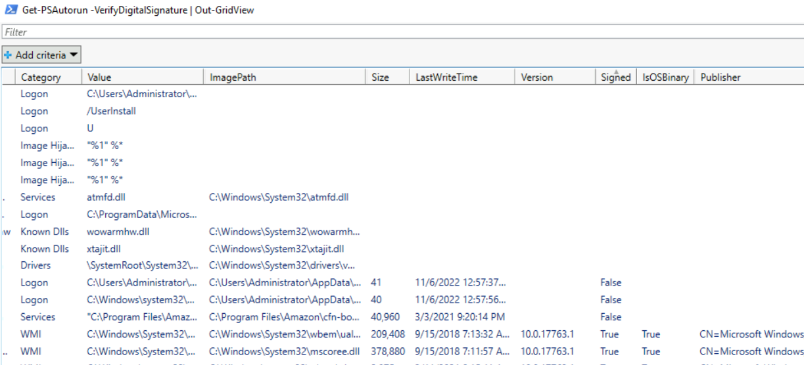
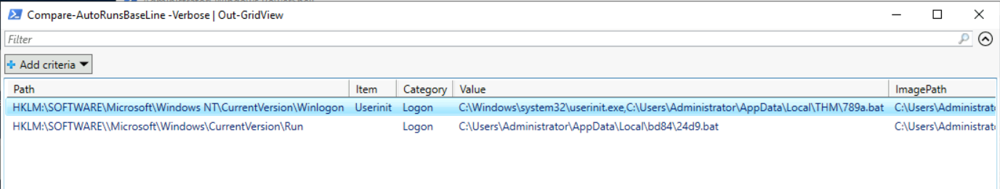
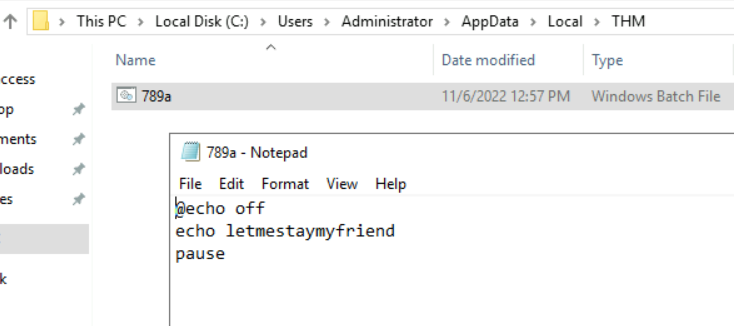

> # Registry Persistence Detection

# Summary
<!-- TOC -->

- [Summary](#summary)
    - [Task 2 - Intro to Malware Persistence Mechanisms](#task-2---intro-to-malware-persistence-mechanisms)
    - [Task 3 - Intro to the AutoRuns PowerShell Module](#task-3---intro-to-the-autoruns-powershell-module)
    - [Task 4 - Filtering AutoRuns Entries](#task-4---filtering-autoruns-entries)
    - [Task 5 - Comparing to a Baseline](#task-5---comparing-to-a-baseline)

<!-- /TOC -->

## Task 2 - Intro to Malware Persistence Mechanisms
1. What is the value "Name" of the suspicious registry entry that runs during startup? Include the parenthesis.<br>
    The answer is in `HKEY_LOCAL_MACHINE\Software\Microsoft\Windows\CurrentVersion\Run`, the (Default) key will run a .bat file when system is start.<br>
    <br>
    **Answer:** (Default)

1. What is the value "Data" of the suspicious registry entry that runs during startup?<br>
    **Answer:** C:\Users\Administrator\AppData\Local\bd84\24d9.bat

1. What string is displayed on the console when the suspicious file runs?<br>
    <br>
    **Answer:** pleaseletmepersist

## Task 3 - Intro to the AutoRuns PowerShell Module
1. What AutoRun function is used for getting and displaying the auto-run entries?<br>
    From PowerShell, run the command.<br>
    ```
    Get-Help Get-PSAutorun

    DESCRIPTION
        Retrieve a list of programs configured to autostart at boot or logon.
    ```
    **Answer:** Get-PSAutorun

1. What AutoRun function is used for creating a baseline file from Autoruns artifact(s)?<br>
    ```
    Get-Help New-AutoRunsBaseLine
    DESCRIPTION

    Create a baseline from Autoruns artifact(s) as a PowerShell script (.ps1) file.
    ```
    **Answer:** New-AutoRunsBaseLine

1. What AutoRun function is used for comparing two baseline files of Autoruns artifact(s)?<br>
    ```
    Get-Help Compare-AutoRunsBaseLine

    DESCRIPTION
        Compare two baseline files of Autoruns artifact(s).
    ```
    **Answer:** Compare-AutoRunsBaseLine

## Task 4 - Filtering AutoRuns Entries
1. What parameter switch is used for filtering for artifacts related to boot execution of images? <br>
    ```
    Get-Help Get-PSAutorun -Detailed
    -BootExecute [<SwitchParameter>]
        Switch to gather artifacts from the Boot Execute category.
    ```
    **Answer:** BootExecute

1. How many entries are outputted using the parameter switch from the previous question?<br>
    ```
    > Get-PSAutorun -BootExecute


    Path          : HKLM:\System\CurrentControlSet\Control\Session Manager
    Item          : BootExecute
    Category      : Boot Execute
    Value         : autocheck autochk /q /v *
    ImagePath     : C:\Windows\system32\autochk.exe
    Size          : 956416
    LastWriteTime : 1/13/2021 9:15:12 PM
    Version       : 10.0.17763.1697
    ```
    **Answer:** 1

1. What parameter switch is used for filtering for artifacts related to printer driver and status monitors?<br>
    > -PrintMonitorDLLs [<SwitchParameter>] Switch to gather artifacts from the Print Monitors category.

    **Answer:** PrintMonitorDLLs

1. How many entries are listed in the output using the parameter switch from the previous question?<br>
    Use `Get-PSAutorun -PrintMonitorDLLs | Out-GridView`,
    <br>
    **Answer:** 5

1. What parameter is used to add a new column to show whether a file is digitally signed?<br>
    > -VerifyDigitalSignature [<SwitchParameter>] Switch to report if a file is digitally signed with the built-in Get-AuthenticodeSignature cmdlet.

    **Answer:** VerifyDigitalSignature

1. Searching all categories, how many entries have the "Signed" column set to "false"?<br>
    Use `Get-PSAutorun -VerifyDigitalSignature | Out-GridView`, then sort `Signed` column.<br>
    <br>
    **Answer:** 3

## Task 5 - Comparing to a Baseline
1. There is another suspicious logon Registry entry. What is the full path of this key?<br>
    After run `Compare-AutoRunsBaseLine -Verbose | Out-GridView`, you will see the other registry key was modified.<br>
    <br>
    **Answer:** HKLM:\SOFTWARE\Microsoft\Windows NT\CurrentVersion\Winlogon

1. What is the value item name of the suspicious Registry entry from question #1?<br>
    **Answer:** Userinit	

1. What is the value data of the suspicious Registry entry from question #1?<br>
    **Answer:** C:\Windows\system32\userinit.exe,C:\Users\Administrator\AppData\Local\THM\789a.bat

1. What is the category that AutoRuns assigned to the entry from question #1?<br>
    **Answer:** Logon

1. What string is displayed on the console when the suspicious file ran?<br>
    Edit the .bat file to see the string will be display on the console.<br>
    <br>
    **Answer:** letmestaymyfriend
