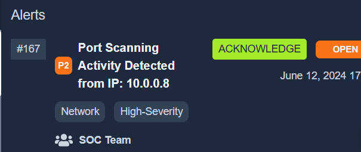
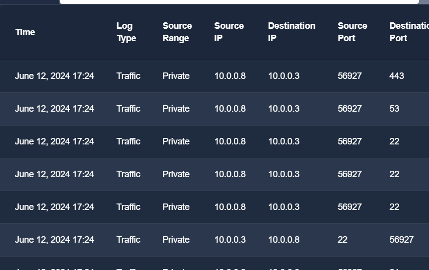

> # SOC Fundamentals

## Summary
- [Summary](#summary)
  - [Task 1 - Introduction to SOC](#task-1---introduction-to-soc)
  - [Task 2 - Purpose and Components](#task-2---purpose-and-components)
  - [Task 3 - People](#task-3---people)
  - [Task 4 - Process](#task-4---process)
  - [Task 5 - Technology](#task-5---technology)
  - [Task 6 - Practical Exercise of SOC](#task-6---practical-exercise-of-soc)

### Task 1 - Introduction to SOC
1. What does the term SOC stand for? 
    **Answer:** Security Operations Center

### Task 2 - Purpose and Components
1. The SOC team discovers an unauthorized user is trying to log in to an account. Which capability of SOC is this? 
    **Answer:** detection

1. What are the three pillars of a SOC? 
    > People, Process, and Technology coexist in a SOC environment. A team of professional individuals working on state-of-the-art security tools in the presence of proper processes is what makes a mature SOC environment.

    **Answer:** People, Process, Technology

### Task 3 - People
1. Alert triage and reporting is the responsibility of? 
    > SOC Analyst (Level 1): Anything detected by the security solution would pass through these analysts first. These are the first responders to any detection. SOC Level 1 Analysts perform basic alert triage to determine if a specific detection is harmful. They also report these detections through proper channels.

    **Answer:** SOC Analyst (Level 1)

1. Which role in the SOC team allows you to work dedicatedly on establishing rules for alerting security solutions? 
    **Answer:** Detection Engineer

### Task 4 - Process
1. At the end of the investigation, the SOC team found that John had attempted to steal the system's data. Which 'W' from the 5 Ws does this answer? 
    **Answer:** who

1. The SOC team detected a large amount of data exfiltration. Which 'W' from the 5 Ws does this answer? 
    **Answer:** what

### Task 5 - Technology
1. Which security solution monitors the incoming and outgoing traffic of the network? 
    > Firewall: A firewall functions purely for network security and acts as a barrier between your internal and external networks (such as the Internet). It monitors incoming and outgoing network traffic and filters any unauthorized traffic. 

    **Answer:** firewall

1. Do SIEM solutions primarily focus on detecting and alerting about security incidents? (yea/nay) 
    **Answer:** yea

### Task 6 - Practical Exercise of SOC
1. What: Activity that triggered the alert? 
     
    **Answer:** Port Scan

1. When: Time of the activity?  
    **Answer:** June 12, 2024 17:24

1. Where: Destination host IP?  
     
    **Answer:** 10.0.0.3

1. Who: Source host name? 
    **Answer:** NESSUS

1. Why: Reason for the activity? Intended/Malicious 
    > As mentioned in the task, the vulnerability assessment team notified the SOC team that they were running a port scan activity inside the network from the host: 10.0.0.8

    **Answer:** Intended

1. Additional Investigation Notes: Has any response been sent back to the port scanner IP? (yea/nay) 
    **Answer:** yea

1. What is the flag found after closing the alert? 
    **Answer:** THM{000_INTRO_TO_SOC}
