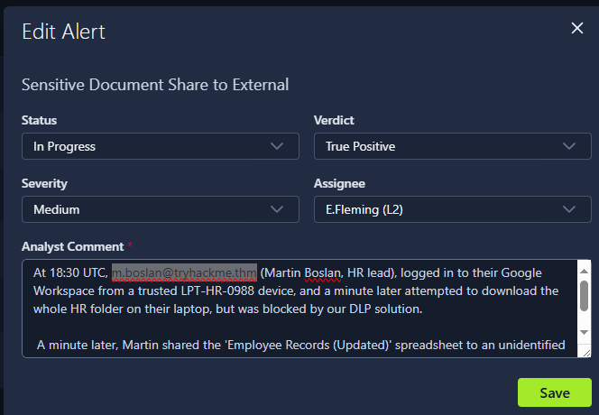
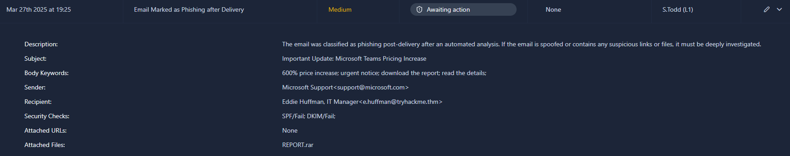

> # SOC L1 Alert Reporting

## Summary
- [Summary](#summary)
  - [Task 2 - Alert Funnel](#task-2---alert-funnel)
  - [Task 3 - Reporting Guide](#task-3---reporting-guide)
  - [Task 4 - Escalation Guide](#task-4---escalation-guide)
  - [Task 5 - SOC Communication](#task-5---soc-communication)

### Task 2 - Alert Funnel
1. What is the process of passing suspicious alerts to an L2 analyst for review?<br>
    > Alert Escalation: If the True Positive alert requires additional actions or deeper investigation, escalate it to the L2 analyst for further review following the agreed procedures. That's where your alert report comes in handy since L2 will use it to get the initial context and spend less on the analysis from scratch.

    **Answer:** 

1. What is the process of formally describing alert details and findings?<br>
    **Answer:** Alert Reporting

### Task 3 - Reporting Guide
1. According to the SOC dashboard, which user email leaked the sensitive document?<br>
        <br>
    **Answer:** m.boslan@tryhackme.thm

1. Looking at the new alerts, who is the "sender" of the suspicious, likely phishing email?<br>
    <br>
    **Answer:** support@microsoft.com

1. Open the phishing alert, read its details, and try to understand the activity. Using the Five Ws template, what flag did you receive after writing a good report?<br>
    ```
    1. Sender: Posed as Microsoft Support using the email support@microsoft.com (spoofed). Recipient: Eddie Huffman, IT Manager at TryHackMe (e.huffman@tryhackme.thm). Real Actor: Likely a malicious entity spoofing Microsoft to trick the recipient.

    2. A phishing email disguised as an urgent pricing update from Microsoft Teams. Contains alarming language like "600% price increase" and prompts to download a file ("REPORT.rar"). Phishing indicators: Suspicious attachment, spoofed sender, and urgent call to action.

    3. The email was flagged post-delivery by an automated analysis(exact timestamp not provided). - The delay in classification increased the risk of user interaction with the malicious content.

    4. Delivered to Eddie Huffman's inbox within the TryHackMe domain. Source spoofed as: Microsoft.com but failed SPF and DKIM, indicating it wasn't sent from a legitimate Microsoft server.

    5. To trick the recipient into downloading a malicious file (*REPORT.rar*) potentially containing malware or ransomware. The phishing attempt leverages fear and urgency to prompt quick action without scrutiny.
    ```
    **Answer:** THM{nice_attempt_faking_microsoft_support}

### Task 4 - Escalation Guide
1. Who is your current L2 in the SOC dashboard that you can assign (escalate) the alerts to?<br>
    **Answer:** E.Fleming

1. What flag did you receive after correctly escalating the alert from the previous task to L2?<br>
    **Answer:** THM{good_job_escalating_your_first_alert}

1. Now, investigate the second new alert in the queue and provide a detailed alert comment. Then, decide if you need to escalate this alert and move on according to the process. After you finish your triage, you should receive a flag, which is your answer!<br>
    ```
    Suspicious activity detected on **DMZ-MSEXCHANGE-2013** (Windows Server 2012 R2). A series of **Active Directory discovery commands** were executed under **NT AUTHORITY\SYSTEM**, including `whoami`, `net group "Domain Admins"`, and `nltest`, indicating possible **lateral movement or privilege enumeration**.

    The commands were invoked from `cmd.exe`, which was spawned by a suspicious binary located at `C:\Users\Public\revshell.exe`. The grandparent process is `w3wp.exe`, suggesting potential **compromise via IIS**.

    This behaviour is **not consistent with normal IT operations** and strongly indicates **post-exploitation activity**. Immediate containment and forensic analysis are recommended.

    Please investigate further and isolate the host if malicious activity is confirmed.
    ```
    **Answer:** THM{looks_like_webshell_via_old_exchange}

### Task 5 - SOC Communication
1. Should you first try to contact your manager in case of a critical threat (Yea/Nay)?<br>
    **Anwser:** Nay

1. Should you immediately contact your L2 if you think you missed the attack (Yea/Nay)?<br>
    **Answer:** Yea
