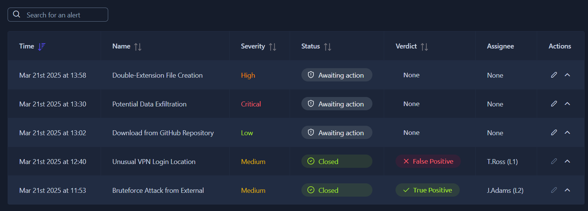
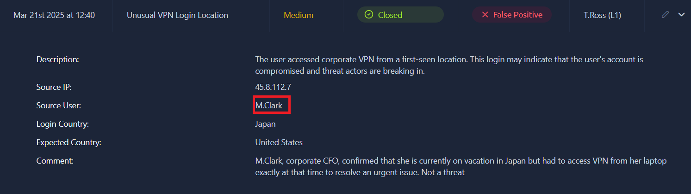
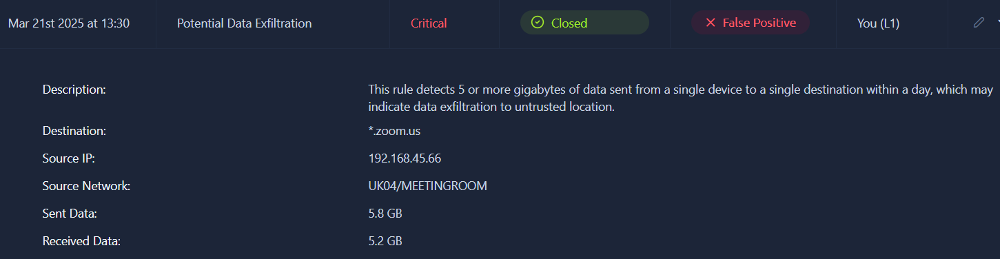
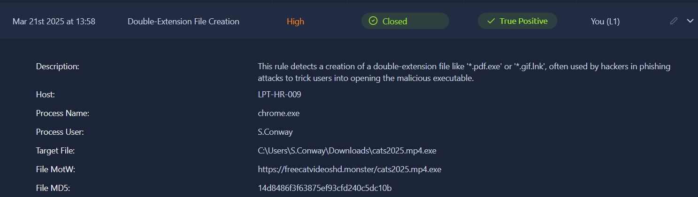
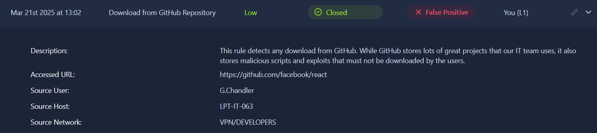

> # SOC L1 Alert Triage

## Summary

### Task 2 - Events and Alerts
1. What is the number of alerts you see in the SOC dashboard? 
     
    **Answer:** 5

1. What is the name of the most recent alert you see? 
    **Answer:** Double-Extension File Creation

### Task 3 - Alert Properties
1. What was the verdict for the "Unusual VPN Login Location" alert? 
    **Answer:** False Positive

1. What user was mentioned in the "Unusual VPN Login Location" alert? 
     
    **Answer:** M.Clark

### Task 4 - Alert Prioritisation
1. Should you first prioritise medium over low severity alerts? (Yea/Nay) 
    **Answer:** Yea

1. Should you first take the newest alerts and then the older ones? (Yea/Nay) 
    **Answer:** Nay

1. The name of your selected alert will be the answer to the question. 
    The `Potential Data Exfiltration` has the `Severity` is `Critical`. 
    **Answer:** Potential Data Exfiltration

### Task 5 - Alert Triage
1. Which flag did you receive after you correctly triaged the first-priority alert? 
     
    **Answer:** THM{looks_like_lots_of_zoom_meetings}

1. Which flag did you receive after you correctly triaged the second-priority alert? 
     
    **Answer:** THM{how_could_this_user_fall_for_it?}

1. Which flag did you receive after you correctly triaged the third-priority alert? 
     
    **Answer:** THM{should_we_allow_github_for_devs?}
