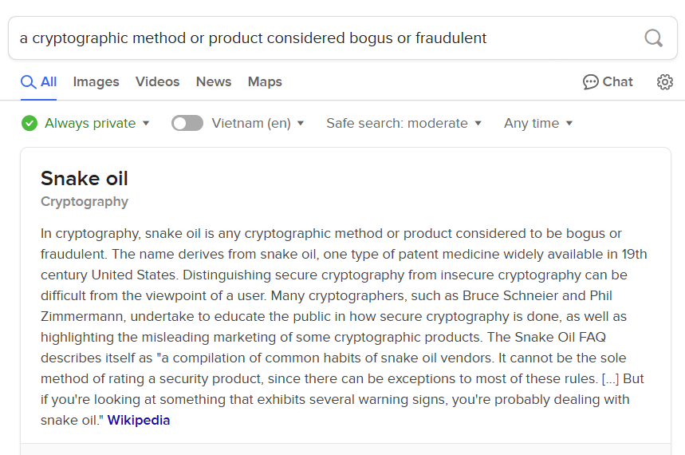
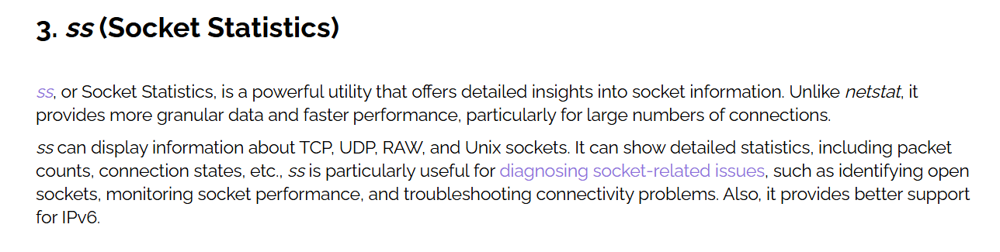
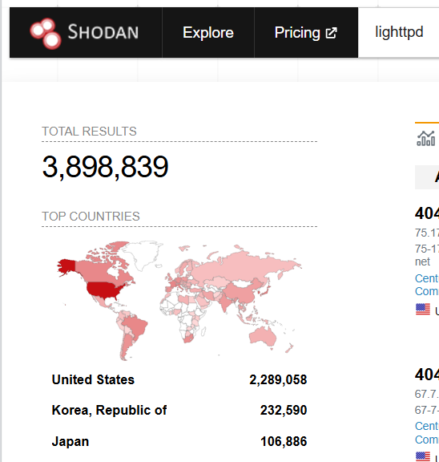
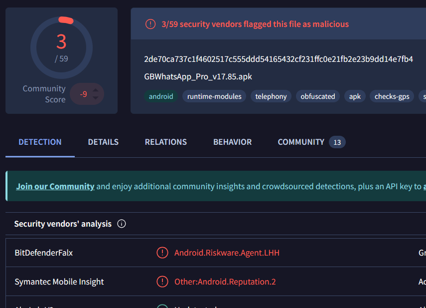

> # Search Skills

## Summary
- [Summary](#summary)
  - [Task 2 - Evaluation of Search Results](#task-2---evaluation-of-search-results)
  - [Task 3 - Search Engines](#task-3---search-engines)
  - [Task 4 - Specialized Search Engines](#task-4---specialized-search-engines)
  - [Task 5 - Vulnerabilities and Exploits](#task-5---vulnerabilities-and-exploits)
  - [Task 6 - Technical Documentation](#task-6---technical-documentation)
  - [Task 7 - Social Media](#task-7---social-media)

### Task 2 - Evaluation of Search Results
1. What do you call a cryptographic method or product considered bogus or fraudulent? 
    Use `DuckDuckGo` to search for the question, you will see the answer appear. 
     
    **Answer:** snake oil

1. What is the name of the command replacing netstat in Linux systems? 
    Search on `DuckDuckGo` with this string `command replace netstat in linux system`, you will see the [link](https://www.baeldung.com/linux/netstat-alternatives). 
     
    They prefer to a command `ss`. 
    **Answer:** ss

### Task 3 - Search Engines
1. How would you limit your Google search to PDF files containing the terms cyber warfare report? 
    **Answer:** filetype:pdf cyber warfare report

1. What phrase does the Linux command ss stand for? 
    From the above image, the `ss` stand for`Socket statistics`. 
    **Answer:** socket statistics

### Task 4 - Specialized Search Engines
1. What is the top country with lighttpd servers? 
    Use shodan.io to search for the string `lighttpd`, you will see the sort country used it. 
     
    **Answer:** United States

1. What does BitDefenderFalx detect the file with the hash 2de70ca737c1f4602517c555ddd54165432cf231ffc0e21fb2e23b9dd14e7fb4 as? 
    Search on Virustotal the hash 2de70ca737c1f4602517c555ddd54165432cf231ffc0e21fb2e23b9dd14e7fb4. 
     
    **Answer:** Android.Riskware.Agent.LHH

### Task 5 - Vulnerabilities and Exploits
1. What utility does CVE-2024-3094 refer to? 
    Search on cve.org [link](https://www.cve.org/CVERecord?id=CVE-2024-3094), in description. 
    > Malicious code was discovered in the upstream tarballs of xz, starting with version 5.6.0. Through a series of complex obfuscations, the liblzma build process extracts a prebuilt object file from a disguised test file existing in the source code, which is then used to modify specific functions in the liblzma code. This results in a modified liblzma library that can be used by any software linked against this library, intercepting and modifying the data interaction with this library.

    **Answer:** xz

### Task 6 - Technical Documentation
1. What does the Linux command cat stand for? 
    Use Linux manual page `cat - concatenate files and print on the standard output`. 
    **Answer:** concatenate

1. What is the netstat parameter in MS Windows that displays the executable associated with each active connection and listening port? 
    Run `netstat help` to see all available option. 
    > -b: Displays the executable involved in creating each connection or listening port. In some cases well-known executables host multiple independent components, and in these cases the sequence of components involved in creating the connection or listening port is displayed. In this case the executable name is in [] at the bottom, on top is the component it called, and so forth until TCP/IP was reached. Note that this option can be time-consuming and will fail unless you have sufficient permissions.
    **Answer:** -b

### Task 7 - Social Media
1. You are hired to evaluate the security of a particular company. What is a popular social media website you would use to learn about the technical background of one of their employees? 
    LinkedIn is the social media to show the technology background of one of the employees in company. 
    **Answer:** LinkedIn

1. Continuing with the previous scenario, you are trying to find the answer to the secret question, “Which school did you go to as a child?”. What social media website would you consider checking to find the answer to such secret questions? 
    Facebook is usally the place to store the story of everyone. 
    **Answer:** Facebook
