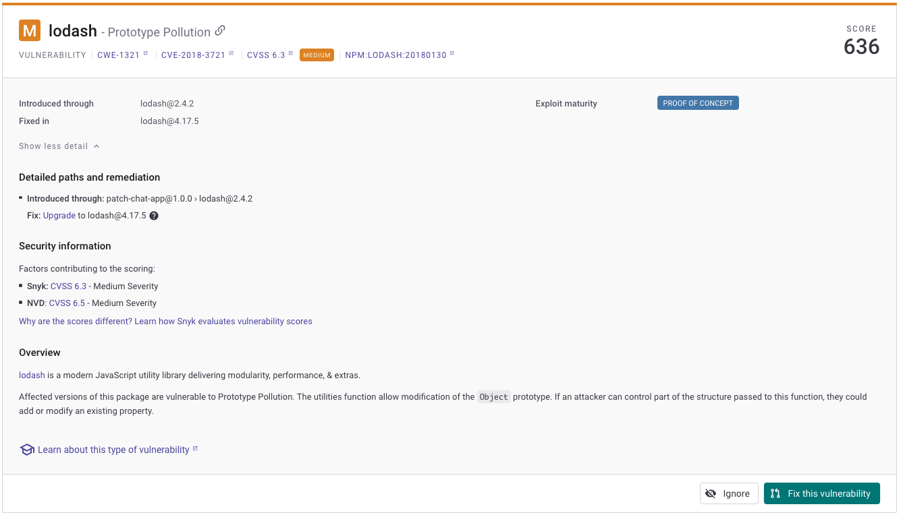
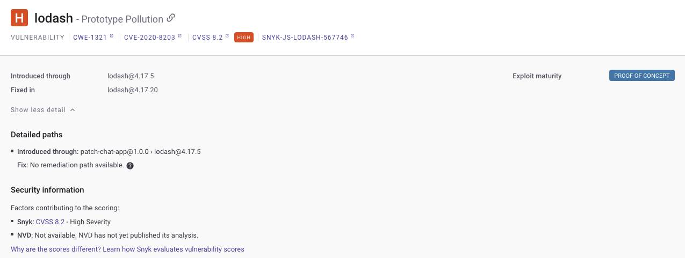

> # Snyk Open Source

## Summary

### Task 3 - Understanding Open Source Security Risks
1. Which JSON-formatted manifest file serves as the central hub for Node.js projects, listing metadata, scripts, and dependency declarations?<br>
    **Answer:** package.json

1. How many dependencies do we have for this new feature?<br>
    ```
    "dependencies": {
      "colors": "1.2.4",
      "express": "3.4.8",
      "lodash": "2.4.2",
      "mongoose": "5.9.7",
      "request": "2.88.2"
    }
    ```
    **Answer:** 5

1. Which term describes indirect package dependencies formed through shared prerequisites, possibly concealing vulnerabilities and demanding cautious assessment?<br>
    > Transitive dependencies: Many open-source libraries depend on other libraries, forming intricate interdependencies. When left unmanaged, transitive dependencies can harbour unknown vulnerabilities propagating silently throughout an entire system. Identifying and resolving these hidden dangers demands thorough analysis and meticulous attention to detail. 

    **Answer:** Transitive dependencies

### Task 4 - Getting Started with Snyk Open Source
1. What single authentication mechanism allows users to transition smoothly amongst various linked platforms and services?<br>
    > She visited the IT department to ensure developers could log in to the platform using Single Sign-On (SSO) login, a secure authentication method companies use to enable employees and authorised users to access applications and services with just a single set of credentials.

    **Answer:** 
    
### Task 5 - Diving Deeper Into Vulnerabilities
1. What is the version of the vulnerable lodash package?<br>
    <br>
    **Answer:** 2.4.2

1. Which vulnerability allows an attacker to modify an Object?<br>
    **Answer:** prototype pollution 

### Task 6 - Remediating Vulnerabilities
1. What does CVSS stand for?<br>
    **Answer:** Common Vulnerability Scoring System

1. Should the development team bulk fix all the vulnerabilities found in this new feature? (y/n)<br>
    There is another vulnerable after fix.<br>
    <br>
    **Answer:** n

### Task 7 - Automating the Process Through CI/CD Pipelines
1. How does CircleCI help streamline pipeline configuration and standardisation?<br>
    > CircleCI enables users to easily create CI/CD workflows using a group of ready-to-use commands called Orbs that can be added to the configuration file. 

    **Answer:** Orb

1. What file defines the GitHub Actions workflow configuration that enables automation and customised sequences for building, testing, and deploying?<br>
    **Answer:** YAML

### Task 8 - Implementing Continuous Monitoring
1. Which collaborative DevOps practice combines real-time communication channels, automation, and operational agility?<br>
    > ChatOps refers to the practice of using real-time messaging platforms, such as Slack, Microsoft Teams, or others, to facilitate collaboration, streamline workflows, and improve operational efficiencies within technical teams, including security and DevOps teams.

    **Answer:** ChatOps

### 