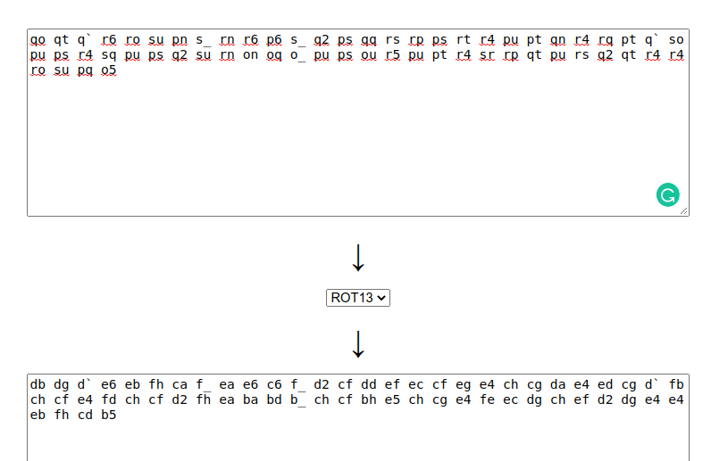
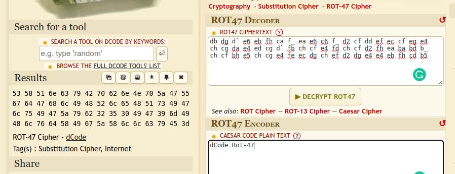
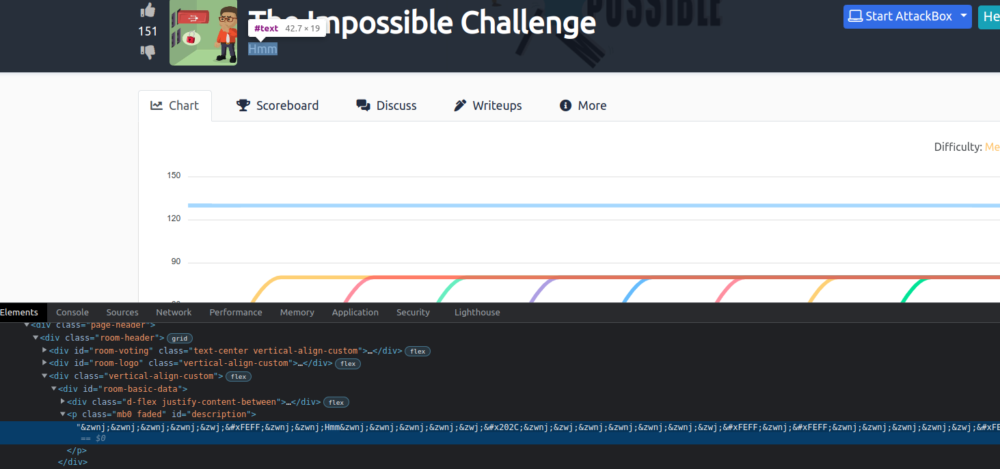

> # The Impossible Challenge - Tryhackme

The description give us a string, and a zip file contains `flag.txt` but we don't know the password.<br>
After researching on google, the given strings is decode with order ROT13 -> ROT47 -> HEX -> Base64.<br>

ROT13<br>
<br>
ROT47<br>
<br>
HEX & base64
```
$ echo -n 5358516e63794270626e4e705a4755676447686c4948526c6548517349476c7549475a79623235304947396d49486c76645849675a586c6c6379453d | xxd -r -p | base64 -d
It's inside the text, in front of your eyes!
```
It's hint that the password is somewhere in front of our eyes.<br>
I detected in the description of the Room, particular in `Hmm` string when I use Inspect DevTools.<br>
<br>
I copied this string and paste it on Google and found a helpful link [https://330k.github.io/misc_tools/unicode_steganography.html](https://330k.github.io/misc_tools/unicode_steganography.html).<br>
Paster `Hmm` in the right field then press Decode button, I received the password of zip file.
Unzip and cat the flag.<br>
```
$ unzip Impossible.zip 
Archive:  Impossible.zip
[Impossible.zip] flag.txt password: 
  inflating: flag.txt                
$ cat flag.txt 
You have solved the Impossible Challenge! Here is your flag THM{SNIP}
```

**Answer:** ...
