> # Threat Intelligence Tools - Tryhackme

# Summary
* [Summary](#summary)
   * [Task 1 - Room Outline](#task-1---room-outline)
   * [Task 2 - Threat Intelligence](#task-2---threat-intelligence)
   * [Task 3 - UrlScan.io](#task-3---urlscanio)
   * [Task 4 - Abuse.ch](#task-4---abusech)
   * [Task 5 - PhishTool](#task-5---phishtool)
   * [Task 6 - Cisco Talos Intelligence](#task-6---cisco-talos-intelligence)
   * [Task 7 - Scenario 1](#task-7---scenario-1)
   * [Task 8 - Scenario 2](#task-8---scenario-2)
   * [Task 9 - Conclusion](#task-9---conclusion)

## Task 1 - Room Outline
Khái niệm Threat Intelligence và các công cụ mã nguồn mở hữu dụng. Mục tiêu:
- Hiểu cơ bản threat intelligence và các loại.
- Sử dụng UrlScan.io để quét URLs độc hại.
- Sử dụng Abuse.ch để theo dõi malware và chỉ số botnet.
- Điều tra email phishing sử dụng PhishTool.
- Sử dụng nền tảng Cisco's Talos Intelligence cho việc tình báo thông tin.

## Task 2 - Threat Intelligence
Các loại:
- Strategic intel: nhìn vào bối cảnh đe dọa và vạch ra vùng rủi ro dựa vào trend, mẫu, các mối đe dọa mới.
- Technical intel: nhìn vào bằng chứng để lại của kẻ tấn công. Dựa vào đó tạo ra một phương pháp phát triển sau này.
- Tactical intel: đánh giá TTPs để tăng cường cơ chế bảo mật.
- Operational intel: nhìn vào động cơ và ý định của kẻ tấn công.

## Task 3 - UrlScan.io
Urlscan.io là một dịch vụ miễn phí được phát triển để hỗ trợ quét và phân tích các trang web. Nó được sử dụng để tự động hóa quá trình duyệt và bò qua các trang web để ghi lại các hoạt động và tương tác.

Use this image to answer questions below. 
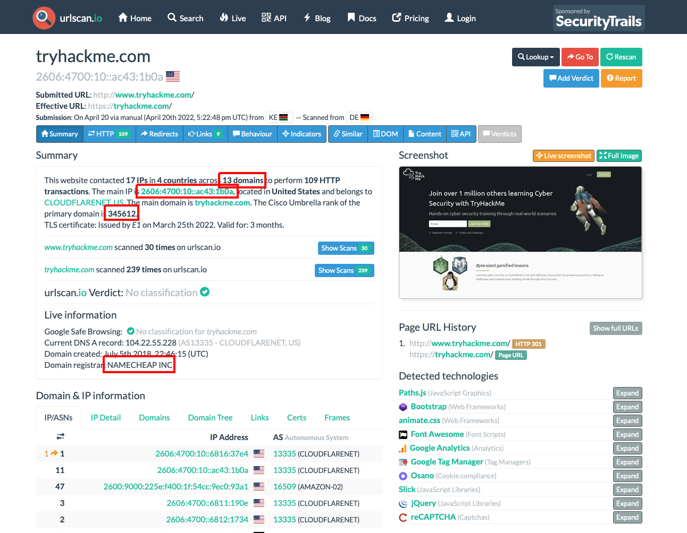 

1. What is TryHackMe's Cisco Umbrella Rank? 
    **Answer:** 281862

1. How many domains did UrlScan.io identify? 
    **Answer:** 13

1. What is the main domain registrar listed? 
    **Answer:** NAMECHEAP INC

1. What is the main IP address identified? 
    **Answer:** 2606:4700:10::ac43:1b0a

## Task 4 - Abuse.ch
Abuse.ch là một dự án nghiên cứu được tổ chức bởi Viện An ninh mạng và Kỹ thuật tại Đại học Khoa học Ứng dụng Bern ở Thụy Sĩ. Nó được phát triển để xác định và theo dõi phần mềm độc hại và botnet thông qua một số nền tảng hoạt động được phát triển theo dự án. Những nền tảng này là:
- Malware Bazaar: Một tài nguyên để chia sẻ các mẫu phần mềm độc hại.
- Feodo Tracker: Một tài nguyên được sử dụng để theo dõi cơ sở hạ tầng của lệnh và điều khiển botnet (C2) được liên kết với Emotet, Dridex và Trickbot. 
- SSL Blacklist: Một tài nguyên để thu thập và cung cấp danh sách chặn cho các chứng chỉ SSL độc hại và dấu vân tay JA3/JA3S. 
- URL Haus: Một tài nguyên để chia sẻ các trang web phân phối phần mềm độc hại. Fox đe dọa: Một nguồn lực để chia sẻ các chỉ số thỏa hiệp (IOCS).

1. The IOC 212.192.246.30:5555 is linked to which malware on ThreatFox? 
    On ThreatFox, search with `ioc:212.192.246.30:5555` and navigate to Malware page. 
    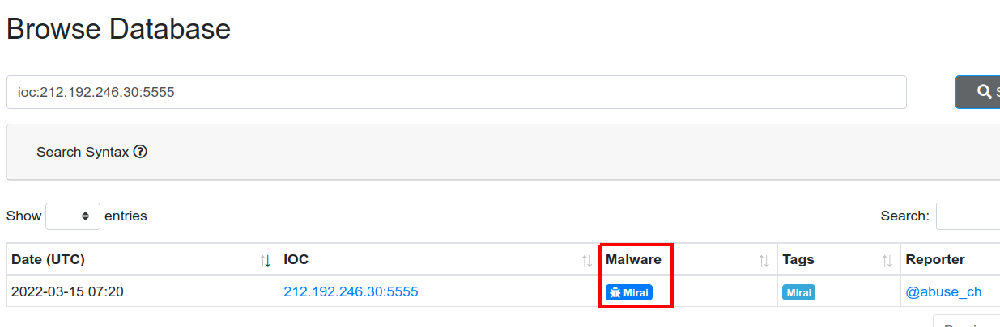 
    The answer is the alias of it base on hint. 
    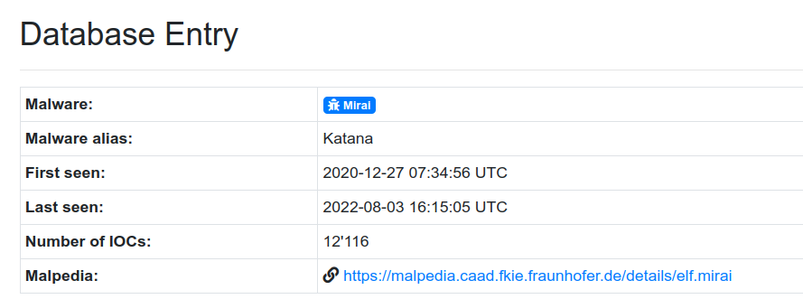 
    **Answer:** Katana

1. Which malware is associated with the JA3 Fingerprint 51c64c77e60f3980eea90869b68c58a8 on SSL Blacklist?
    The result is on page [https://sslbl.abuse.ch/ja3-fingerprints/51c64c77e60f3980eea90869b68c58a8/](https://sslbl.abuse.ch/ja3-fingerprints/51c64c77e60f3980eea90869b68c58a8/).     
    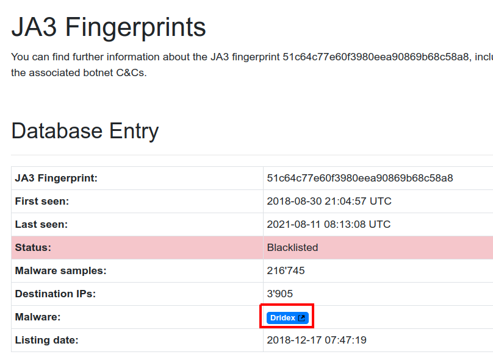 
    **Answer:** Dridex

1. From the statistics page on URLHaus, what malware-hosting network has the ASN number AS14061?  
    Search on URLHaus. 
    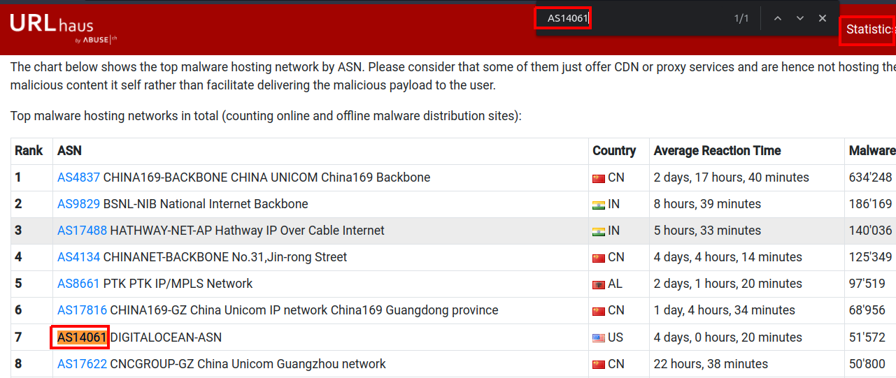 
    Navigate to this page. 
    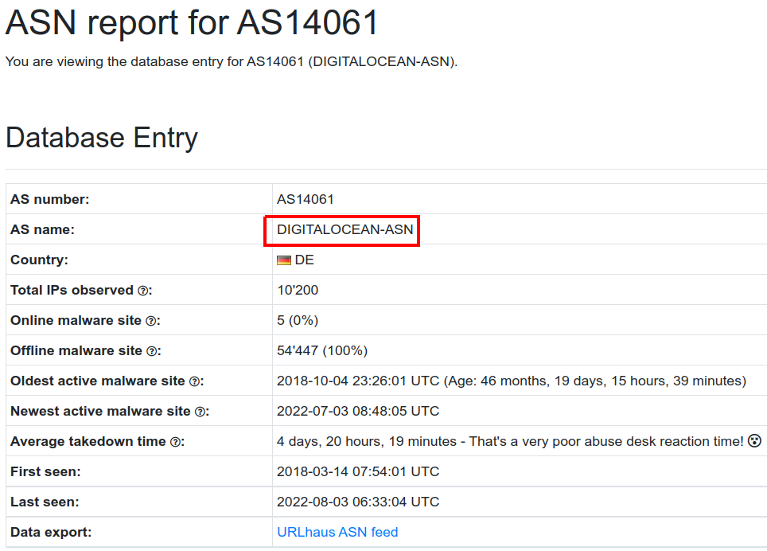 
    **Answer:** DIGITALOCEAN-ASN

1. Which country is the botnet IP address 178.134.47.166 associated with according to FeodoTracker? 
    The result is in page [https://feodotracker.abuse.ch/browse/host/178.134.47.166/](https://feodotracker.abuse.ch/browse/host/178.134.47.166/). 
    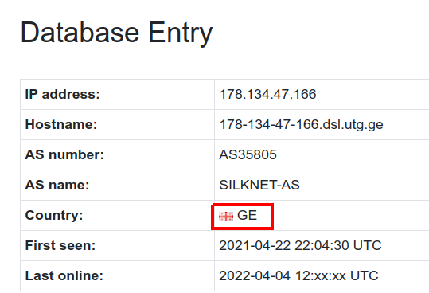 
    Find country on Google. 
    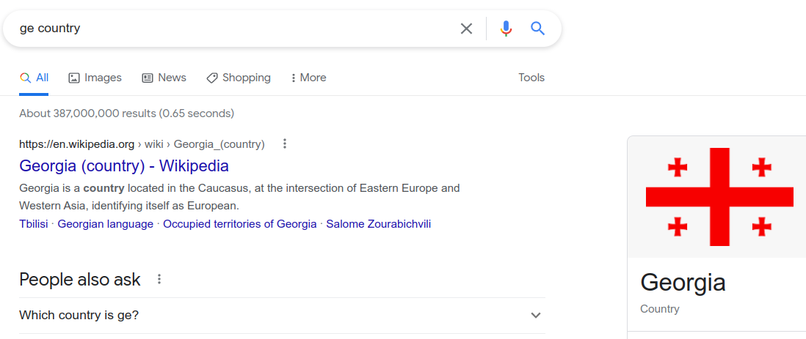 
    **Answer:** Georgia

## Task 5 - PhishTool
1. What organisation is the attacker trying to pose as in the email? 
    Upload Email1.eml to PhishTool. 
    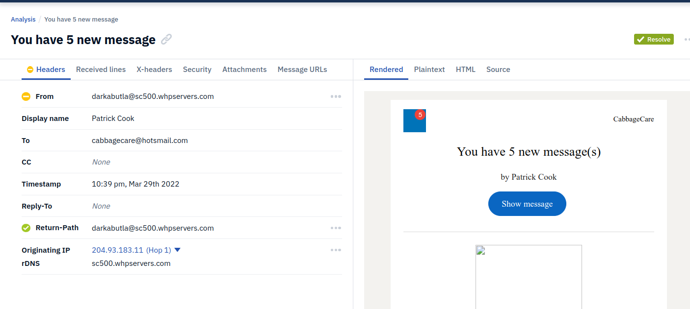 
    In body of email, we found they noticed us that we have 5 unread messages from LinkedIn. 
    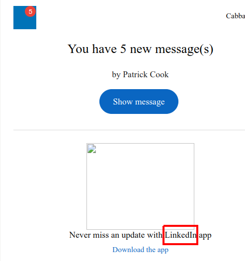 
    **Answer:** LinkedIn

1. What is the senders email address? 
    **Answer:** darkabutla@sc500.whpservers.com

1. What is the recipient's email address? 
    **Answer:** cabbagecare@hotsmail.com

1. What is the Originating IP address? Defang the IP address. 
    Defang is add "[" and "]" to avoid accientally clicking on it. 
    **Answer:** 204[.]93[.]183[.]11

1. How many hops did the email go through to get to the recipient? 
    Select dropdown button to see all hops. 
    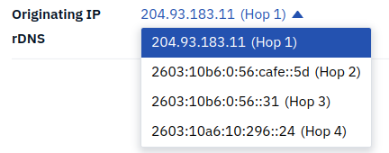 
    **Answer:** 4

## Task 6 - Cisco Talos Intelligence
Các công ty CNTT và an ninh mạng thu thập một lượng lớn thông tin có thể được sử dụng để phân tích mối đe dọa và trí thông minh. Là một trong những công ty đó, Cisco đã tập hợp một nhóm lớn các học viên an ninh gọi Cisco Talos để cung cấp trí thông minh có thể hành động, khả năng hiển thị trên các chỉ số và bảo vệ chống lại các mối đe dọa mới nổi thông qua dữ liệu được thu thập từ các sản phẩm của họ. Giải pháp có thể truy cập như Talos Intelligence.

Cisco Talos bao gồm sáu đội chính:
- (Threat Intellignce & Interdiction)Trí thông minh và sự can thiệp của mối đe dọa: Tương quan nhanh và theo dõi các mối đe dọa cung cấp một phương tiện để biến các IOC đơn giản thành thông tin giàu ngữ cảnh.
- (Detection Research) Nghiên cứu phát hiện: Lỗ hổng và phân tích phần mềm độc hại được thực hiện để tạo ra các quy tắc và nội dung để phát hiện mối đe dọa.
- (Engineering $ Development) Kỹ thuật & Phát triển: Cung cấp hỗ trợ bảo trì cho các công cụ kiểm tra và giúp chúng cập nhật để xác định và xử lý các mối đe dọa mới nổi.
- (Vulnerability Research and Discovery) Nghiên cứu & Discovery dễ bị tổn thương: Làm việc với các nhà cung cấp dịch vụ và phần mềm để phát triển các phương tiện có thể lặp lại để xác định và báo cáo các lỗ hổng bảo mật. 
- (Communities) Cộng đồng: Duy trì hình ảnh của nhóm và các giải pháp nguồn mở. 
- (Global Outreach) Tiếp cận toàn cầu: Phổ biến trí thông minh cho khách hàng và cộng đồng bảo mật thông qua các ấn phẩm.

1. What is the listed domain of the IP address from the previous task? 
    The IP of previous question is 204[.]93[.]183[.]11, paste it on `Reputation Center` to get the result. In overview details, we see the domain. 
    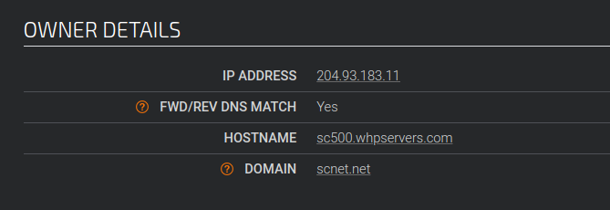 
    **Answer:** scnet.net

1. What is the customer name of the IP address? 
    In `Additional Information` panel, select `Whois` tab then search for `Cust`. You will see the Customer name of the IP Address. 
    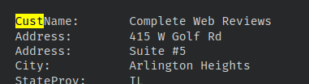 
    **Answer:** Complete Web Reviews

## Task 7 - Scenario 1
Material: Email2.eml 
Upload this email to PhishTool. 
1. According to Email2.eml, what is the recipient's email address? 
    From this image, we will see the answer. 
    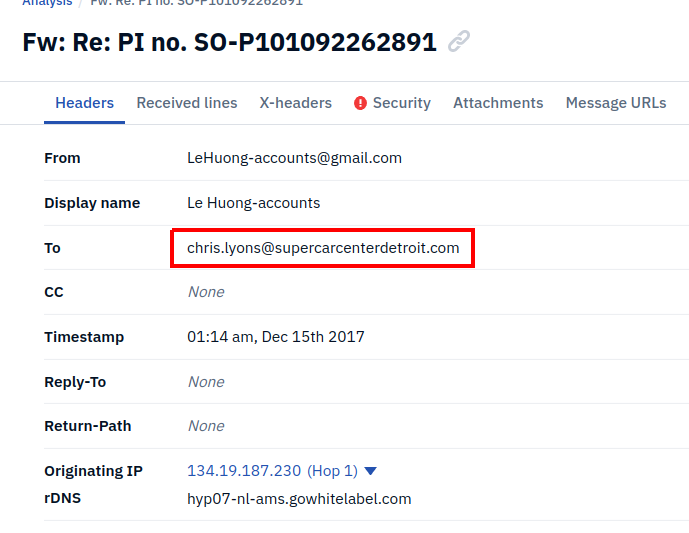 
    **Answer:** chris.lyons@supercarcenterdetroit.com

1. From Talos Intelligence, the attached file can also be identified by the Detection Alias that starts with an H... 
    Paste the SHA256 to `Talos File Reputation` 
    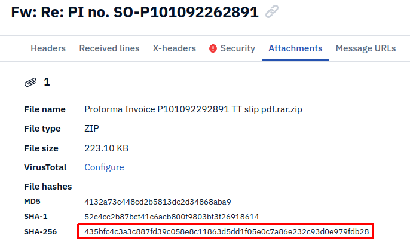 
    In Detection Alias, we found an alias starts with an H. 
    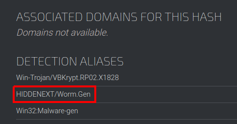 

## Task 8 - Scenario 2
Metarial: Email3.eml
Upload this file to PhishTool. 

1. What is the name of the attachment on Email3.eml?
    In PhishTool and Attachment tab, we will see the name of the attachment. 
    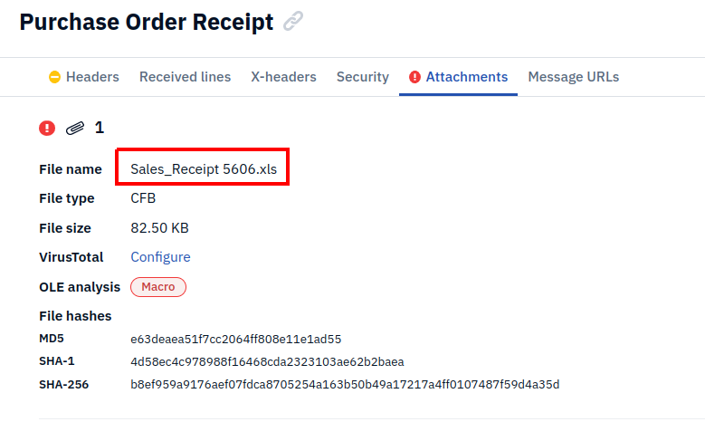 
    **Answer:** Sales_Receipt 5606.xls

1. What malware family is associated with the attachment on Email3.eml? 
    Paste the sha256 to Malware Bazaar then view the result. 
    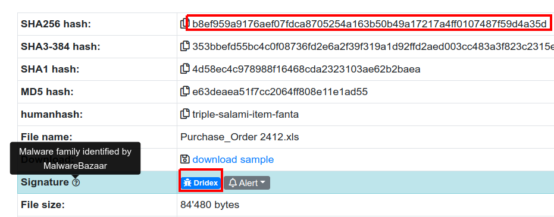 
    **Answer:** Dridex

## Task 9 - Conclusion
There's More Out There
You have come to the end of the room. However, this is just the tip of the iceberg for open-source threat intelligence tools that can help you as an analyst triage through incidents. There are plenty of more tools that may have more functionalities than the ones discussed in this room.

Check out these rooms to dive deeper into Threat Intelligence:

- Introduction to ISAC
- Yara
- MISP
- Red Team Threat Intel
