> # Threat Intelligence for SOC

# Summary
<!-- TOC -->

- [Summary](#summary)
    - [Task 2 - Threat Intelligence Feeds](#task-2---threat-intelligence-feeds)
    - [Task 3 - Intelligence-driven Prevention](#task-3---intelligence-driven-prevention)
    - [Task 4 - Intelligence-driven Detection](#task-4---intelligence-driven-detection)

<!-- /TOC -->

## Task 2 - Threat Intelligence Feeds
1. How many unique IP addresses were provided in the IOC list? 
    Paste the list IPs to [https://uncoder.io/](https://uncoder.io/) 
    It will display number of unique IPs in list. 
    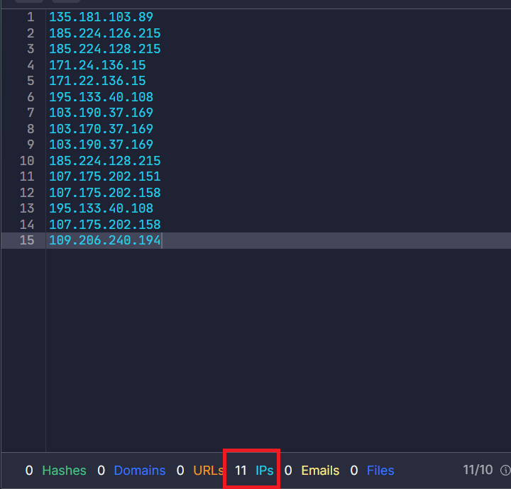 
    **Answer:** 11

1. Based on the set of IOCs, how many IOC hits were discovered in the logs? 
    Paste the query into filter. You will see the number of hit IOC. 
    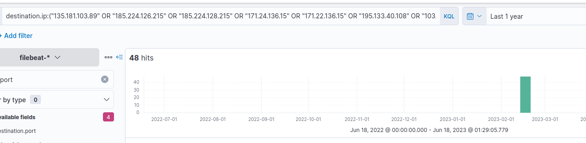 
    **Answer:** 48

1. Out of the total number of IOCs, how many unique IP addresses were discovered in the logs? 
    Change the value of "Number of value" to 10, you will see all the unique IPs. 
    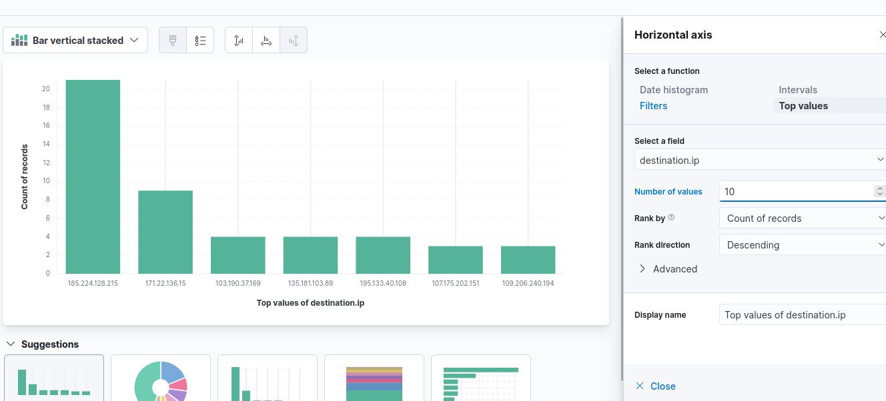 
    **Answer:** 7

1. How many connections were made to 185[.]224[.]128[.]215? 
    View in `Visualize`. 
    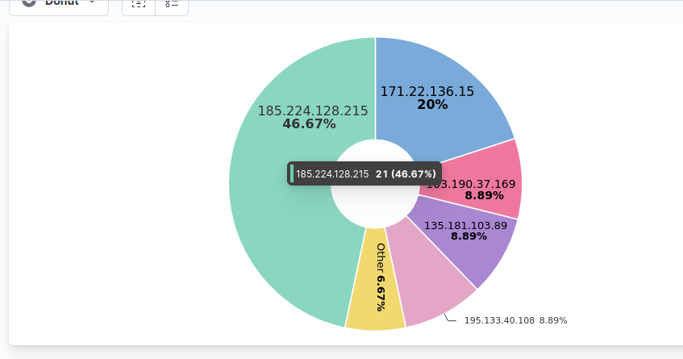 
    **Answer:** 21

1. What is the IP address of the compromised host?  
    In source.ip, only one IP address appear. 
    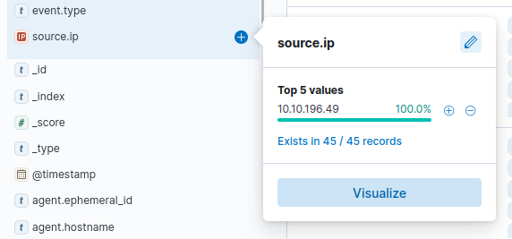 
    **Answer:** 10.10.196.49

1. What is the destination port of connections made to 107[.]175[.]202[.]151? 
    Filter with this IP, and view in destination.port. 
    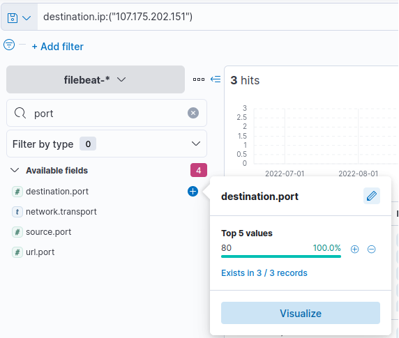 
    **Answer:** 80

## Task 3 - Intelligence-driven Prevention
1. How many DNS queries to agrosaoxe[.]info have been created? 
    Filter with `dns.question.name: "agrosaoxe.info"`. 
    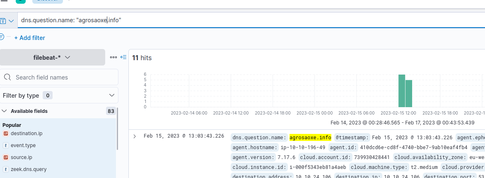 
    **Answer:** 11

1. Before deploying the sinkhole configuration, what IPv4 addresses are resolved by agrosaoxe[.]info? (format: IPs in ascending order) 
    In dns.resolve_ip you will two public IPs. 
    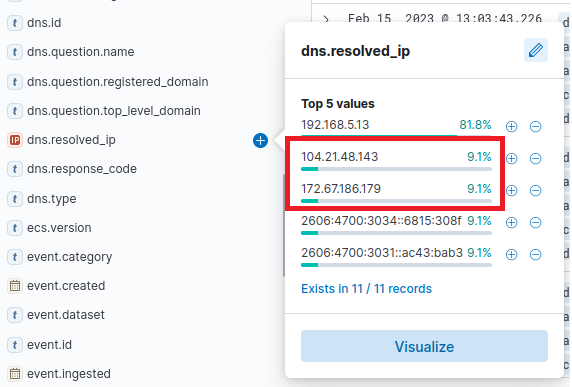 
    **Answer:** 172.67.186.179,104.21.48.143

1. What is the IP address used for DNS Sinkhole? 
    In the image above, almost request receives dns respone with IP 192.168.5.13. 
    **Answer:** 192.168.5.13

1. How many hits were caused by connections to sinkholed domains?
    Filter with dns sinkholded IP. 
    **Answer:** 192.168.5.13

1. How many unique domains have been sinkholed? 
    Visualize dns.question_name, you will see 12 domain have dns.response_ip is 192.168.5.13 
    **Answer:** 12

## Task 4 - Intelligence-driven Detection
1. What is the value of the alert field in the converted ElastAlert rule? 
    Read file sinhold.yaml 
    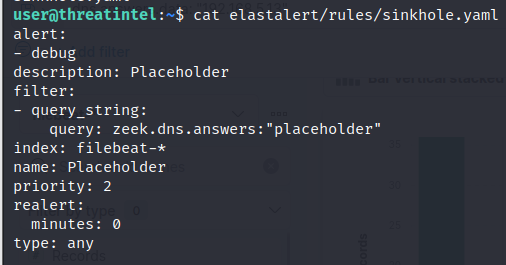 
    **Answer:** debug

1. How many alerts were generated by the rule? 
    Modify sinkhole.yaml as the description, then run the given command. 
    You will see it sents 40 alerts. 
    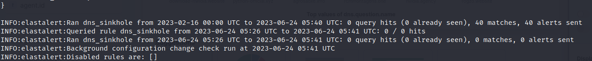 
    **Answer:** 40

1. How many unique domains were sinkholed via 0.0.0.0? 
    Filter `"query"` field, then use `sort, uniq, wc -l` to count number of unique domains. 
    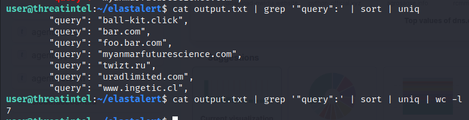 
    **Answer:** 7

1. What is the sinkholed domain that has .ru TLD? 
    From the image above 
    **Answwer:** twizt.ru

